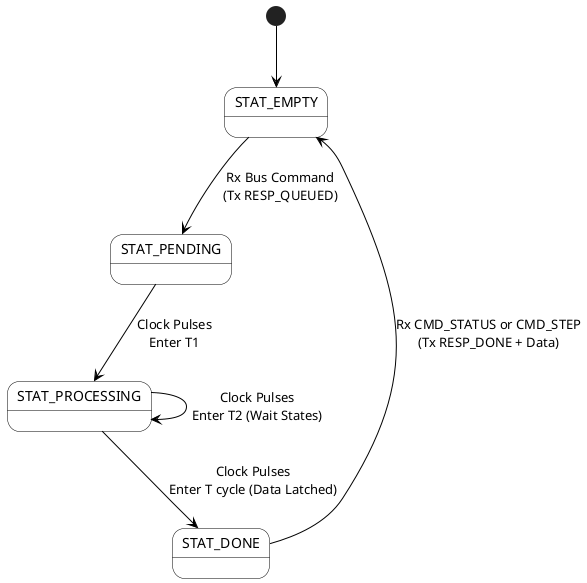
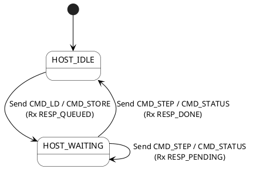
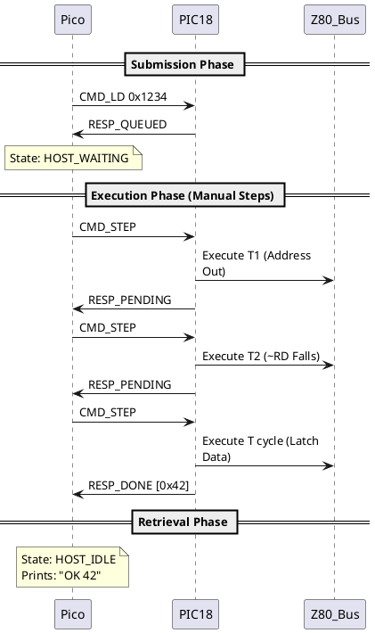
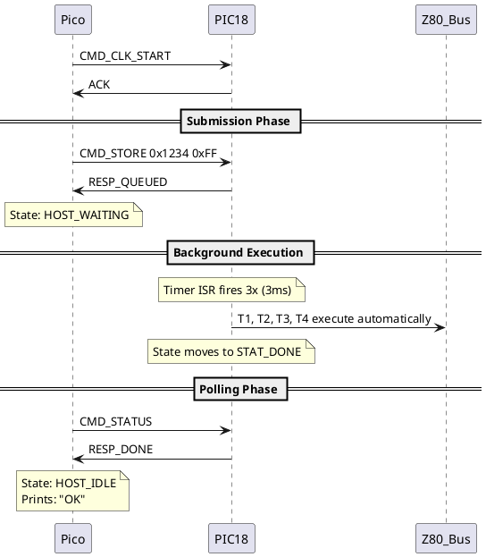
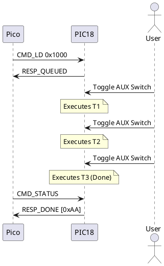

# Zx50 Bus Probe: Asynchronous Protocol & State Machine

## 1. Architectural Overview

The Zx50 Bus Probe originally utilized a synchronous Remote Procedure Call (RPC) paradigm. The Pico (Host) would send a command (e.g., Memory Read) and block until the PIC18 completed the full Z80 instruction cycle (T1, T2, T3) and returned the result.

While this worked for auto-running clocks, it fundamentally broke **Manual Stepping Mode**. If the user wanted to step the clock manually via the front panel `AUX` switch to observe the bus states, the PIC would pause mid-instruction. This caused the Pico's UART timeout to expire, dropping the packet and breaking the CLI.

To resolve this, the protocol has been redesigned as a **Fully Asynchronous Polling System**.
1. **Submission:** The Pico submits a command and receives an immediate `RESP_QUEUED` acknowledgment.
2. **Execution:** The PIC processes the command asynchronously (either driven by the 1kHz auto-clock timer or manual `AUX` steps).
3. **Retrieval:** The Pico polls the PIC (via `CMD_STEP` or `CMD_STATUS`) to check if the command is complete and fetch the data payload.

---

## 2. Protocol Definitions

### 2.1 Command Opcodes (Pico $\rightarrow$ PIC)
* `CMD_LD (0x01)`: Queue Memory Read.
* `CMD_STORE (0x02)`: Queue Memory Write.
* `CMD_IN (0x03)`: Queue I/O Read.
* `CMD_OUT (0x04)`: Queue I/O Write.
* `CMD_STEP (0x11)`: Advance the clock 1 cycle (if auto-clock is off) and return queue status.
* `CMD_STATUS (0x15)`: *[NEW]* Return queue status without advancing the clock.

### 2.2 Response Codes (PIC $\rightarrow$ Pico)
* `RESP_QUEUED (0x5C)`: Command accepted into the empty queue slot.
* `RESP_PENDING (0x5D)`: Command is actively executing (currently in T1 or T2).
* `RESP_DONE (0x5E)`: Command finished (T cycle completed). A data byte immediately follows if the command was a Read.
* `RESP_IDLE (0x5F)`: Queue is empty. Nothing is executing.
* `SYNC_OK (0x5A)`: Command accepted (e.g. non-queued commend, like STEP).
* `SYNC_NACK (0x5B)`: Command rejected (e.g., Queue is full or invalid syntax).

---

## 3. State Machines

### 3.1 PIC18 State Machine (Command Queue)

The PIC maintains a command queue and tracks the Z80 T-States for the active command.

**State Definitions:**

* `STAT_EMPTY`: No command loaded. If stepped or polled, returns `RESP_IDLE`.
* `STAT_PENDING`: Command is queued but hasn't started its T1 cycle yet.
* `STAT_PROCESSING`: The PIC is actively driving the transceivers and holding the bus.
* `STAT_DONE`: The Z80 cycle is complete. The result is buffered. The PIC waits for the Pico to retrieve it, then clears the queue.

### 3.2 Pico State Machine (Host CLI)

The Pico CLI must track whether it is waiting for a bus operation to complete, preventing the user from overflowing the queue.

**State Definitions:**

* `HOST_IDLE`: Ready to accept new CLI commands.
* `HOST_WAITING`: A bus command is queued. New bus commands are rejected locally. The user must issue `pic step` or `pic status` to resolve the pending command.

---

## 4. Sequence Diagrams

### 4.1 Scenario A: Manual Stepping (Read Operation)

This scenario demonstrates how the asynchronous protocol allows the user to manually step through a Memory Read without triggering a UART timeout on the Pico.

### 4.2 Scenario B: Auto-Clock Mode (Write Operation)

When the 1kHz auto-clock is running, the PIC will execute the command in the background immediately. The Pico uses `CMD_STATUS` to poll for completion.

### 4.3 Scenario C: Hardware AUX Switch Stepping

If the user steps the clock using the physical hardware switch on the PCB instead of the CLI, the PIC completes the command silently. The Pico retrieves it via `CMD_STATUS`.

