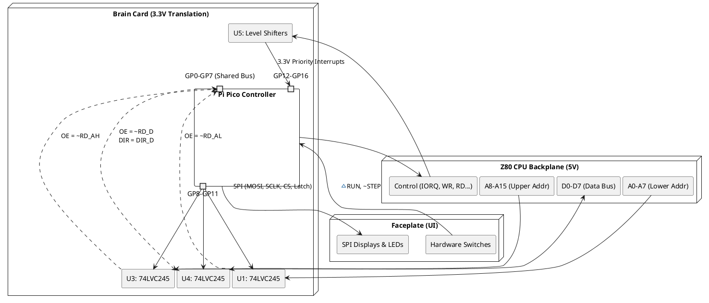

Here is the complete, consolidated `Zx50_FrontPanel.md` file. I have removed the redundancies, added a clear introductory overview, mapped out the system architecture with a PlantUML diagram, and included the pseudo-code for the high-speed `OTIR` state machine.

```markdown
# Zx50 Front Panel & Controller Card Architecture

## 1. Introduction

### What It Is
The Zx50 Front Panel system is a modular, microcontroller-driven diagnostic and display interface for a custom Z80-based retrocomputer. It consists of two physical printed circuit boards:
1. **The Brain Card:** A Raspberry Pi Pico-based controller that interfaces directly with the 5V Z80 bus via high-speed logic level shifters and transceivers.
2. **The Faceplate:** A "dead-front" aesthetic UI board featuring vintage HCMS dot-matrix displays, an EA DIP205 LCD, discrete LEDs, and heavy-duty NKK toggle switches.

### Purpose
The system provides real-time visibility into the Z80's internal state without imposing wait states or halting the CPU during normal execution. It acts as both a passive bus monitor (displaying current addresses and data) and an active I/O peripheral capable of receiving high-speed block data transfers (`OTIR`) directly from the Z80 for terminal output. Additionally, it provides hardware-level debugging controls (Run/Halt/Step) via the front panel switches.

### Overview of Operation
Because the Pi Pico lacks the physical pins required to monitor the entire Z80 bus simultaneously, the Brain Card utilizes a **Multiplexed 8-bit Data Bus**. Three 74LVC245 transceivers isolate the Z80's lower address, upper address, and data lines. The Pico systematically toggles the Output Enable (`~OE`) lines of these transceivers to read or write specific segments of the bus onto its own internal GP0-GP7 pins. 

---

## 2. Hardware Architecture

The core of the design relies on safely bridging the 5V Z80 backplane to the 3.3V Pi Pico while managing pin constraints.



---

## 3. Operation Modes & Workflow

The Pi Pico firmware utilizes two distinct operational modes to balance high-speed Z80 communication with visual UI updates.

### Mode A: Priority Transfer Mode (`OTIR` Catch)
When the Z80 executes an `OUT` or block `OTIR` instruction, the Pico relies on Programmable I/O (PIO) or high-speed hardware interrupts to catch the data at full bus speed. During an `OTIR` block transfer, the Z80 places the I/O port address on the lower address bus (`C` register) and the remaining byte count on the upper address bus (`B` register).

```python
# Pseudo-code for PIO / Interrupt High-Speed Catch
def handle_z80_write_irq():
    # Triggered by FALLING edge of ~WR (while ~IORQ is low)
    
    # 1. Verify target Port (Read A0-A7)
    assert_low(OE_U1_RD_AL)
    target_port = read_shared_bus(GP0_GP7)
    assert_high(OE_U1_RD_AL)
    
    if target_port != PICO_PORT_ADDRESS:
        return # Ignore, not for us
        
    # 2. Enter High-Speed Block Transfer Loop
    while True:
        # Read the Data Bus (D0-D7)
        assert_low(OE_U4_RD_D)
        data_byte = read_shared_bus(GP0_GP7)
        assert_high(OE_U4_RD_D)
        
        fifo_buffer.push(data_byte)
        
        # Read the Upper Address Bus (A8-A15) to check the B-Register Counter
        assert_low(OE_U3_RD_AH)
        bytes_remaining = read_shared_bus(GP0_GP7)
        assert_high(OE_U3_RD_AH)
        
        # OTIR completes when the B register hits 0
        if bytes_remaining == 0:
            break
            
        wait_for_next_WR_falling_edge()
```

### Mode B: Passive Polling (10Hz - 20Hz)
Outside of priority data bursts, the Pico acts as a classic front-panel observer.
1. A timer interrupt triggers 10 to 20 times per second.
2. The Pico sequentially latches `U1`, `U3`, and `U4` to capture a snapshot of the current Address and Data buses.
3. If the `~DISP_EN` control signal is active, the Pico formats this snapshot and shifts it out over the SPI bus to the Faceplate's HCMS displays and discrete LEDs.

### Mode C: Switch State Monitoring
In the background, the Pico monitors the physical Faceplate switches (`~RUN`, `~STEP`). State changes trigger immediate updates to the Z80 control lines (e.g., pulling `~WAIT` low) to pause, step, or release the CPU execution.

---

## 4. Pi Pico GPIO Pin Mapping

This table reflects the final netlist routing on the Brain Card (`Zx50_FrontPanelCard.net`).

| Pico Pin | GPIO | Net Name | Function | Hardware Routing |
| :--- | :--- | :--- | :--- | :--- |
| 1, 2, 4-7, 9, 10 | GP0-GP7 | `D0`-`D7` | Multiplexed Shared Bus | U1, U3, U4 (B-Sides) |
| 11 | GP8 | `~RD_AL` | Read Lower Address | `~OE` for U1 (A0-A7) |
| 12 | GP9 | `~RD_AH` | Read Upper Address | `~OE` for U3 (A8-A15) |
| 14 | GP10 | `~RD_D` | Read Data Bus | `~OE` for U4 (Z80_D0-D7) |
| 15 | GP11 | `DIR_D` | Data Bus Direction | `DIR` for U4 (Low = Read Z80) |
| 16 | GP12 | `~WR_3V` | Z80 Write (3.3V) | U5 Level Shifter |
| 17 | GP13 | `~RD_3V` | Z80 Read (3.3V) | U5 Level Shifter |
| 19 | GP14 | `~IORQ_3V` | Z80 I/O Request (3.3V) | U5 Level Shifter |
| 20 | GP15 | `~M1_3V` | Z80 Machine Cycle 1 | U5 Level Shifter |
| 21 | GP16 | `~MREQ_3V`| Z80 Mem Request (3.3V) | U5 Level Shifter |
| 22 | GP17 | `REG_SEL` | SPI Reg Select (LCD RS) | to Faceplate J3 |
| 24 | GP18 | `~LCD_CS` | SPI Chip Select (LCD) | to Faceplate J3 |
| 25 | GP19 | `MOSI` | SPI Data Out | to Faceplate J3 |
| 26 | GP20 | `~LED_CE` | SPI Latch (595 RCLK) | to Faceplate J3 |
| 27 | GP21 | `SCLK` | SPI Clock | to Faceplate J3 |
| 29 | GP22 | `~RUN` | Switch Input (RUN) | to Faceplate J4 |
| 31 | GP26 | `~STEP` | Switch Input (STEP) | to Faceplate J4 |
| 32 | GP27 | `~DISP_EN`| Z80 IO Address Select | to Faceplate J4 |
| 34 | GP28 | `~WAIT` | Z80 Wait (Output) | to Faceplate J4 |
```

## 5. Physical Connectors (Faceplate to Brain Card)

The system uses two 10-pin (2x5) 2.54mm pitch IDC ribbon cables to bridge the Faceplate to the Brain Card and Z80 backplane. 

### J3: Display & SPI Bus Cable
This cable strictly handles the 3.3V logic SPI bus and the isolated power domains for the displays to prevent noise from polluting the Z80 logic.

| Pin | Signal | Source / Destination | Description |
| :--- | :--- | :--- | :--- |
| **1** | `+3.3V_SW`| Faceplate LDO | Clean 3.3V logic power |
| **2** | `+5VD` | Brain Card / PSU | Isolated Display & Backlight Power |
| **3** | `GND` | Common Ground | Reference |
| **4** | `SCLK` | Pico **GP21** | SPI Clock |
| **5** | `MOSI` | Pico **GP19** | SPI Data Out (to HCMS & 595) |
| **6** | `~LCD_CS` | Pico **GP18** | EA DIP205 Chip Select (Active Low) |
| **7** | `REG_SEL` | Pico **GP17** | EA DIP205 Register Select (0=Cmd, 1=Data) |
| **8** | `~LED_CE` | Pico **GP20** | 74HC595 Latch / RCLK (Active Low) |
| **9** | *Open* | - | - |
| **10**| `GND` | Common Ground | Ground shield / Reference |

### J4: Switches & Z80 Control Cable
This cable mirrors the standard Zx50 CPU card front-panel header. It handles the 5V system power and the physical UI switch states.

| Pin | Signal | Source / Destination | Description |
| :--- | :--- | :--- | :--- |
| **1** | `+5VA` | Z80 Backplane | Raw system 5V power (Feeds Faceplate LDO) |
| **2** | `GND` | Common Ground | Reference |
| **3** | `~DISP_EN`| Z80 IO Decoder / Pico **GP27**| Faceplate Update Enable (Active Low) |
| **4** | `~WAIT` | Pico **GP28** -> Z80 | Pauses CPU execution (Active Low) |
| **5** | `~RUN` | Faceplate Switch -> Pico **GP22**| Run/Stop Toggle |
| **6** | `~STEP` | Faceplate Switch -> Pico **GP26**| Single-step clock trigger |
| **7** | `~RESET` | Faceplate Switch -> Z80 | System Reset |
| **8** | *Open* | - | - |
| **9** | *Open* | - | - |
| **10**| `GND` | Common Ground | Ground shield / Reference |

---

## 6. Transceiver Multiplexing Map (U1, U3, U4)

To facilitate the shared 8-bit bus, three 74LVC245 octal bus transceivers sit between the 5V Z80 bus (A-Side) and the 3.3V Pi Pico (B-Side). 

* **U1 (Lower Address):** `~OE` controlled by Pico **GP8** (`~RD_AL`). `DIR` hardwired to `B` (Z80 -> Pico).
* **U3 (Upper Address):** `~OE` controlled by Pico **GP9** (`~RD_AH`). `DIR` hardwired to `B` (Z80 -> Pico).
* **U4 (Data Bus):** `~OE` controlled by Pico **GP10** (`~RD_D`). `DIR` controlled by Pico **GP11** (`DIR_D`).

### Shared GP0-GP7 Pin Mapping

| Pico Shared Bus | GP0 | GP1 | GP2 | GP3 | GP4 | GP5 | GP6 | GP7 |
| :--- | :--- | :--- | :--- | :--- | :--- | :--- | :--- | :--- |
| **LVC245 B-Side Pin**| Pin 18 | Pin 17 | Pin 16 | Pin 15 | Pin 14 | Pin 13 | Pin 12 | Pin 11 |
| **U1 Signal (Addr L)**| `A0` | `A1` | `A2` | `A3` | `A4` | `A5` | `A6` | `A7` |
| **U3 Signal (Addr H)**| `A8` | `A9` | `A10` | `A11` | `A12` | `A13` | `A14` | `A15` |
| **U4 Signal (Data)** | `D0` | `D1` | `D2` | `D3` | `D4` | `D5` | `D6` | `D7` |
| **LVC245 A-Side Pin**| Pin 2 | Pin 3 | Pin 4 | Pin 5 | Pin 6 | Pin 7 | Pin 8 | Pin 9 |

*(Note: During an `OTIR` burst, U1 holds the Target I/O Port, U3 holds the remaining byte counter, and U4 holds the payload data).*