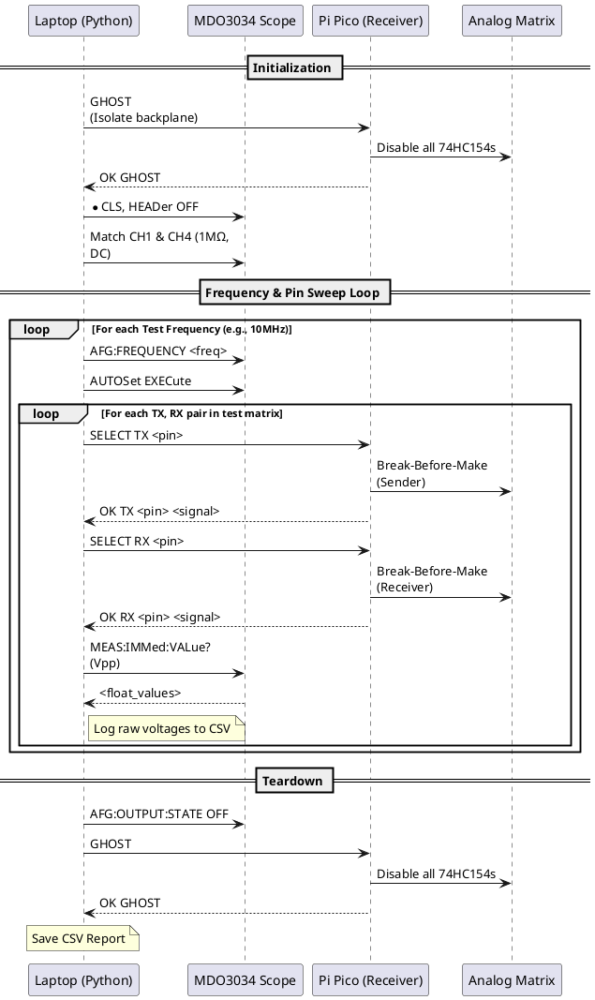

# Zx50 Bus Probe & Injector Card - Software Reference

## 1. Automated Backplane Characterization Protocol (Laptop Host Software)

To validate the electrical integrity, propagation delays, and crosstalk of the Zx50 backplane, the system utilizes an automated testing protocol orchestrated by a host laptop. This test requires two Zx50 Bus Probe cards: one configured as the Receiver (Master) and one as the Sender (Slave), connected via the 10-pin IDC ribbon cable.

### Host Environment & Setup
The host software is written in Python and is designed to run in an isolated virtual environment (`.venv`) to prevent dependency conflicts.
* **Hardware Connection:** The laptop connects to the Pi Pico via USB Serial (CDC) and to the oscilloscope via Ethernet LAN (PyVISA/SCPI).
* **Control Dependencies:** `pyserial` (for Pi Pico communication), `pyvisa`, and `pyvisa-py` (a pure-Python backend ideal for macOS/Linux LAN scope communication).
* **Data Science Dependencies:** `pandas`, `matplotlib`, `seaborn`, `numpy`, and `jupyter` (for post-sweep analysis).

### Tektronix SCPI Configuration & Quirks
To reliably automate the Tektronix MDO3034 scope, the PyVISA script (`scope_control.py`) implements several specific hardware configurations:
* **Header Suppression (`HEADer OFF`):** Tektronix scopes default to "chatty" mode, returning command headers with values (e.g., `:MEASUREMENT:IMMED:VALUE 4.24`). This command suppresses the header, allowing Python to directly parse the floating-point return values.
* **Impedance Matching (`CH1:IMPedance MEG`):** Scope channels must be explicitly forced to 1 MΩ DC coupling. If left at the default 75Ω internal termination, the scope forms a massive voltage divider against the AFG's 50Ω output and the backplane traces, falsely presenting extreme attenuation.
* **Dynamic Scaling (`AUTOSet EXECute`):** When sweeping across massive frequency ranges (e.g., 100 kHz to 10 MHz), the scope's mechanical relays and timebase must be reset. AutoSet ensures the waveforms are perfectly framed on-screen, preventing `NaN` (9.9E37) calculation errors from the internal measurement engine.
* **Execution Blocking (`*OPC?`):** The "Operation Complete" query is polled after changing measurement targets to safely block the Python script until the scope finishes its internal waveform math.

### Automated Sweep Execution Flow
The host script (`test_runner.py`) coordinates the physical test loop, utilizing a neighborhood matrix to measure both direct traces and adjacent pins.

### Data Analysis & Visualization (Jupyter Notebook)
Raw voltages (`CH1_Vpp`, `CH4_Vpp`) generated by `test_runner.py` are processed using a Jupyter Notebook (`backplane_analysis.ipynb`) in the host environment. The notebook dynamically splits the data to isolate two distinct RF characteristics:

1. **Signal Integrity (Where `TX_Pin == RX_Pin`):**
   * Computes high-frequency roll-off and attenuation.
   * Converts raw voltage drops into an industry-standard RF Gain metric using `numpy`: 
     `Gain (dB) = 20 * log10(CH4_Vpp / CH1_Vpp)`
   * Visualizes global phase shift and line-specific attenuation sweeps from 100 kHz up to 10 MHz.
2. **Crosstalk / Noise Coupling (Where `TX_Pin != RX_Pin`):**
   * Isolates rows where the scope is listening to a neighboring pin while the AFG drives the target pin.
   * Visualizes induced noise (`Vpp`) on adjacent traces to identify layout vulnerabilities where coupling might exceed the ~0.8V TTL logic-low threshold.

## 2. MicroPython Firmware Architecture (Pi Pico)

The Pi Pico orchestrates the routing of signals across both the local (Receiver) and remote (Sender) analog matrices. The firmware is written in MicroPython and is highly modular to allow for rapid updates during testing.

### Modular Codebase
* **`pin_map.py`**: A pure configuration file containing the hardware dictionaries. It maps the physical J1 Edge Connector integer pin numbers (critical for calculating physical trace adjacency) to their logical signal names, the specific `CD74HC4051E` multiplexer chip, and the channel index (0-7). It also maintains the Pico GPIO assignments for the local and remote control buses.
* **`display.py`**: A dedicated hardware driver for the `EA DIP205-4` LCD. It handles the SPI initialization, the hard-reset sequence on boot, and the specific 3-byte formatting required by the display's `RW1073` controller. It abstracts all formatting so the main loop can update the UI with a single function call.
* **`main.py`**: The execution core. It establishes a non-blocking serial loop using `select.poll()`, parsing ASCII commands from the laptop. It maintains state variables for the currently routed `TX` and `RX` signals, updating the LCD in real-time.

### Break-Before-Make Safety
To prevent catastrophic bus collisions, `main.py` enforces a strict hardware-level "break-before-make" sequence inside the `route_signal()` function:
1. **Break:** Forces the `74LS154` decoder address to `1111` (Address 15, the "Phantom Mux"), instantly dropping the Enable pins on all multiplexers to disable output.
2. **Select:** Manipulates the GPIO pins to set the S0, S1, and S2 channel selection bits while the matrix is safely dead.
3. **Make:** Writes the target 4-bit address to the decoder, enabling only the single requested multiplexer to bridge the path to the BNC connector.

### The Serial Control Protocol (USB CDC)
The laptop communicates with the Receiver's Pi Pico using a simple ASCII protocol:
* `GHOST\n` - Instantly disables the 74HC154 decoders on both cards, isolating all test equipment from the backplane. Returns `OK GHOST`.
* `SELECT TX <physical_pin>\n` - Routes the AFG signal from the Sender's BNC `IN` to the specified backplane pin. Returns `OK TX <pin> <signal>`.
* `SELECT RX <physical_pin>\n` - Routes the specified backplane pin to the Receiver's BNC `OUT`. Returns `OK RX <pin> <signal>`.
* `IDN?\n` - Identifies the firmware variant. Returns `OK Zx50_PROBE_REVA`.

## 3. Firmware Architecture (PIC18F4620 Z80 BIU)

The 18F4620 uses its onboard SPI to talk to the GPIO expanders and the UART to talk to the Pico. The intent is the 4620 has a simple command monitor and rarely needs flash updates. Running at 32MHz (via an 8MHz internal oscillator and 4x PLL), it provides strictly timed, cycle-accurate control over the Zx50 bus.

### The RPC Serial Protocol
The PIC acts as a slave to the Pi Pico via a 1 Mbps UART link. It continuously listens for a magic Sync Byte (`0x5A`) followed by a 4-byte payload: `[OPCODE] [ADDR_H] [ADDR_L] [PARAM]`. Supported operations include:
* `CMD_LD` (0x01) / `CMD_STORE` (0x02): Read/Write a single byte to memory.
* `CMD_IN` (0x03) / `CMD_OUT` (0x04): Read/Write to I/O ports.
* `CMD_LDIR` (0x05): High-speed block memory writes up to 255 bytes.
* `CMD_SNAPSHOT` (0x07): Passively captures the current state of the Address, Data, and Control buses.
* `CMD_GHOST` (0x08): Hardware isolation toggle.
* `CMD_STEP` (0x11): Issues a single manual clock pulse.

### Hardware Ghost Mode
To prevent bus contention when the PIC is not actively driving the bus, the system defaults to "Ghost Mode". In this state, the `74ABT245` bidirectional transceivers (`U6` and `U7`) are driven into a High-Z state by pulling their Output Enable (`~OE`) pins HIGH, safely isolating the PIC's local pins from the active Zx50 backplane.

### Exact Cycle Emulation
Unlike standard microcontrollers that just toggle pins arbitrarily, the PIC firmware meticulously emulates Z80 machine cycles.
* **Address Setup:** Uses the 8MHz hardware SPI bus to pre-load the 16-bit address into dual `MCP23S17` expanders.
* **T-State Sequencing:** The clock generation transitions from continuous PWM to manual bit-banging (`Z80_Clock_High()`, `Z80_Clock_Low()`), allowing the PIC to precisely orchestrate T1, T2, and T3 states.
* **Hardware WAIT:** During T2 and TW (Wait States), the PIC actively samples the external `Z80_WAIT` line, stalling its internal sequence just like real silicon until the external hardware is ready.

### Bus Snapshot
To analyze the state of the backplane at any given microsecond, the `CMD_SNAPSHOT` function temporarily opens the `74ABT245` transceivers in a "Listen Only" (A->B) direction. It pulls the 16-bit address from the SPI expanders, reads the Data and Control lines from its local PORT registers, immediately re-isolates the bus, and dispatches a 6-byte confirmation packet back to the Pico.
