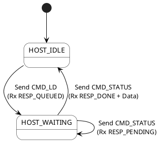
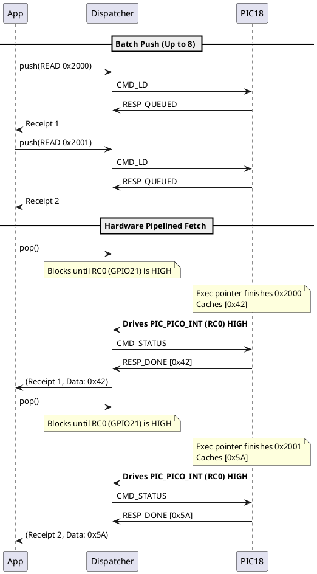

# Zx50 Bus Probe: Protocol Evolution & Queue Management

## 1. Architectural Overview & Evolution

The Zx50 Bus Probe architecture has evolved through several paradigms to handle the latency mismatch between the Pico's
USB/UART stack and the PIC18's real-time Z80 bus toggling.

1. **Legacy Synchronous (RPC):** The Pico sent a command and blocked until the PIC completed the full instruction cycle.
   This broke if the user manually stepped the clock, causing the Pico's UART to timeout.
2. **Current Mode (Depth-1 Async Polling):** The current implementation. The Pico submits a command, gets an immediate
   acknowledgment, and then repeatedly polls the PIC using `CMD_STATUS` to wait for completion.
3. **Target Mode (Decoupled 8-Slot Ring Buffer):** The planned redesign. The PIC will utilize its full 8-slot ring
   buffer, running independently. The Pico will rely on a physical hardware strobe (`PIC_PICO_INT`) to fetch batched
   results, acting as a high-speed DMA pipeline.

---

## 2. Protocol Definitions & Command Classes

The `Process_UART_Command` dispatcher categorizes 4-byte packets into four distinct behavioral classes.

### 2.1 Async Queued Commands
These commands attempt to insert an operation into the PIC's ring buffer.
* **Opcodes:** `CMD_LD (0x01)`, `CMD_STORE (0x02)`, `CMD_IN (0x03)`, `CMD_OUT (0x04)`
* **Response:** * `RESP_QUEUED (0x5C)` if successfully added to the queue.
  * `SYNC_NACK (0x5B)` if rejected (Queue is full).

### 2.2 Async Polling & Stepping
Used to manually advance the Z80 state machine or check the status of the `head` pointer.
* **Opcodes:** * `CMD_STATUS (0x15)`: Queries the queue. Returns `DONE` (and pops), `PENDING`, or `IDLE`.
  * `CMD_STEP (0x11)`: Uses the `param` byte to loop `CQ_Dispatch_Cycle()` N times. It intentionally falls through to `CMD_STATUS` to instantly report the resulting state.

### 2.3 Clock Controls
Instantly reconfigures the PIC's hardware timers and updates the `is_sync_clock_active` flag (which dictates if the physical AUX button is allowed to dispatch cycles).
* **Opcodes:** `CMD_CLK_AUTO (0x20)`, `CMD_CLK_SYNC (0x21)`, `CMD_CLK_OFF (0x22)`
* **Response:** `SYNC_OK (0x5A)`

### 2.4 Immediate Commands
Synchronous hardware overrides.
* **Opcodes:**
  * `CMD_GHOST (0x08)`: Toggles bus driving. Returns `SYNC_OK`.
  * `CMD_BOOT (0x14)`: Triggers reset sequence. Returns `SYNC_OK`.
  * `CMD_SNAPSHOT (0x07)`: Assumes UART control and returns a raw buffer of bus states.

---

## 3. Current Implementation: "Stop-and-Wait" (Depth-1)

In the current code, the PIC has a queue, but the Pico driver (`pic18_link.py` and `z80_async_bus.py`) artificially
restricts it to a depth of 1.

### 3.1 Command Opcodes & Responses

* **Opcodes:** `CMD_LD (0x01)`, `CMD_STORE (0x02)`, `CMD_IN (0x03)`, `CMD_OUT (0x04)`, `CMD_STATUS (0x15)`.
* **Responses:**
    * `RESP_QUEUED (0x5C)`: Command accepted.
    * `RESP_PENDING (0x5D)`: Command is actively executing T-states.
    * `RESP_DONE (0x5E)`: Command finished (popped from queue). Data follows if a Read.
    * `RESP_IDLE (0x5F)`: Queue is empty.

### 3.2 The Polling State Machine

The Pico submits a command, receives `RESP_QUEUED`, and enters a `HOST_WAITING` state where it spins in a polling loop,
sending `CMD_STATUS` until it receives `RESP_DONE`.

---

## 4. Target Redesign: The Decoupled 8-Slot Ring Buffer

To achieve high-speed memory sweeps (e.g., 1MB SRAM tests), the architecture will be refactored into a pipelined "
Sliding Window". The Pico will push up to 8 commands without waiting, and the PIC will execute them unstoppably.

### 4.1 The Hardware Strobe (`PIC_PICO_INT`)

A physical trace bridging PIC `RC0` to Pico `GPIO21` will replace UART polling.

* **Driven HIGH (Ready):** The PIC asserts this line whenever there is $\ge 1$ completed command waiting at the head of
  the buffer to be fetched.
* **Driven LOW (Busy/Empty):** The queue is empty, or the PIC is actively executing and no commands are finished.

### 4.2 The PIC Three-Pointer Queue

The PIC C-code will decouple execution from fetching by maintaining three pointers:

1. **`tail`:** UART inserts new commands here.
2. **`exec`:** The Z80 state machine independently runs the command here, caches the result in the slot, marks it
   `STAT_DONE`, and immediately advances to the next slot.
3. **`head`:** The oldest completed command. Only advances when the Pico explicitly asks for the data via `CMD_STATUS`.

### 4.3 The Pico 3-Tier Python Architecture

The Python host will be refactored to cleanly manage the pipeline.

1. **Layer 1: `pic18_link` (The Dumb Pipe)**
   Strictly non-blocking. It pushes formatted packets, reads the 1-byte immediate `RESP_QUEUED` ack, and exposes the
   `GPIO21` pin state. It enforces a strict ~50ms timeout for UART desyncs.
2. **Layer 2: `pic18_dispatch` (The FIFO Manager)**
   Maintains a local `in_flight` counter (0 to 8).
    * `push(cmd)`: Submits to the PIC. Returns a local "Receipt" dictionary. Blocks if queue is full.
    * `pop()`: Blocks until `GPIO21` goes HIGH (with an execution timeout). Sends `CMD_STATUS`, retrieves the payload,
      and returns `(Receipt, Data)`.
3. **Layer 3: Application (`z80_mem_test`)**
   Uses pipelining. Blasts 8 `push()` commands in a loop, followed by 8 `pop()` commands to retrieve the data rapidly.

### 4.4 Target Sequence: Pipelined Fetch

The Pico pushes a batch of reads, then immediately waits to pop them. `PIC_PICO_INT` signals exactly when the Pico
should fetch.

