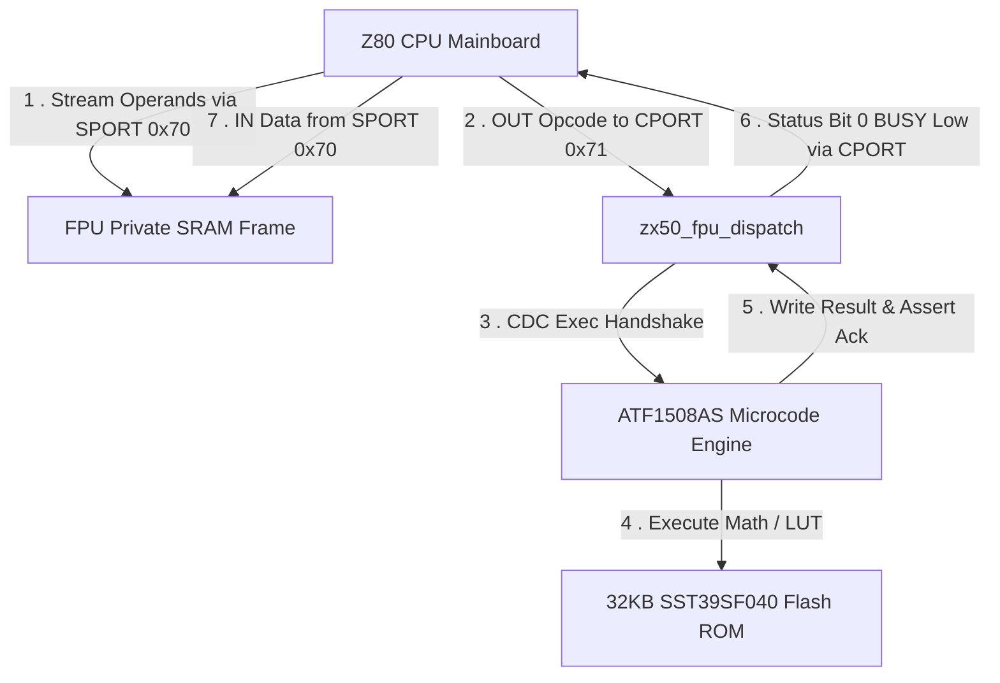

# PROGRAMMERS_GUIDE.md

# ZX50 FPU Coprocessor Programmers Guide

**Target System:** ZX50 Z80 Mainboard  
**Coprocessor Hardware:** ATF1508AS CPLD, C61Y256AL SRAM, SST39SF040 32KB Flash ROM  
**Port Definitions:**

* **`SPORT` (`0x70`):** Stack / Data Port (Read/Write)
* **`CPORT` (`0x71`):** Command / Status Port (Read/Write)

**Document Revision:** 2.4

---

## 1. Introduction

The ZX50 Floating-Point Unit (FPU) coprocessor provides hardware-accelerated integer, fixed-point, and transcendental
math to Z80 assembly programs. Operating on a high-speed coprocessor clock (20MHz / 40MHz) independent of the mainboard
Z80 clock (`ZCLK`), the FPU offloads multi-byte arithmetic, quarter-square multiplications, reciprocal divisions, square
roots, logarithms, exponentials, and trigonometric functions from the host Z80 CPU.

---

## 2. Data Types & Formats

The FPU uses an 8-bit composite Opcode byte where **Bits [7:4]** specify the Data Format and **Bits [3:0]** specify the
Mathematical Operation. Operands are stored in Little-Endian byte order in private SRAM (Least Significant Byte at the
lowest memory address).

### Format Field Decoding (`opcode[7:4]`)

| Format ID | Constant Name | Description           | Frame Size | Numerical Range / Precision                       |
|:----------|:--------------|:----------------------|:-----------|:--------------------------------------------------|
| **`0x0`** | `FMT_I16`     | 16-Bit Signed Integer | 2 Bytes    | $-32,768$ to $+32,767$                            |
| **`0x1`** | `FMT_I32`     | 32-Bit Signed Integer | 4 Bytes    | $-2,147,483,648$ to $+2,147,483,647$              |
| **`0x2`** | `FMT_I64`     | 64-Bit Signed Integer | 8 Bytes    | $-9.22 \times 10^{18}$ to $+9.22 \times 10^{18}$  |
| **`0x3`** | `FMT_FX1616`  | 16.16 Fixed-Point     | 4 Bytes    | $-32,768.0000$ to $+32,767.9999$ (Res: $1/65536$) |
| **`0x4`** | `FMT_DFLOAT`  | 64-Bit Double Float   | 8 Bytes    | IEEE-754 Double Precision                         |
| **`0x5`** | `FMT_CFLOAT`  | 32-Bit Complex Float  | 8 Bytes    | Real & Imaginary Pairs ($a + bi$)                 |
| **`0xE`** | `FMT_SPECIAL` | Custom Table Access   | Variable   | System Extensions & Direct Flash LUT              |
| **`0xF`** | `FMT_MGMT`    | Management Control    | N/A        | Stack Pointer & Hardware Reset                    |

---

## 3. Z80 Hardware & Memory Interface

Communication occurs via host I/O Ports `SPORT` (`0x70`) and `CPORT` (`0x71`) and private SRAM stack frames.



### 3.1 I/O Port Architecture

* **`SPORT` (`0x70` - Stack / Data Port):** Indirect data port used to stream operand bytes into and out of private SRAM
  stack frames.
* **`CPORT` (`0x71` - Command / Status Port):** Dual-purpose command/status interface.
    * **Write:** Sending an 8-bit Opcode to `CPORT` initiates command dispatch and triggers Clock Domain Crossing (CDC)
      execution.
    * **Read:** Reading `CPORT` returns coprocessor status flags:
        * **Bit 0 (`BUSY`):** `1` = FPU executing; `0` = Idle / Done.
        * **Bit 1 (`ZERO`):** Result is Zero.
        * **Bit 2 (`SIGN`):** Result is Negative.
        * **Bit 3 (`CARRY`):** Overflow / Carry Out.
        * **Bit 4 (`ERROR`):** Invalid Opcode or Division-by-Zero.

### 3.2 High-Speed Block Transfers (`OTIR` & `INIR`)

While single byte instructions (`OUT (SPORT), A` / `IN A, (SPORT)`) work well for simple routines, Z80 block I/O
instructions (`OTIR` and `INIR`) provide the fastest method for streaming multi-byte operands and results across the
bus.

* **`OTIR` (Block Output):** Streams $B$ bytes from main RAM at `(HL)` to `SPORT`, automatically incrementing `HL` and
  decrementing `B`.
* **`INIR` (Block Input):** Reads $B$ bytes from `SPORT` directly into main RAM at `(HL)`, automatically incrementing
  `HL` and decrementing `B`.

```z80
; Stream 4-byte operand from main RAM to SPORT using OTIR
LD   HL, OPERAND_BUF         ; Pointer to 4-byte Little-Endian operand
LD   BC, (4 << 8) | SPORT    ; B = 4 bytes, C = SPORT (0x70)
OTIR                         ; Stream 4 bytes to FPU SRAM stack

; Read 4-byte result from SPORT into main RAM using INIR
LD   HL, RESULT_BUF          ; Pointer to 4-byte destination buffer
LD   BC, (4 << 8) | SPORT    ; B = 4 bytes, C = SPORT (0x70)
INIR                         ; Read 4 bytes from FPU SRAM stack
```

### 3.3 SRAM Stack Frame Layout

Operands reside in private C61Y256AL SRAM relative to the active Stack Pointer (`SP`):

```text
SRAM Address    Operand Component       Description
-----------------------------------------------------------------
SP - 8          NOS Byte 0 (LSB)        Result LSB / Primary Operand LSB
SP - 7          NOS Byte 1              Result Byte 1
SP - 6          NOS Byte 2              Result Byte 2
SP - 5          NOS Byte 3 (MSB)        Result MSB / Primary Operand MSB
SP - 4          TOS Byte 0 (LSB)        Secondary Operand LSB
SP - 3          TOS Byte 1              Secondary Operand Byte 1
SP - 2          TOS Byte 2              Secondary Operand Byte 2
SP - 1          TOS Byte 3 (MSB)        Secondary Operand MSB
SP              Active Stack Pointer Base
```

---

## 4. Complete Opcode Matrix (`Format [7:4] | Operation [3:0]`)

An 8-bit command is constructed by combining a Format field with an Operation field (e.g., `0x30` = 16.16 Fixed Point
Addition):

### Operation Field Definitions (`opcode[3:0]`)

| Op ID     | Name         | Mnemonic       | Description                                                              |
|:----------|:-------------|:---------------|:-------------------------------------------------------------------------|
| **`0x0`** | `OP_ADD`     | Addition       | $\text{NOS} \leftarrow \text{NOS} + \text{TOS}$                          |
| **`0x1`** | `OP_SUB`     | Subtraction    | $\text{NOS} \leftarrow \text{NOS} - \text{TOS}$                          |
| **`0x2`** | `OP_MUL`     | Multiplication | $\text{NOS} \leftarrow \text{NOS} \times \text{TOS}$                     |
| **`0x3`** | `OP_DIV`     | Division       | $\text{NOS} \leftarrow \text{NOS} / \text{TOS}$                          |
| **`0x4`** | `OP_SQRT`    | Square Root    | $\text{NOS} \leftarrow \sqrt{\text{TOS}}$                                |
| **`0x5`** | `OP_CHS`     | Change Sign    | $\text{NOS} \leftarrow -\text{TOS}$                                      |
| **`0x6`** | `OP_SIN`     | Sine           | $\text{NOS} \leftarrow \sin(\text{TOS})$ via Flash LUT                   |
| **`0x7`** | `OP_COS`     | Cosine         | $\text{NOS} \leftarrow \cos(\text{TOS})$ via Flash LUT                   |
| **`0x8`** | `OP_EXP`     | Exponential    | $\text{NOS} \leftarrow e^{\text{TOS}}$ or $2^{\text{TOS}}$ via Flash LUT |
| **`0x9`** | `OP_LN`      | Natural Log    | $\text{NOS} \leftarrow \ln(\text{TOS})$ via Flash LUT                    |
| **`0xA`** | `OP_LOG10`   | Base-10 Log    | $\text{NOS} \leftarrow \log_{10}(\text{TOS})$ via Flash LUT              |
| **`0xB`** | `OP_LOG_MUL` | Log Multiply   | Fast log-domain multiplication                                           |
| **`0xC`** | `OP_LOG_DIV` | Log Divide     | Fast log-domain division                                                 |

---

## 5. Z80 Assembly Reference & Basic Examples

### Port Constant Equates

```z80
SPORT  EQU  0x70            ; Stack / Data Port
CPORT  EQU  0x71            ; Command / Status Port
```

---

### 5.1 System Management Opcodes (`Format 0xF`)

Management commands execute administrative stack and system tasks directly:

* **`0xF0` (`MGMT_CLR_STK`):** Resets Stack Pointer to base (`SP = 0x00`).
* **`0xF1` (`MGMT_POP_TOS`):** Drops active TOS frame by decrementing `SP` by 4 bytes.
* **`0xF2` (`MGMT_DUP_TOS`):** Duplicates 4-byte TOS frame in SRAM.
* **`0xFF` (`MGMT_RESET`):** Soft resets coprocessor registers and clears stack.

```z80
; =====================================================================
; FPU_WAIT_IDLE: Polls CPORT until Bit 0 (BUSY) clears
; =====================================================================
FPU_WAIT_IDLE:
    IN   A, (CPORT)          ; Read Status Register from CPORT
    BIT  0, A                ; Test BUSY bit
    JR   NZ, FPU_WAIT_IDLE   ; Loop if BUSY == 1
    RET

; Clear Stack Example
LD   A, 0xF0                 ; Opcode MGMT_CLR_STK
OUT  (CPORT), A              ; Issue Command to CPORT
CALL FPU_WAIT_IDLE
```

---

### 5.2 32-Bit Signed Integer Addition (`I32_ADD = 0x10`)

Performs 32-bit serial addition ($\text{NOS} \leftarrow \text{NOS} + \text{TOS}$). This example demonstrates streaming
the operands, executing the operation, polling status, and explicitly reading the full 32-bit calculation result back
into main RAM.

```z80
; Example: Add 500 (0x000001F4) and -200 (0xFFFFFF38)
; Target Memory: RESULT_BUF (4-byte RAM buffer for result)

; ---------------------------------------------------------------------
; Step 1: Stream NOS operand (500 = 0x000001F4) to SPORT (LSB first)
; ---------------------------------------------------------------------
LD   A, 0xF4 \ OUT (SPORT), A
LD   A, 0x01 \ OUT (SPORT), A
LD   A, 0x00 \ OUT (SPORT), A
LD   A, 0x00 \ OUT (SPORT), A

; ---------------------------------------------------------------------
; Step 2: Stream TOS operand (-200 = 0xFFFFFF38) to SPORT (LSB first)
; ---------------------------------------------------------------------
LD   A, 0x38 \ OUT (SPORT), A
LD   A, 0xFF \ OUT (SPORT), A
LD   A, 0xFF \ OUT (SPORT), A
LD   A, 0xFF \ OUT (SPORT), A

; ---------------------------------------------------------------------
; Step 3: Trigger 32-bit Integer Addition (FMT_I32 = 0x1, OP_ADD = 0x0) -> 0x10
; ---------------------------------------------------------------------
LD   A, 0x10
OUT  (CPORT), A
CALL FPU_WAIT_IDLE

; ---------------------------------------------------------------------
; Step 4: Read 32-bit Result (300 = 0x0000012C) back from SPORT into RAM
; ---------------------------------------------------------------------
LD   HL, RESULT_BUF          ; Point HL to main RAM destination buffer
IN   A, (SPORT)              ; Read LSB (0x2C)
LD   (HL), A \ INC HL
IN   A, (SPORT)              ; Read Byte 1 (0x01)
LD   (HL), A \ INC HL
IN   A, (SPORT)              ; Read Byte 2 (0x00)
LD   (HL), A \ INC HL
IN   A, (SPORT)              ; Read MSB (0x00)
LD   (HL), A
```

---

### 5.3 16.16 Fixed-Point Multiplication (`FX1616_MUL = 0x32`)

Performs $16.16$ fixed-point multiplication using Quarter-Square Flash LUTs.

```z80
; Example: 1.5 (0x00018000) * 2.0 (0x00020000) = 3.0 (0x00030000)

; 1. Stream 1.5 to NOS via SPORT
LD   A, 0x00 \ OUT (SPORT), A ; Fraction LSB
LD   A, 0x80 \ OUT (SPORT), A ; Fraction MSB
LD   A, 0x01 \ OUT (SPORT), A ; Integer LSB
LD   A, 0x00 \ OUT (SPORT), A ; Integer MSB

; 2. Stream 2.0 to TOS via SPORT
LD   A, 0x00 \ OUT (SPORT), A
LD   A, 0x00 \ OUT (SPORT), A
LD   A, 0x02 \ OUT (SPORT), A
LD   A, 0x00 \ OUT (SPORT), A

; 3. Trigger 16.16 Fixed Multiplication (FMT_FX1616 = 0x3, OP_MUL = 0x2) -> 0x32
LD   A, 0x32
OUT  (CPORT), A
CALL FPU_WAIT_IDLE

; Note: Result (3.0 = 0x00030000) is ready in NOS. Read back from SPORT or OTIR/INIR as shown in Sec 5.2 / 3.2.
```

---

### 5.4 16.16 Fixed-Point Division (`FX1616_DIV = 0x33`)

Performs two-pass reciprocal multiplication ($\text{NOS} / \text{TOS}$).

```z80
; Trigger 16.16 Fixed Division (FMT_FX1616 = 0x3, OP_DIV = 0x3) -> Opcode 0x33
LD   A, 0x33
OUT  (CPORT), A
CALL FPU_WAIT_IDLE

; Note: Result is ready in NOS. Read back from SPORT as shown in Sec 5.2 / 3.2.
```

---

### 5.5 Transcendental Natural Logarithm (`FX1616_LN = 0x39`)

Evaluates $\text{NOS} \leftarrow \ln (\text{TOS})$ using Flash ROM lookup tables.

```z80
; Trigger 16.16 Fixed Natural Log (FMT_FX1616 = 0x3, OP_LN = 0x9) -> Opcode 0x39
LD   A, 0x39
OUT  (CPORT), A
CALL FPU_WAIT_IDLE

; Note: Result is ready in NOS. Read back from SPORT as shown in Sec 5.2 / 3.2.
```

---

## 6. Chained Functions & Multi-Step Calculations

The key advantage of the FPU stack architecture is that intermediate calculation results remain on the coprocessor's
private SRAM stack. Programs can chain multiple mathematical operations without constantly streaming intermediate values
back and forth across the Z80 bus.

---

### 6.1 Computing the Hypotenuse of a Right Triangle ($c = \sqrt{a^2 + b^2}$)

Using 16.16 Fixed-Point format (`FMT_FX1616 = 0x3`), we
calculate $c = \sqrt{3.0^2 + 4.0^2} = 5.0$.  $$\text{Inputs: } a = 3.0 \text{ (`0x00030000`)}, \quad b = 4.0 \text{ (
`0x00040000`)} \implies \text{Expected } c = 5.0 \text{ (`0x00050000`)}$$

#### SRAM Stack Evolution View

```text
========================================================================================
FPU PRIVATE SRAM STACK TRANSITIONS: COMPUTING sqrt(3.0^2 + 4.0^2)
========================================================================================

[0. Initial State]          [1. Push 3.0 & 3.0]        [2. Execute FX1616_MUL]
+-----------------+        +-----------------+        +-----------------+
| (Empty Stack)   |        | TOS: 0x00030000 | (3.0)  |                 |
+-----------------+        +-----------------+        +-----------------+
|                 |        | NOS: 0x00030000 | (3.0)  | NOS: 0x00090000 | (a^2 = 9.0)
+-----------------+        +-----------------+        +-----------------+
SP = 0x00                  SP = 0x08                  SP = 0x04


[3. Push 4.0 & 4.0]        [4. Execute FX1616_MUL]    [5. Execute FX1616_ADD]
+-----------------+        +-----------------+        +-----------------+
| TOS: 0x00040000 | (4.0)  |                 |        |                 |
+-----------------+        +-----------------+        +-----------------+
| NOS: 0x00040000 | (4.0)  | TOS: 0x00100000 | (16.0) |                 |
+-----------------+        +-----------------+        +-----------------+
|      0x00090000 | (9.0)  | NOS: 0x00090000 | (9.0)  | NOS: 0x00190000 | (a^2+b^2 = 25.0)
+-----------------+        +-----------------+        +-----------------+
SP = 0x0C                  SP = 0x08                  SP = 0x04


[6. Execute FX1616_SQRT]   [7. INIR Read Result]
+-----------------+        +-----------------+
|                 |        | (Empty Stack)   |
+-----------------+        +-----------------+
| NOS: 0x00050000 | (5.0)  |                 |
+-----------------+        +-----------------+
SP = 0x04                  SP = 0x00
========================================================================================
```

#### Z80 Assembly Implementation

```z80
; =====================================================================
; COMPUTE_HYPOTENUSE: Calculates c = sqrt(a^2 + b^2)
; Inputs: a = 3.0, b = 4.0
; Output: Reads 32-bit Fixed-Point result (5.0) into RAM_HYPOT
; =====================================================================
COMPUTE_HYPOTENUSE:
    ; -----------------------------------------------------------------
    ; Step 1: Compute a^2 = 3.0 * 3.0
    ; Stream a (3.0) to NOS, then a (3.0) to TOS
    ; -----------------------------------------------------------------
    LD   A, 0x00 \ OUT (SPORT), A \ OUT (SPORT), A  ; Fraction LSB / MSB
    LD   A, 0x03 \ OUT (SPORT), A                   ; Integer LSB
    LD   A, 0x00 \ OUT (SPORT), A                   ; Integer MSB

    LD   A, 0x00 \ OUT (SPORT), A \ OUT (SPORT), A
    LD   A, 0x03 \ OUT (SPORT), A
    LD   A, 0x00 \ OUT (SPORT), A

    LD   A, 0x32                 ; FX1616_MUL (3.0 * 3.0)
    OUT  (CPORT), A
    CALL FPU_WAIT_IDLE           ; NOS now contains a^2 = 9.0 (0x00090000)

    ; -----------------------------------------------------------------
    ; Step 2: Compute b^2 = 4.0 * 4.0
    ; Stream b (4.0) to NOS, then b (4.0) to TOS
    ; -----------------------------------------------------------------
    LD   A, 0x00 \ OUT (SPORT), A \ OUT (SPORT), A
    LD   A, 0x04 \ OUT (SPORT), A
    LD   A, 0x00 \ OUT (SPORT), A

    LD   A, 0x00 \ OUT (SPORT), A \ OUT (SPORT), A
    LD   A, 0x04 \ OUT (SPORT), A
    LD   A, 0x00 \ OUT (SPORT), A

    LD   A, 0x32                 ; FX1616_MUL (4.0 * 4.0)
    OUT  (CPORT), A
    CALL FPU_WAIT_IDLE           ; NOS now contains b^2 = 16.0 (0x00100000)

    ; -----------------------------------------------------------------
    ; Step 3: Chain Addition (a^2 + b^2 = 9.0 + 16.0)
    ; Both a^2 and b^2 are already positioned on the FPU SRAM stack!
    ; -----------------------------------------------------------------
    LD   A, 0x30                 ; FX1616_ADD
    OUT  (CPORT), A
    CALL FPU_WAIT_IDLE           ; NOS now contains 25.0 (0x00190000)

    ; -----------------------------------------------------------------
    ; Step 4: Chain Square Root (sqrt(25.0))
    ; -----------------------------------------------------------------
    LD   A, 0x34                 ; FX1616_SQRT
    OUT  (CPORT), A
    CALL FPU_WAIT_IDLE           ; NOS now contains c = 5.0 (0x00050000)

    ; -----------------------------------------------------------------
    ; Step 5: Read Final Chained Result back to Z80 Main Memory using INIR
    ; -----------------------------------------------------------------
    LD   HL, RAM_HYPOT
    LD   BC, (4 << 8) | SPORT    ; 4 bytes from SPORT
    INIR
    RET
```

---

### 6.2 Computing the Volume of a Sphere ($V = \frac{4}{3} \pi r^3$)

Using 16.16 Fixed-Point format (`FMT_FX1616 = 0x3`), we evaluate the volume of a sphere with
radius $r = 3.0$.  $$\text{Fixed-Point Constants: } \pi \approx 3.14159 \text{ (
`0x0003243F`)}, \quad \frac{4}{3} \approx 1.33333 \text{ (`0x00015555`)}$$

$$\text{Calculation Chain: } r^2 = 3.0 \times 3.0 = 9.0 \longrightarrow r^3 = 9.0 \times 3.0 = 27.0 \longrightarrow \pi r^3 = 3.14159 \times 27.0 = 84.823 \longrightarrow V = \frac{4}{3} \times 84.823 = 113.097$$

```z80
; =====================================================================
; COMPUTE_SPHERE_VOLUME: Calculates V = (4/3) * pi * r^3
; Input:  r = 3.0 (0x00030000)
; Output: Reads 32-bit Fixed-Point result (~113.097 = 0x007118E3) into RAM_VOL
; =====================================================================
COMPUTE_SPHERE_VOLUME:
    ; -----------------------------------------------------------------
    ; Step 1: Compute r^2 = 3.0 * 3.0 = 9.0
    ; -----------------------------------------------------------------
    LD   HL, VAL_3_0
    LD   BC, (4 << 8) | SPORT \ OTIR    ; Push r (3.0) to NOS
    LD   HL, VAL_3_0
    LD   BC, (4 << 8) | SPORT \ OTIR    ; Push r (3.0) to TOS

    LD   A, 0x32                        ; FX1616_MUL
    OUT  (CPORT), A \ CALL FPU_WAIT_IDLE; NOS = 9.0 (r^2)

    ; -----------------------------------------------------------------
    ; Step 2: Compute r^3 = 9.0 * 3.0 = 27.0
    ; NOS already has 9.0. Push r (3.0) to TOS.
    ; -----------------------------------------------------------------
    LD   HL, VAL_3_0
    LD   BC, (4 << 8) | SPORT \ OTIR    ; Push r (3.0) to TOS

    LD   A, 0x32                        ; FX1616_MUL
    OUT  (CPORT), A \ CALL FPU_WAIT_IDLE; NOS = 27.0 (r^3)

    ; -----------------------------------------------------------------
    ; Step 3: Compute pi * r^3 = 3.14159 * 27.0
    ; NOS already has 27.0. Push pi (3.14159 = 0x0003243F) to TOS.
    ; -----------------------------------------------------------------
    LD   HL, VAL_PI
    LD   BC, (4 << 8) | SPORT \ OTIR    ; Push pi to TOS

    LD   A, 0x32                        ; FX1616_MUL
    OUT  (CPORT), A \ CALL FPU_WAIT_IDLE; NOS = 84.823 (pi * r^3)

    ; -----------------------------------------------------------------
    ; Step 4: Compute V = (4/3) * (pi * r^3) = 1.33333 * 84.823
    ; NOS already has 84.823. Push 4/3 (1.33333 = 0x00015555) to TOS.
    ; -----------------------------------------------------------------
    LD   HL, VAL_FOUR_THIRDS
    LD   BC, (4 << 8) | SPORT \ OTIR    ; Push 4/3 to TOS

    LD   A, 0x32                        ; FX1616_MUL
    OUT  (CPORT), A \ CALL FPU_WAIT_IDLE; NOS = 113.097 (Volume)

    ; -----------------------------------------------------------------
    ; Step 5: Read Volume Result into Z80 RAM using INIR
    ; -----------------------------------------------------------------
    LD   HL, RAM_VOL
    LD   BC, (4 << 8) | SPORT
    INIR
    RET

; Constant Buffers (16.16 Fixed-Point, Little-Endian)
VAL_3_0:          DB 0x00, 0x00, 0x03, 0x00  ; 3.0
VAL_PI:           DB 0x3F, 0x24, 0x03, 0x00  ; 3.14159
VAL_FOUR_THIRDS:  DB 0x55, 0x55, 0x01, 0x00  ; 1.33333
```

---

## 7. Accuracy & Resolution Summary

| Function          | Opcode Pattern           | Format          | Resolution / Error             |
|:------------------|:-------------------------|:----------------|:-------------------------------|
| **`ADD` / `SUB`** | `0x10` / `0x30` / `0x31` | `I32`, `FX1616` | $0.00\%$ Exact                 |
| **`MUL`**         | `0x12` / `0x32`          | `I32`, `FX1616` | $0.00\%$ Exact Quarter-Square  |
| **`DIV`**         | `0x13` / `0x33`          | `I32`, `FX1616` | $0.00\%$ 2-Pass Reciprocal     |
| **`SQRT`**        | `0x34`                   | `FX1616`        | $\le 0.024\%$ Table Seed       |
| **`SIN` / `COS`** | `0x36` / `0x37`          | `FX1616`        | $\le 0.15\%$ Interpolated LUT  |
| **`EXP` / `LN`**  | `0x38` / `0x39`          | `FX1616`        | $\le 0.39\%$ 1 LSB Fixed-Point |
| **`LOG_MUL`**     | `0x3B`                   | `FX1616`        | $\le 0.48\%$ Fast Log-Domain   |