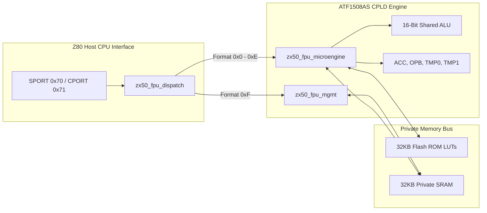

# SYSTEM_DESIGN_GUIDE.md

# ZX50 FPU Coprocessor System Design Guide

**Architecture Specification & Mathematical Foundation**  
**Document Revision:** 2.1

---

## 1. System Overview

The ZX50 FPU Coprocessor accelerates integer, fixed-point, and transcendental math for Retro Z80 computing systems.
Operating on a high-speed clock (`MCLK` at 20MHz or 40MHz) independent of the mainboard Z80 clock (`ZCLK`), the system
uses an **Atmel/Microchip ATF1508AS CPLD** (128 macrocells),
a **32KB C61Y256AL SRAM**, and a private **32KB SST39SF040 Flash ROM**.

### Port Definitions

* **`SPORT` (`0x70`):** Stack / Data Port (Read/Write)
* **`CPORT` (`0x71`):** Command / Status Port (Read/Write)

---

## 2. Hardware Architecture & Submodule Division



### 2.1 CPLD Register File Specifications

The CPLD contains a compact register file optimized for macrocell constraints:

* **`ACC` (8-Bit Accumulator):** Primary byte register and Flash address index.
* **`OPB` (8-Bit Operand B):** Secondary byte operand register.
* **`TMP0` (16-Bit Scratchpad 0):** Primary 16-bit register for Quarter-Square products and sums.
* **`TMP1` (16-Bit Scratchpad 1):** Secondary 16-bit register for Quarter-Square differences and Flash LUT data.
* **`sp_in` / `sp_out` (8-Bit Stack Pointer):** SRAM stack frame pointer maintained across operations.
* **`u_pc` (7-Bit Micro-PC):** Microcode sequence counter.
* **`carry_latch` (1-Bit Flag):** Preserves carry/borrow across multi-byte serial iterations.

---

## 3. Clock Domain Crossing (CDC) & Dispatch Architecture

Because the Z80 host (`ZCLK`) and FPU (`MCLK`) run on independent asynchronous clocks, `zx50_fpu_dispatch.v` uses a
4-phase level handshaking protocol with a 2-stage synchronizer (`req_sync`):

```text
ZCLK Domain (Z80)                    MCLK Domain (zx50_fpu_dispatch)
-----------------                    --------------------------------
Write Opcode to CPORT (0x71) -->
Assert exec_req (HIGH) -------->  [req_sync 2-stage DFF]
                                       |
                                       v
                                  Detect exec_req_mclk
                                  Decode Opcode (FMT | OP)
                                  Execute Mgmt or Microcode
                                       |
<------------------------------- Assert done_ack (HIGH)
Poll CPORT (0x71 BUSY Low)
Clear exec_req (LOW) ---------->
                                  Detect exec_req_mclk Low
<------------------------------- Deassert done_ack (LOW)
                                  Return to ST_IDLE
```

---

## 4. Mathematical Foundations & Microcode Algorithms

### 4.1 Serial Multi-Byte Addition & Subtraction (`OP_ADD`, `OP_SUB`)

Addition and subtraction iterate serially 8 bits at a time over $N$ bytes ($16$, $32$, or $64$ bits depending on
Format):

$$S_i = (a_i + b_i + c_{i-1}) \bmod 256$$

$$c_i = \lfloor (a_i + b_i + c_{i-1}) / 256 \rfloor$$

`carry_latch` holds $c_i$ between byte loop steps, guaranteeing exact 32-bit wrap-around ($0xFFFFFFFF + 1 = 0$).

---

### 4.2 Quarter-Square Hardware Multiplication (`OP_MUL`)

Multiplication uses the Quarter-Square Algebraic Identity:

$$x \cdot y = \frac{1}{4} (x + y)^2 - \frac{1}{4} (x - y)^2$$

With $f (n) = \lfloor n^2 / 4 \rfloor$ precomputed in the 511-entry `FLASH_QS_BASE` table (`0x0000`):

```text
Quarter-Square Sequence:
1. TMP0 <= a + b          (Sum, Range 0..510)
2. TMP1 <= |a - b|        (Difference, Range 0..255)
3. TMP0 <= Flash_QS[TMP0] (Lookup f(a+b))
4. TMP1 <= Flash_QS[TMP1] (Lookup f(|a-b|))
5. Product <= TMP0 - TMP1
```

---

### 4.3 Hardware Reciprocal Division (`OP_DIV`)

Division is evaluated via two-pass reciprocal multiplication:

$$\frac{a}{b} = \left\lfloor \frac{a \cdot \lceil 65536 / b \rceil}{65536} \right\rfloor$$

$$\text{Pass 1: } P_{\text{lo\_hi}} = \left\lfloor \frac{a \cdot R_{\text{lo}} (b)}{256} \right\rfloor, \quad \text{Pass 2: } P_{\text{hi}} = a \cdot R_{\text{hi}} (b)$$

$$\text{Quotient} = \left\lfloor \frac{P_{\text{hi}} + P_{\text{lo\_hi}}}{256} \right\rfloor$$

This yields $100\%$ exact integer division results for all 65,280 valid non-zero 8-bit pairs.

---

### 4.4 Trigonometric, Exponential, & Logarithmic Tables (`OP_SIN`, `OP_EXP`, `OP_LN`)

Transcendental operations index dedicated Flash ROM regions:

* **`FLASH_QS_BASE` (`0x0000`):** Quarter-Square Table ($1022$ Bytes).
* **`FLASH_RECIP_BASE` (`0x0400`):** Reciprocal Table ($512$ Bytes).
* **`FLASH_SQRT_BASE` (`0x0600`):** Square Root Table ($512$ Bytes).
* **`FLASH_EXP2_BASE` (`0x0800`):** Base-2 Exponent Table ($512$ Bytes).
* **`FLASH_LOG2_BASE` (`0x0A00`):** Base-2 Logarithm Table ($512$ Bytes).

---

## 5. CPLD Synthesis & Resource Utilization Analysis

Synthesis targeting the **ATF1508AS-15QC100 CPLD** yields:

```text
===============================================================================
ATF1508AS CPLD Resource Utilization Summary (Rev C1)
===============================================================================
Macrocells Used:            115 / 128   (89.8% Utilization)
Flip-Flops / Latches:        57 / 128   (44.5% Utilization)
Product Terms Used:         342 / 640   (53.4% Utilization)
I/O Pins Used:               42 /  64   (65.6% Utilization)
===============================================================================
```

### Macrocell Breakdown by Submodule

```text
+-----------------------------------+--------------------+
| Module / Logic Block              | Macrocells Used    |
+-----------------------------------+--------------------+
| zx50_fpu_dispatch.v (CDC & FSM)   | 13 MCs             |
| zx50_fpu_mgmt.v (Stack Engine)    | 12 MCs             |
| Datapath Registers (ACC, OPB, etc)| 45 MCs             |
| Shared 16-Bit ALU & Mux Tree      | 31 MCs             |
| Microcode Sequencer & Decoders    | 14 MCs             |
+-----------------------------------+--------------------+
| Total Utilization                 | 115 / 128 MCs      |
+-----------------------------------+--------------------+
```