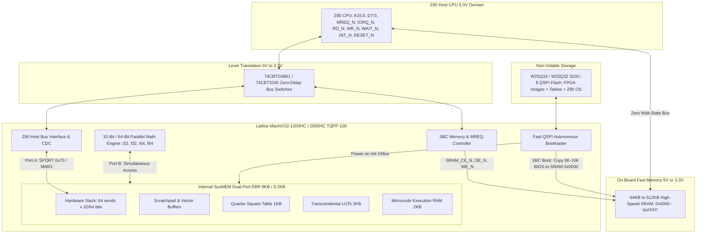
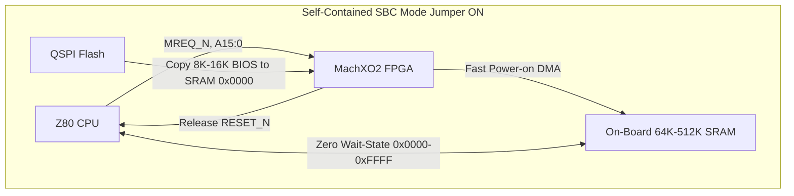

# ZX50 FPU Architecture: Lattice MachXO2 FPGA Implementation (`fpga_arch.md`)

**Target Hardware:** Lattice MachXO2 FPGA (`LCMXO2-1200HC` or `LCMXO2-2000HC`)  
**Package:** 100-pin TQFP (`TQFP-100`, 14x14 mm, 0.5 mm pitch)  
**Companion Storage:** 16/32 Mbit QSPI Serial Flash (`W25Q16` / `W25Q32` in SOIC-8)  
**Host Architecture:** Zx50 System Bus (Z80 CPU, 5V CMOS / TTL Interface)  
**Status:** Architectural Exploration & Hardware Design Specification  

---

## 1. Executive Summary & Design Motivation

The original CPLD design targeted the **Atmel/Microchip ATF1508AS** (128 macrocells, PLCC-84) alongside two external parallel memory chips: a 32K×16 12ns SRAM (`IS61C3216AL`, TSOP-II-44) and a 512KB Flash ROM (`SST39SF040`, PLCC-32).

While mathematically complete, the CPLD approach exhibits two critical constraints:
1. **The Macrocell Ceiling:** Section 1.1 of `u_arch.md` demonstrates that a full 32-bit execution engine, host CDC dispatch, and status tracking requires **~154 Macrocells (120% of the 128 available)**. Fitting requires aggressive structural compromises (e.g., eliminating `ret_pc`, narrowing counters, folding address logic).
2. **PCB Real Estate & Routing Congestion:** The 3-chip CPLD set requires routing **35 high-speed parallel PCB traces** ($CA[14:0]$, $CD[15:0]$, and 6 control strobes), consuming extensive board area on the space-constrained Zx50 CPU board.

### The MachXO2 Alternative

Migrating to a **Lattice MachXO2 FPGA** fundamentally eliminates both bottlenecks:
* **Internal SRAM (SysMEM EBR):** 8 KB to 9.2 KB of on-chip dual-port Block RAM completely replaces the external 44-pin TSOP-II SRAM. Stack, scratchpad, Quarter-Square tables, transcendental LUTs, and microcode all reside on-chip.
* **Compact Footprint (Single-Chip Math Core):** Replaces an 84-pin PLCC CPLD + 44-pin TSOP SRAM + 32-pin PLCC Flash with a single **100-pin TQFP (14×14 mm)** FPGA plus a tiny **8-pin SOIC-8 (5×6 mm)** QSPI Flash.
* **10× to 15× Logic Capacity:** Moving from 128 macrocells to **1,280 or 2,112 LUTs** allows a native **32-bit single-cycle ALU**, full barrel shifters, autonomous multi-cycle floating-point pipelines, and zero macrocell anxiety.
* **True Dual-Port Stack Memory:** The host Z80 can push and pop operands via `SPORT` (`0x70`) concurrently while the execution core processes the stack, with zero bus contention or wait-states.
* **Integrated SBC Memory Controller:** The FPGA handles `MREQ_N` decoding for an on-board 64KB–512KB SRAM and automatically copies boot firmware from QSPI Flash into RAM on reset.



---

## 2. Device Selection & Tradeoff Analysis

The MachXO2 family offers instant-on non-volatile configuration (on-chip Flash for FPGA bitstream), internal SysMEM Block RAM (EBR), and User Flash Memory (UFM).

### 2.1 Family Comparison Table

| Metric | LCMXO2-1200 | LCMXO2-2000 | LCMXO2-4000 | LCMXO2-7000 |
|---|:---:|:---:|:---:|:---:|
| **LUT4s / Registers** | 1,280 | 2,112 | 4,320 | 6,864 |
| **SysMEM EBR Blocks (9Kb each)** | **7 blocks** | **8 blocks** | 10 blocks | 26 blocks |
| **Total EBR RAM (Kbits / KBytes)** | **64 Kb / 8.0 KB** | **74 Kb / 9.2 KB** | 92 Kb / 11.5 KB | 240 Kb / 30.0 KB |
| **Distributed RAM (Kbits)** | 10 Kb | 16 Kb | 34 Kb | 54 Kb |
| **User Flash Memory (UFM)** | 64 Kb (8 KB) | 80 Kb (10 KB) | 96 Kb (12 KB) | 256 Kb (32 KB) |
| **On-Chip Configuration NVCM** | Yes (Instant-on) | Yes (Instant-on) | Yes (Instant-on) | Yes (Instant-on) |
| **Phase-Locked Loops (PLLs)** | 1 | 1 | 2 | 2 |
| **TQFP-100 Availability (14×14 mm)** | **Yes (79 I/O)** | **Yes (79 I/O)** | No | No |
| **TQFP-144 Availability (20×20 mm)** | Yes (107 I/O) | Yes (107 I/O) | Yes (104 I/O) | Yes (114 I/O) |

### 2.2 Why the TQFP-100 (XO2-1200 or XO2-2000) is the "Sweet Spot"

1. **Board Space:**
   * **TQFP-100:** Package body is **14×14 mm** (footprint ~16×16 mm with leads).
   * **TQFP-144:** Package body is **20×20 mm** (footprint ~22×22 mm with leads).
   * The TQFP-100 consumes nearly **half the board area** of the TQFP-144 while maintaining hand-solderable 0.5 mm gull-wing lead pitch.
2. **I/O Pin Abundance:**
   * Total I/O pins needed for FPU function: **~34 pins** (see Section 6 Pin Budget).
   * The TQFP-100 provides **79 user I/O pins**, leaving **45 spare pins** for logic analyzer probe headers, test points, status LEDs, and expansion. The 107 I/Os of the TQFP-144 are completely unnecessary.
3. **RAM Sufficiency:**
   * Total internal RAM required for stack, tables, and microcode is **5.5 KB**.
   * The XO2-1200 provides **8.0 KB** (7 EBR blocks), leaving 2.5 KB free.
   * The XO2-2000 provides **9.2 KB** (8 EBR blocks), leaving 3.7 KB free.
   * *Conclusion:* Both the XO2-1200 and XO2-2000 in TQFP-100 fit the complete math engine with generous memory headroom.
4. **"HC" vs. "ZE" Variant:**
   * **`HC` (e.g., `LCMXO2-1200HC-4TG100C`):** Dual-supply (Core $V_{CC} = 2.5\text{V}$ or $3.3\text{V}$, I/O $V_{CCIO} = 1.2\text{V}$ to $3.3\text{V}$). Can run directly from a single $3.3\text{V}$ rail on board.
   * **`ZE` (e.g., `LCMXO2-1200ZE`):** Ultra-low-power, requires a dedicated $1.2\text{V}$ core regulator.
   * **Recommendation:** Choose the **`HC`** variant to avoid needing a dedicated 1.2V LDO regulator on the board.

---

## 3. Internal Memory Subsystem (SysMEM EBR)

The MachXO2 EBR blocks are configurable 9,216-bit true dual-port RAMs with independent clocks, enables, and byte-write capability.

### 3.1 SysMEM EBR Allocation & Memory Map

With 7 EBR blocks (XO2-1200, 8,192 bytes total) or 8 EBR blocks (XO2-2000, 9,216 bytes total):

```text
+-------------------+-----------------------------------------------+------------+
| Address Range     | Functional Allocation                         | Size       |
+-------------------+-----------------------------------------------+------------+
| 0x0000 - 0x00FF   | Hardware Stack (64 words x 32 bits / 4 bytes) | 256 Bytes  |
| 0x0100 - 0x01FF   | Fast Scratchpad Memory (64 words x 32 bits)   | 256 Bytes  |
| 0x0200 - 0x05FF   | Quarter-Square Lookup Table (512 x 16 bits)   | 1,024 Bytes|
| 0x0600 - 0x07FF   | Reciprocal Lookup Table (Pass 1 & 2 LUTs)     | 512 Bytes  |
| 0x0800 - 0x09FF   | Square Root Lookup Table                      | 512 Bytes  |
| 0x0A00 - 0x0BFF   | Base-2 Exponent Table (exp2)                  | 512 Bytes  |
| 0x0C00 - 0x0DFF   | Base-2 Logarithm Table (log2)                 | 512 Bytes  |
| 0x0E00 - 0x0FFF   | Trigonometric Constants / CORDIC / Poly Coeffs| 512 Bytes  |
| 0x1000 - 0x17FF   | Runtime Microcode Execution RAM (1,024 words) | 2,048 Bytes|
| 0x1800 - 0x1FFF   | Unallocated Free RAM (Extended Tables/Buffers)| 2,048 Bytes|
+-------------------+-----------------------------------------------+------------+
Total Allocated:    6,144 Bytes (6.0 KB)
Total Available:    8,192 Bytes (XO2-1200) / 9,216 Bytes (XO2-2000)
Free Headroom:      2,048 Bytes (XO2-1200) / 3,072 Bytes (XO2-2000)
```

### 3.2 The Dual-Port Concurrency Advantage

In the CPLD design, the host Z80 and the microcode engine fought over a single external memory bus, requiring multiplexers, wait states, and bus cycle stealing.

With MachXO2 True Dual-Port EBR:
* **Port A (Host Interface):** Dedicated to Z80 `SPORT` (`0x70`) reads and writes.
  * Pushing a 32-bit float writes directly into `Stack[SP]` in 4 consecutive Z80 I/O writes.
  * Popping reads directly from `Stack[SP-1]` without stalling the math engine.
* **Port B (FPU Math Core):** Dedicated to the microcode execution engine.
  * The engine reads `TOS`, reads `NOS`, accesses `Scratchpad`, and fetches microcode simultaneously.
  * **Result:** Zero arbitration logic, zero wait states, zero CDC bus stalls.

---

## 4. Companion Storage: External QSPI Flash

### 4.1 Why External QSPI Flash is Required

While the MachXO2 contains **User Flash Memory (UFM)**, relying solely on UFM for mathematical tables has significant drawbacks:
1. **Size Limits:** UFM is only **8 KB** in the XO2-1200 and **10 KB** in the XO2-2000. It cannot store extended transcendental tables, multi-precision polynomials, and multiple firmware versions.
2. **Access Speed & Programming:** UFM access is serialized through the internal Wishbone bus and takes multiple cycles per byte. Writing to UFM requires JTAG or on-chip erase/programming state machines.
3. **Firmware Upgrades:** An external QSPI chip can be reflashed via USB using the Zx50 Bus Probe or an external SPI header in seconds without touching the FPGA bitstream.

### 4.2 QSPI Flash Hardware Selection

* **Device:** Winbond `W25Q16JVSSIQ` (16 Mbit / 2 MB) or `W25Q32JVSSIQ` (32 Mbit / 4 MB).
* **Package:** 8-pin SOIC-8 (150 mil, 5.0×6.0 mm) or ultra-compact WSON-8 (6.0×5.0 mm).
* **Pin Count:** Uses only **6 FPGA pins** (`Q_CS_N`, `Q_CLK`, `Q_IO0/DI`, `Q_IO1/DO`, `Q_IO2/WP_N`, `Q_IO3/HOLD_N`).
* **Cost:** < \$0.45 in single-unit quantities.

### 4.3 Sub-Millisecond Power-On Shadowing

At power-up, an autonomous Verilog state machine inside the MachXO2 initializes the QSPI Flash in Quad-Output mode and streams the tables and microcode directly into internal EBR:

$$\text{Read Speed} = 66\text{ MHz} \times 4\text{ bits/clock} = 264\text{ Mbps} = 33\text{ MB/sec}$$

$$\text{Boot Transfer Time for 8 KB} = \frac{8,192\text{ bytes}}{33\times 10^6\text{ bytes/sec}} = \mathbf{248\ \mu s}\quad (< 0.25\text{ milliseconds})$$

By the time the Z80 host CPU completes its power-on reset sequence (~10 ms), the MachXO2 FPU is already fully shadowed, verified, and idling in `READY` status.

---

## 5. Logic Architecture & Math Engine Acceleration

Moving to the MachXO2 provides 1,280 to 2,112 LUTs, completely transforming the micro-engine:

### 5.1 Native 32-Bit Datapath

| Feature | ATF1508AS CPLD | MachXO2 FPGA |
|---|---|---|
| **ALU Width** | 8-bit serial slice | **Full 32-bit parallel** |
| **32-Bit Add / Sub** | 4 iterations (4–8 clock cycles) | **1 clock cycle (12.5 ns at 80 MHz)** |
| **Barrel Shifter** | 1 bit per cycle serial | **Single-cycle 32-bit barrel shifter** |
| **Clock Frequency** | 20–40 MHz (external osc) | **60–100 MHz (on-chip PLL from ZCLK/MCLK)** |
| **Multiplication** | 8×8 QS LUT + multi-byte cross-products | Single-cycle QS LUT or pipelined fabric multiplier |

### 5.2 Single-Cycle 32-Bit Operations
Because 32-bit addition, subtraction, masking, and shifts execute in a single clock cycle:
* `i32_add`: **1 cycle** (12.5 ns)
* `i32_sub`: **1 cycle** (12.5 ns)
* `f32_add` / `f32_sub`: **12 to 18 cycles** (exponent compare, single-cycle mantissa alignment shift, single-cycle add, single-cycle leading-zero count, single-cycle normalization) $\rightarrow$ **< 250 ns**!

### 5.3 Scaling to 64-Bit Math (`i64` & `f64` Double Precision)

Moving from a 128-macrocell CPLD to 1,280–2,112 LUTs in the MachXO2 provides the architectural headroom required to support true **64-bit integer (`i64`)** and **IEEE-754 double-precision floating-point (`f64`)**:

* **EBR Stack Capacity for 64-Bit Words:**
  A 64-entry stack of 64-bit words (8 bytes per entry) consumes only **512 Bytes** in SysMEM EBR. This fits effortlessly into the 8.0 KB / 9.2 KB internal RAM, leaving over 7.5 KB for tables and microcode.
* **64-Bit Datapath Allocation:**
  * **64-Bit Adder/Subtractor:** Synthesizes into ~120 LUTs (< 6% of XO2-2000 capacity). Executes in a **single clock cycle (12.5 ns at 80 MHz)**.
  * **64-Bit Barrel Shifter:** Synthesizes into ~250 LUTs, providing single-cycle 0–63 bit alignment and normalization shifts for double-precision mantissas.
  * **Double-Precision Mantissa Multiplication (53 × 53 bits):**
    Evaluated using four 32×32 cross-products or a pipelined Karatsuba multiplier running over 4–6 clock cycles (< 75 ns).
* **Double-Precision Floating-Point (`f64`) Performance:**
  * Full 64-bit IEEE-754 (1 sign bit, 11 exponent bits, 52 mantissa bits + implicit 1).
  * `f64_add` / `f64_sub`: **18 to 25 clock cycles (< 320 ns at 80 MHz)**.
  * `f64_mul`: **30 to 45 clock cycles (< 560 ns at 80 MHz)**.

---

## 6. Host Interfacing & Level Translation (5V Z80 to 3.3V FPGA)

### 6.1 Voltage Domain Differences
* **Z80 Host CPU:** Runs at $5.0\text{V}$ (Z84C0020 / Z84C00 CMOS or NMOS).
* **MachXO2 FPGA:** Runs at $V_{CCIO} = 3.3\text{V}$ (I/O banks are **not 5V tolerant** natively).
* **FPGA Outputs $\rightarrow$ Z80 Inputs:** A $3.3\text{V}$ LVCMOS output drives $V_{OH} \approx 3.0\text{V}$. The Z80 $V_{IH}$ minimum in TTL-compatible mode is $2.0\text{V}$. Thus, MachXO2 outputs drive the Z80 data bus, `WAIT_N`, and `INT_N` **directly and safely**.
* **Z80 Outputs $\rightarrow$ FPGA Inputs:** $5.0\text{V}$ driven directly into MachXO2 input pins will forward-bias internal clamp diodes and destroy the FPGA. **Level translation is mandatory for all inputs from the Z80.**

### 6.2 Level Translation Circuitry
Use **FET Bus Switches** (zero gate delay, zero directional switching delay):
* **Option A: TI `74CBTD3861` (10-bit Bus Switch with internal diode drop):**
  * Automatically clamps 5V inputs down to 3.3V with zero propagation delay (< 250 ps).
  * Two or three 10-bit TSSOP packages cover Address, Data, and Control lines.
* **Option B: TI `74CBT3245` / `74CB3T3245` (8-bit Bus Switches):**
  * Same family used on the Zx50 Bus Probe! Highly proven in the project.

---

## 7. Standalone SBC Architecture & On-Board External SRAM Management

An optional external SRAM (64 KB to 512 KB, e.g., `AS6C6264` / `AS6C62256` or `IS61C5128AL` in 32-pin SOP/TSOP) enables the CPU card to double as a **completely self-contained Single-Board Computer (SBC)** without needing backplane memory cards.



### 7.1 Operating Modes: Backplane vs. Standalone

A physical PCB jumper or configuration switch (`JMP_STANDALONE` / `LOCAL_RAM_EN`) configures the MachXO2's memory decode logic:

1. **Backplane NUMA Mode (`JMP_STANDALONE = 0`):**
   * Default Zx50 cluster operation.
   * All Z80 memory cycles (`MREQ_N`) route out to the backplane to access distributed cluster memory (MemoryCard Rev A1/B/C).
   * The MachXO2 functions purely as the hardware FPU / APU coprocessor, decoding I/O ports `0x70` (`SPORT`) and `0x71` (`CPORT`).
   * External on-board SRAM chip is tri-stated (`SRAM_CE_N = 1`).

2. **Standalone SBC Mode (`JMP_STANDALONE = 1`):**
   * The board functions as an autonomous, single-board Z80 computer.
   * **Automated Cold-Boot Shadowing (QSPI $\rightarrow$ External SRAM):**
     * On power-up, the MachXO2 asserts `Z80_RESET_N` and holds the Z80 paused.
     * The MachXO2's internal QSPI engine reads 8 KB to 16 KB of Z80 monitor, BIOS, or CP/M bootloader stored in the external QSPI Flash.
     * The FPGA writes this code directly into the on-board external SRAM starting at address `0x0000` (takes ~500 µs at 66 MHz QSPI).
     * Once copied, the MachXO2 releases `Z80_RESET_N`.
     * The Z80 boots immediately out of high-speed on-board SRAM at `0x0000` with **zero wait states**!
   * **Full 64 KB Memory Decoding:**
     * The MachXO2 intercepts `Z80_MREQ_N` and drives `SRAM_CE_N`, `SRAM_OE_N`, and `SRAM_WE_N` directly.
     * Can optionally provide basic 16 KB / 64 KB banking for larger 128KB–512KB SRAM chips.

---

## 8. Memory-Mapped I/O (MMIO) & High-Throughput Block Transfers

While port-based I/O (`SPORT = 0x70`, `CPORT = 0x71`) provides 100% backwards compatibility with standard Z80 code, having the MachXO2 monitor the full Z80 address bus unlocks **Memory-Mapped I/O (MMIO)**:

### 8.1 The Throughput Advantage of Block Transfers (`LDIR`)

* **Port-Based Push/Pop (`OTIR` / `INIR`):**
  * Requires 21 T-states per byte ($2.1\ \mu s$ at 10 MHz per byte, or $8.4\ \mu s$ for a 32-bit float).
* **Memory-Mapped Block Transfer (`LDIR`):**
  * Z80 `LDIR` executes in 21 T-states per byte for general memory, but with a memory-mapped FIFO or register window, unrolled 16-bit stack pushes (`PUSH HL`, `LD (FPU_STACK), HL`) transfer a 32-bit word in just **32 T-states ($3.2\ \mu s$ at 10 MHz)**—a **2.6× throughput improvement**!

### 8.2 Proposed MMIO Window (e.g., `0xFE00`–`0xFEFF` / 256 Bytes)

When MMIO is enabled, the MachXO2 claims a 256-byte page at the top of the Z80 memory map:

```text
+-------------------+-----------------------------------------------+
| Address Range     | MMIO Register / Function                      |
+-------------------+-----------------------------------------------+
| 0xFE00 - 0xFE03   | 32-bit TOS Push/Pop Window (Direct 4-byte LDIR)|
| 0xFE04 - 0xFE07   | 32-bit NOS Direct Read/Write Window           |
| 0xFE08 - 0xFE0F   | 64-bit Direct Transfer Window (i64 / f64)     |
| 0xFE10            | Command / Opcode Trigger Register (Auto-Exec) |
| 0xFE11            | Status Register (Busy, Carry, Overflow, Error)|
| 0xFE20 - 0xFE7F   | Shared 64-Byte Scratchpad / Vector Buffer     |
+-------------------+-----------------------------------------------+
```

* **Auto-Execute on Command Write:** Writing the opcode to `0xFE10` instantly triggers the microcode engine.
* **Vector / Matrix DMA Window:** The Z80 can stream array buffers directly into `0xFE20`–`0xFE7F` using `LDIR`, allowing the FPU to perform vector dot-products, polynomial evaluations, or matrix operations without manual stack shuffling.

---

## 9. FPGA Pin Budget: TQFP-100 Package

The TQFP-100 package provides **79 User I/O pins**. Even with full 16-bit address decoding, external SRAM control, and Bus Probe debug headers, the pin budget has ample headroom:

| Signal Group | Signal Names | Pin Count | Direction | Notes |
|---|---|:---:|:---:|---|
| **Z80 Address Bus** | `Z80_A[15:0]` | 16 | Input | Full 16-bit decode for MMIO and standalone SRAM |
| **Z80 Data Bus** | `Z80_D[7:0]` | 8 | Inout | Bidirectional data port via CBT switch |
| **Z80 Control Strobes** | `Z80_IORQ_N`, `Z80_MREQ_N` | 2 | Input | I/O and Memory cycle detection |
| | `Z80_RD_N`, `Z80_WR_N`, `Z80_M1_N` | 3 | Input | Read, write, and interrupt acknowledge |
| | `Z80_WAIT_N`, `Z80_INT_N` | 2 | Output (OD) | Open-drain handshake lines (direct to Z80) |
| | `Z80_RESET_N` | 1 | Inout (OD) | Sensed on reset, held low during boot copy |
| **On-Board External SRAM**| `SRAM_CE_N`, `SRAM_OE_N`, `SRAM_WE_N`| 3 | Output | Direct chip select and strobes for 64K SRAM |
| **QSPI Flash** | `Q_CS_N`, `Q_CLK` | 2 | Output | Chip select and 66 MHz SPI clock |
| | `Q_IO[3:0]` | 4 | Inout | Quad-SPI bidirectional data nibble |
| **Clocks & Configuration** | `ZCLK` (host bus), `MCLK` (40MHz osc)| 2 | Input | Primary clock inputs to on-chip PLL |
| | `JMP_STANDALONE`, `JMP_MMIO_EN` | 2 | Input | Hardware mode jumpers with internal pull-ups |
| **Debug & Bus Probe** | `PROBE_DBG[7:0]` | 8 | Output | State machine snooping for RP2040 Bus Probe |
| | `STATUS_LEDS[3:0]` | 4 | Output | Front panel / onboard activity LEDs |
| **Total Pins Required** | | **57** | | **Out of 79 available User I/Os** |
| **Spare Pins** | | **22** | | Available for future expansion / banking |

---

## 10. Physical Footprint & BOM Comparison

| Metric | CPLD Rev C3 Architecture | MachXO2 Architecture | Advantage |
|---|---|---|---|
| **Primary Logic IC** | ATF1508AS (PLCC-84, 30×30 mm socket) | **LCMXO2-1200/2000 (TQFP-100, 14×14 mm)** | **> 75% smaller footprint** |
| **Math RAM** | IS61C3216AL (TSOP-II-44, 12×18 mm) | **None (Integrated on-chip SysMEM EBR)** | **Eliminates dedicated math RAM** |
| **Companion Flash** | SST39SF040 (PLCC-32, 14×14 mm socket) | **W25Q16/32 (SOIC-8, 5×6 mm)** | **> 85% smaller footprint** |
| **Parallel Math Traces** | **35 traces** ($CA[14:0]$, $CD[15:0]$, strobes) | **Zero dedicated parallel math traces** | **Massive routing simplification** |
| **Logic Capacity** | 128 Macrocells (oversubscribed) | **1,280 – 2,112 LUTs (10× to 15× capacity)**| **Native 32-bit & 64-bit datapath** |
| **Math Precision** | 8-bit slices, 32-bit max | **`i32`, `f32`, `i64`, `f64` (Double Prec)** | **Full double precision support** |
| **Standalone SBC Option** | None (requires external backplane) | **Yes (Copies BIOS to SRAM & handles MREQ)**| **Autonomous Single-Board Computer** |
| **Access Methods** | Port I/O only (`0x70` / `0x71`) | **Dual: Port I/O + High-Speed MMIO (`LDIR`)** | **Up to 2.6× faster data transfers** |

---

---

## 11. Schematic Capture & PCB Layout Guidelines for KiCad

To streamline schematic entry and board layout in KiCad for the MachXO2 FPU & SBC subsystem:

### 11.1 Power Supply Distribution & Decoupling
* **Target Device:** `LCMXO2-1200HC-4TG100C` or `LCMXO2-2000HC-4TG100C` (Commercial grade, 100-pin TQFP, Speed Grade 4).
* **Single 3.3V Supply Rail:** The `HC` series operates internal core logic and all four I/O banks from a single **+3.3V rail** ($V_{CC} = 3.3\text{V}$, $V_{CCIO0..3} = 3.3\text{V}$). No 1.2V LDO regulator is needed.
* **Bypass Capacitors:**
  * Place one **0.1 µF (0603 or 0805 ceramic)** capacitor directly adjacent to each $V_{CC}$ and $V_{CCIO}$ pin pair with short, direct vias into internal ground and power planes.
  * Place one **10 µF (0805 or 1206 ceramic / tantalum)** bulk capacitor near the FPGA power entry.
* **Ferrite Bead Filtering for PLL:**
  * If the on-chip PLL is utilized to multiply the 40 MHz clock up to 80 MHz, isolate the `VCCPLL` pin with a small ferrite bead (e.g., Murata `BLM18HE152SN1D`) and a $0.1\ \mu\text{F} + 10\ \mu\text{F}$ LC filter to minimize jitter.

### 11.2 Dedicated JTAG Header & Unified In-System Programming

A single standard Lattice 10-pin (2×5, 0.1" pitch) JTAG header programs **both** the MachXO2 FPGA configuration Flash **and** the external QSPI Flash via **JTAG Pass-Through**:

* **How JTAG-to-SPI Pass-Through Works in Lattice Diamond Programmer:**
  * To program the FPGA: Select `Access Mode: JTAG Flash Programming` to write the FPGA bitstream directly into internal non-volatile NVCM/Flash.
  * To program the external QSPI Flash: Select `Access Mode: SPI Flash Background Programming` (or `SPI Serial Flash`). Diamond Programmer automatically downloads a temporary hardware bridge bitstream into the FPGA SRAM via JTAG. This bridge maps the JTAG TAP controller directly to the SPI Flash pins, allowing you to erase, program, and verify `.bin` or `.hex` ROM/table data in the external Winbond Flash over the single JTAG cable.
  * **Result:** No second SPI programming header, pogo-pin jig, or SOIC clip is required on the PCB!
* **Verified TQFP-100 (TG100) JTAG Pin Numbers (from `MachXO2100-PinTQFPPackageMigrationFile.CSV`):**
  * **Pin 1 (`TCK`):** FPGA **Pin 91** (`PT11C`/`PT16C`, Bank 0) — add 4.7k–10k $\Omega$ pull-down to GND.
  * **Pin 2 (`GND`):** System Ground (e.g., FPGA Pin 92).
  * **Pin 3 (`TMS`):** FPGA **Pin 90** (`PT11D`/`PT16D`, Bank 0) — add 4.7k–10k $\Omega$ pull-up to +3.3V.
  * **Pin 4 (`+3.3V`):** Target Power Sense (connect to Bank 0 $V_{CCIO0}$, Pin 93).
  * **Pin 5 (`TDI`):** FPGA **Pin 94** (`PT10D`/`PT12D`, Bank 0) — add 4.7k–10k $\Omega$ pull-up to +3.3V.
  * **Pin 6 (`VCCIO`):** Connected to +3.3V sense rail.
  * **Pin 7 (`TDO`):** FPGA **Pin 95** (`PT10C`/`PT12C`, Bank 0).
  * **Pin 8 (`GND`):** System Ground.
  * **Pin 9 (`TRST_N`):** Optional TAP reset (pull up to +3.3V via 10k $\Omega$).
  * **Pin 10 (`GND`):** System Ground.
* **Programming Tools:** Compatible with official Lattice HW-USBN-2A, FT2232-based USB-JTAG adapters, OpenOCD, or the custom Zx50 RP2040 Bus Probe.

### 11.3 External QSPI Flash Schematic & sysCONFIG Pin Mapping (`W25Q16` / `W25Q32`)
* **Footprint:** 8-pin SOIC (150 mil / 208 mil, e.g., `SOIC-8_3.9x4.9mm_P1.27mm`).
* **Wiring & sysCONFIG Compatibility:**
  * Wiring the QSPI Flash directly to the MachXO2 Bank 2 **sysCONFIG Master SPI pins** ensures that Diamond Programmer's built-in JTAG-to-SPI bridge recognizes and drives the Flash automatically without custom netlist constraints:
    * Pin 1 (`/CS`) $\rightarrow$ FPGA **Pin 27** (`CSSPIN`, Master SPI Chip Select output, Bank 2) with a **10k pull-up resistor to 3.3V**.
    * Pin 2 (`DO / IO1`) $\rightarrow$ FPGA **Pin 32** (`SO / SPISO`, SPI Master In / Slave Out, Bank 2).
    * Pin 3 (`/WP / IO2`) $\rightarrow$ FPGA **Pin 28** (`PB5B` dual-purpose GPIO, Bank 2) with 10k pull-up to 3.3V.
    * Pin 4 (`GND`) $\rightarrow$ System Ground.
    * Pin 5 (`DI / IO0`) $\rightarrow$ FPGA **Pin 49** (`SI / SISPI`, SPI Master Out / Slave In, Bank 2).
    * Pin 6 (`CLK`) $\rightarrow$ FPGA **Pin 31** (`MCLK / CCLK`, Master SPI Clock output, Bank 2) with series 22–33 $\Omega$ damping resistor.
    * Pin 7 (`/HOLD / IO3`) $\rightarrow$ FPGA **Pin 30** (`PB6B` dual-purpose GPIO, Bank 2) with 10k pull-up to 3.3V.
    * Pin 8 (`VCC`) $\rightarrow$ +3.3V with local 0.1 µF ceramic decoupling capacitor.

### 11.4 Level Translation Topology (`74CBTD3861`)
* Use **TI `74CBTD3861`** (10-bit Bus Switches in TSSOP-24) powered from **+5.0V**:
  * An integrated internal diode drop automatically level-shifts incoming 5.0V CMOS/TTL signals down to safe 3.3V levels on the FPGA side.
  * Zero propagation delay (< 250 ps), zero directional control logic needed for address and control lines.
* **IC Partitioning:**
  * **U1 (74CBTD3861):** Z80 Address $A[7:0]$ + Control $IORQ\_N$, $MREQ\_N$.
  * **U2 (74CBTD3861):** Z80 Address $A[15:8]$ + Control $RD\_N$, $WR\_N$.
  * **U3 (74CBTD3861 or 74CBT3245):** Z80 Data $D[7:0]$ + Control $M1\_N$, $RESET\_N$.

### 11.5 On-Board External SRAM Topology (`IS61WV12816DBLL-10TLI`)
* **Selected Device:** ISSI **`IS61WV12816DBLL-10TLI`**
  * **Capacity & Organization:** 2-Mbit (128K × 16 bits = 256 KBytes total).
  * **Package:** Standard 44-pin TSOP Type II (`44L 400mil TSOP-2`, lead-free `TLI`).
  * **Operating Voltage:** **2.4V to 3.6V (Native 3.3V)** — perfectly matches the MachXO2 3.3V I/O bank and level-shifter outputs without needing a separate 5V SRAM or extra level translation!
  * **Access Time:** **10 ns** (runs at **8 ns** at $V_{DD} = 3.3\text{V} \pm 5\%$). Substantially faster than any Z80 bus cycle, guaranteeing true zero-wait-state operation up to 20+ MHz Z80 clocks.
  * **Byte Control (`/UB`, `/LB`):**
    * Lower Byte (`/LB`, pin 39) controls `I/O[7:0]`.
    * Upper Byte (`/UB`, pin 40) controls `I/O[15:8]`.
* **Interfacing Modes:**
  * **8-bit Z80 SBC Mode (Low Byte Only):**
    * Connect Z80 data bus $D[7:0]$ (via the 3.3V side of CBTD bus switches) to SRAM `I/O[7:0]`.
    * Connect Z80 address bus $A[15:0]$ to SRAM $A[15:0]$.
    * Tie `/LB` low (or drive from FPGA) and `/UB` high (disabling upper 8 bits).
    * SRAM address line $A_{16}$ (pin 18) connects to an FPGA GPIO pin, allowing the FPGA to provide two switchable 64 KB banks (Bank 0 and Bank 1) or bank switching for CP/M 3.0 / large apps.
  * **16-bit Fast DMA / Wide Math Buffer Mode (Dual-Byte Option):**
    * By connecting both `I/O[7:0]` and `I/O[15:8]` to the FPGA (or mapping $A_0$ to `/LB` and `/UB` while using $A[16:1]$ for word addressing), the 256 KB memory can be accessed as a contiguous 256 KB 8-bit space for the Z80, or as a fast 16-bit wide scratchpad / cache by the FPGA datapath.
* **Control Pins:**
  * Chip Enable (`/CE`, pin 6), Output Enable (`/OE`, pin 41), and Write Enable (`/WE`, pin 17) connect directly to dedicated MachXO2 3.3V outputs.
  * In standalone mode, the FPGA asserts `/CE` when `MREQ_N = 0` (outside MMIO regions). In backplane NUMA mode, the FPGA pulls `/CE` high to tri-state the local SRAM.

---

## 12. Recommendation & Architectural Summary

The **Lattice MachXO2-1200HC or MachXO2-2000HC in a 100-pin TQFP** delivers an extraordinary expansion of system capability while dramatically reducing physical board congestion:

1. **Space & Routing Win:** Collapses the bulky 3-chip CPLD set into a single 14×14 mm FPGA and an 8-pin SOIC Flash, freeing up the physical board space needed for an optional on-board 64KB/512KB SRAM.
2. **Double Precision (`f64` / `i64`):** Abundant LUTs (~2,100) and 8–9 KB of dual-port EBR easily accommodate full 64-bit arithmetic without macrocell compromises.
3. **Dual-Role Flexibility (Coprocessor + SBC):** Through a single jumper, the board seamlessly switches between a distributed NUMA cluster CPU card and a completely self-contained Z80 Single-Board Computer that auto-boots out of QSPI into fast local SRAM.
4. **Accelerated Transfers via MMIO:** Expands beyond port-based bottlenecks, enabling lightning-fast `LDIR` block transfers and vector memory windows.

