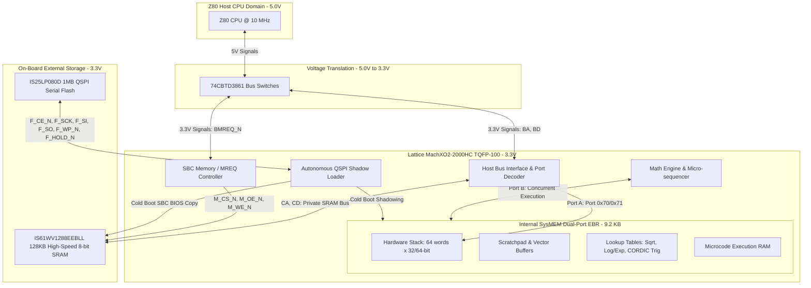

# Zx50 CPU Rev C4 Math & Stack Coprocessor Specification (FPU Rev 2)

This document specifies the high-level hardware architecture, operating theory, and instruction set architecture (ISA) for the FPGA-based Floating-Point and Stack Coprocessor on the **Zx50 CPU Card (Rev C4)**.

- **High-Level Architecture:** [FPU_REV2.md](file:///Users/marc/Documents/z80/Zx50/fpu/fpu_rev2/FPU_REV2.md) (this document)
- **Low-Level System Design & Gate Estimates:** `SystemDesign.md` *(see roadmap in [TODO.md](file:///Users/marc/Documents/z80/Zx50/fpu/fpu_rev2/TODO.md))*
- **Z80 Assembly Programmer's Guide:** `ProgrammersGuide.md`

---

## 1. System Overview & Hardware Architecture

The Zx50 FPU Rev 2 is an FPGA-based math accelerator and stack processor tightly coupled to the host Zilog Z80 CPU.



### 1.1 Key Hardware Specifications

* **Host CPU:** Zilog Z80C @ 10 MHz (`CLK` / `BZCLK`).
* **Target FPGA:** **Lattice MachXO2-2000HC** (`LCMXO2-2000HC-4TG100I` / `U17`):
  * **Package:** 100-pin TQFP (14×14 mm, 0.5 mm pitch), 100% pin allocation (0 spare pins).
  * **Logic Capacity:** 2,112 LUT4s, 2,112 Registers.
  * **SysMEM EBR (Embedded Block RAM):** 8 true dual-port blocks (74 Kb / 9,216 Bytes total).
  * **Distributed RAM:** 16 Kb.
  * **Phase-Locked Loops (PLLs):** 1 on-chip PLL.
  * **Power Supply:** Single +3.3V rail for core and all I/O banks (`HC` variant).
* **Companion Flash:** **ISSI `IS25LP080D-JNLE-TR` (`U19`)** (1 MB / 8 Mbit Serial NOR Flash, Quad-SPI, 3.3V, 8 ns).
  * Signals: `F_CE_N`, `F_SCK`, `F_SI`, `F_SO`, `F_WP_N`, `F_HOLD_N`.
* **On-Board External SRAM:** **ISSI `IS61WV1288EEBLL-10HLI` (`U18`)** (128 KB, 128K×8, 10 ns access time with ECC, 3.3V).
  * Signals: `CA[16:0]`, `CD[7:0]`, `M_CS_N` (`M_CE_N`), `M_OE_N`, `M_WE_N`.
* **Bus Level Translation:** TI `74CBTD3861` (`U12`, `U13`, `U14`) zero-delay bus switches clamping 5.0V Z80 signals to 3.3V (`BA[15:0]`, `BD[7:0]`, control signals). MachXO2 3.3V LVCMOS outputs drive Z80 inputs ($V_{IH} \ge 2.0\text{V}$) directly and safely.
* **Clocking:**
  * External bus clock: **`ZCLK` / `BZCLK`** (5 MHz or 10 MHz, buffered via `U15` 74LVC1G17 to FPGA pin 38 `PCLKT2_1`).
  * External shadow bus clock: **`MCLK` / `BMCLK`** (20 MHz or 40 MHz, buffered via `U16` 74LVC1G17 to FPGA pin 34 `PCLKT2_0`), synchronous with ZCLK.
  * Internal FPGA core clock: **80 MHz** generated by the on-chip PLL from BMCLK (or up to 160 MHz for internal execution).

---

## 2. Operating Modes & Boot Flow

The FPGA supports two distinct operational modes determined at power-on reset:

### 2.1 Mode 1: Backplane Coprocessor (NUMA Cluster Mode)
* Default Zx50 distributed cluster operation (`LOCAL_RAM_EN = 0`).
* All Z80 memory cycles (`MREQ_N`) pass to the backplane to access NUMA cluster memory.
* The MachXO2 acts purely as the math coprocessor, decoding I/O ports `0x70` and `0x71` (and optional MMIO).
* On-board external SRAM is disabled (`M_CS_N = 1`).

### 2.2 Mode 2: Standalone Single-Board Computer (SBC Mode)
* Activated via jumper or debug setting (`LOCAL_RAM_EN = 1` via `DBG3` sampled low at reset).
* The CPU card functions as an autonomous, self-contained single-board computer without external backplane memory cards.
* The FPGA acts as the system memory controller, intercepting `BMREQ_N` and driving `M_CS_N`, `M_OE_N`, and `M_WE_N` to provide zero-wait-state memory access to the on-board 128 KB SRAM across `CA[16:0]` and `CD[7:0]`.

### 2.3 Flash Organization & Boot Configuration
The 1 MB external QSPI Flash is partitioned into 64 KB blocks:
* Production FPU microcode and math lookup tables.
* Debug/Diagnostic FPU microcode.
* Production Z80 BIOS / Monitor firmware.
* Diagnostic / Standalone CP/M bootloader.

Boot mode and image selection are controlled at reset by sampling the debug lines:
* **`DBG_N` & `DBG[2:0]`:** Select which microcode/table block and Z80 firmware block to load.
* **`DBG3`:** If sampled LOW on reset, enables on-board Z80 SRAM memory decoding (SBC mode).

### 2.4 Sub-Millisecond Power-On Shadowing
At power-up reset:
1. The FPGA holds `Z80_RESET_N` low.
2. An autonomous QSPI hardware state machine reads the selected microcode and mathematical lookup tables from the `IS25LP080D` Flash in Quad-Output mode into internal SysMEM EBR:
   $$\text{Transfer Time for 8 KB at 66 MHz QSPI} \approx 248\ \mu\text{s}$$
3. In Standalone SBC mode, the FPGA copies 8 KB–16 KB of Z80 monitor/BIOS from Flash into the on-board external SRAM starting at `0x0000` (~500 µs).
4. Once shadowing is complete and verified, the FPGA releases `Z80_RESET_N`.
5. The Z80 exits reset with the FPU ready for immediate execution.

---

## 3. Internal Memory Subsystem (SysMEM EBR)

The MachXO2-2000 provides 8 true dual-port SysMEM EBR blocks (9,216 bytes total).

### 3.1 SysMEM EBR Memory Map

```text
+-------------------+-----------------------------------------------+------------+
| Address Range     | Functional Allocation                         | Size       |
+-------------------+-----------------------------------------------+------------+
| 0x0000 - 0x01FF   | Hardware Math Stack (64 words x 64-bit / 8B)  | 512 Bytes  |
| 0x0200 - 0x02FF   | Scratchpad & Vector Registers (64 x 32-bit)   | 256 Bytes  |
| 0x0300 - 0x033F   | User Word Storage (16 words x 32-bit)         | 64 Bytes   |
| 0x0400 - 0x07FF   | Polynomial Coefficients & Math Headroom       | 1,024 Bytes|
| 0x0800 - 0x09FF   | Reciprocal / Division Table                   | 512 Bytes  |
| 0x0A00 - 0x0BFF   | Square Root Seed LUT                          | 512 Bytes  |
| 0x0C00 - 0x0DFF   | Base-2 Exponent / Power LUT                   | 512 Bytes  |
| 0x0E00 - 0x0FFF   | Base-2 Logarithm LUT                          | 512 Bytes  |
| 0x1000 - 0x11FF   | Trigonometric Constants / CORDIC Tables       | 512 Bytes  |
| 0x1200 - 0x19FF   | Runtime Microcode Execution RAM (1K x 16-bit) | 2,048 Bytes|
| 0x1A00 - 0x23FF   | Unallocated / Extended Buffer Headroom        | 2,560 Bytes|
+-------------------+-----------------------------------------------+------------+
Total Allocated:    5,440 Bytes (~5.3 KB)
Total Available:    9,216 Bytes (8 EBR blocks)
Free Headroom:      3,776 Bytes (~41% free)
```

### 3.2 User Memory Allocation (Intermediate Storage)
A dedicated 64-byte block (`0x0300`–`0x033F`) in SysMEM EBR is reserved specifically for fast user-level variable and constant storage:
* **Organization:** Configured as 16 words of 32 bits (or 8 words of 64 bits), addressed as index `0x0` through `0xF`.
* **Purpose:** Allows the Z80 to stache and reload intermediate values directly between the Top of Stack ($TOS$) and internal FPGA memory using single-byte command writes (`CP [xxxx], TOS` and `CP TOS, [xxxx]`). This eliminates the significant I/O overhead of transferring operands back and forth across the 8-bit Z80 data bus (Port `0x70`) during complex multi-step evaluations (e.g., evaluating polynomials, holding loop invariants, or accumulating sums).
* **Isolation:** Physically isolated from the microcode scratchpad and ALU registers (`0x0200`–`0x02FF`), guaranteeing that user storage words remain untouched and preserved across all arithmetic opcode executions.

### 3.3 True Dual-Port Concurrency
The dual-port architecture completely separates host I/O from math execution:
* **Port A (Host Interface):** Servicing Z80 I/O port `0x70` reads and writes. Pushes and pops write directly to or read from `Stack[SP]`.
* **Port B (Math Engine):** Servicing the internal micro-engine. The core reads operands (`TOS`, `NOS`), accesses internal scratchpad memory, and writes results back to the stack without host bus arbitration conflicts.

---

## 4. Complete 100-Pin Package Budget & Signal Allocation

On the **Zx50 CPU Card (Rev C4)**, the MachXO2-2000HC in TQFP-100 (`U17`) has 100% of its pins assigned with **0 remaining pins**:

| Signal Group | Signal Names | Pin Count | Direction | Function |
|---|---|:---:|:---:|---|
| **Host Address Bus** | `BA[15:0]` | 16 | Input | Buffered Z80 address bus (via `U12`, `U13`, `U14` 74CBTD3861). Port decode (`0x70`/`0x71`) & SBC memory decode. |
| **Host Data Bus** | `BD[7:0]` | 8 | Inout | Buffered Z80 data bus (via `U13` 74CBTD3861). |
| **Host Control** | `BIORQ_N`, `BMREQ_N` | 2 | Input | Buffered I/O and Memory cycle requests (`U12`). |
| | `BRD_N`, `BWR_N`, `BM1_N` | 3 | Input | Buffered Read, Write, and M1 machine cycle indicators (`U12`). |
| | `BRESET_N` | 1 | Input | Buffered active-low reset signal (`U12`). |
| | `BWAIT_N` | 1 | Output | Active-high wait request driving gate of N-ch FET `Q4` (2N7002) to pull bus `~WAIT~` low. |
| **Host Clocks** | `BZCLK`, `BMCLK` | 2 | Input | Buffered Z80 CPU clock (10 MHz) and Master clock (40 MHz) via `U15`/`U16` 74LVC1G17. |
| **External SRAM** | `CA[16:0]` | 17 | Output | Private 17-bit address bus to 128KB SRAM (`U18` `IS61WV1288EEBLL-10HLI`). |
| | `CD[7:0]` | 8 | Inout | Private 8-bit bidirectional data bus to SRAM. |
| | `M_CS_N` (`M_CE_N`), `M_OE_N`, `M_WE_N` | 3 | Output | Private SRAM chip select, output enable, and write enable strobes. |
| **Serial QSPI Flash** | `F_CE_N`, `F_SCK` | 2 | Output | Chip select (`CSSPIN` pin 27) and serial clock (`CCLK` pin 31) for `U19` `IS25LP080D`. |
| | `F_SI`, `F_SO`, `F_WP_N`, `F_HOLD_N` | 4 | Inout | Quad-SPI data lines (IO0–IO3 on pins 49, 32, 28, 30). |
| **Debug & Config** | `DBG[3:0]` | 4 | Inout | Real-time debug / telemetry lines routed to header `J9` (pins 24, 25, 35, 36). |
| | `DBG_N` | 1 | Input | Debug enable jumper routed to header `J8` (pin 88). |
| **JTAG Programming** | `TCK`, `TDI`, `TDO`, `TMS`, `JTAGENB` | 5 | Inout | Dedicated JTAG interface routed to header `J7` (pins 91, 94, 95, 90, 82). |
| **FPGA Config / Status**| `DONE`, `INIT_N`, `PROGRAM_N` | 3 | Output/Input | Status LED `D4` (pin 76), Init strobe (pin 77), and reconfiguration switch `SW2` (pin 81). |
| **Power Supplies** | `VCC` (Core), `VCCIO[5:0]` | 11 | Power | Single +3.3V rail: Pins 5, 11, 23, 26, 46, 50, 55, 73, 80, 93, 100. |
| **Ground** | `GND` | 8 | Power | Ground returns: Pins 6, 22, 33, 44, 56, 72, 79, 92. |
| **No Connect** | `NC` | 1 | NC | Pin 89. |
| **Total Pins Accounted** | | **100** | | **100% of TQFP-100 pins allocated (0 remaining pins)** |

---

## 5. Register & I/O Interface Protocol

The FPU occupies host I/O base addresses `0x70` and `0x71`.

| Port Address | Direction | Register Name | Description |
|---|---|---|---|
| **`0x70`** | Write | `DATA_PUSH` | Pushes 1 byte to Top of Stack ($TOS$), auto-incrementing byte pointer $SP$. |
| **`0x70`** | Read | `DATA_POP` | Reads 1 byte from Top of Stack ($TOS$), auto-decrementing byte pointer $SP$. |
| **`0x71`** | Write | `CMD_EXEC` | Latches opcode to execution dispatcher, triggers math core. |
| **`0x71`** | Read | `STATUS` | Returns status flags: `[BUSY, ZERO, SIGN, CARRY, OVERFLOW, UNDERFLOW, ERR, 0]`. |

### 5.1 Status Register Bit Flags (`0x71` Read)

| Bit 7 | Bit 6 | Bit 5 | Bit 4 | Bit 3 | Bit 2 | Bit 1 | Bit 0 |
|:---:|:---:|:---:|:---:|:---:|:---:|:---:|:---:|
| `BUSY` | `ZERO` | `SIGN` | `CARRY` | `OVERFLOW` | `UNDERFLOW` | `ERR` | Reserved (0) |

* **`BUSY` (Bit 7):** High during computation; cleared automatically when the math engine completes.
* **`ZERO` (Bit 6):** Set if result is equal to 0.
* **`SIGN` (Bit 5):** Set if result is negative.
* **`CARRY` (Bit 4):** Set on integer arithmetic carry / borrow.
* **`OVERFLOW` (Bit 3):** Set if result exceeds dynamic range of the target type (or FP $+\infty$).
* **`UNDERFLOW` (Bit 2):** Set if floating-point result underflows to denormalized / zero.
* **`ERR` (Bit 1):** Set high on illegal opcode, divide-by-zero, invalid operand (NaN), or stack underflow/overflow.

### 5.2 Handshaking Modes

1. **Blocking Mode (Default):**
   * Upon receiving an arithmetic opcode write to `0x71`, the FPGA immediately asserts `BWAIT_N` high (turning on N-ch FET `Q4` to pull host `~WAIT~` low).
   * The Z80 is held in wait states until the computation finishes.
   * When finished, the FPGA deasserts `BWAIT_N` low (releasing host `~WAIT~`) and updates `STATUS`.
   * For operations that complete in 1 or 2 cycles (e.g. integer sign change, stack dup), wait states are not inserted.
2. **Non-Blocking Mode:**
   * Configured via management command (`0b1111_1101`).
   * The FPGA accepts the opcode, sets `BUSY = 1`, and does **not** assert `BWAIT_N`.
   * The Z80 polls Port `0x71` until bit 7 (`BUSY`) clears, allowing the CPU to perform interleaved tasks during longer calculations (e.g., transcendental functions or 64-bit divisions).

### 5.3 High-Throughput Memory-Mapped I/O Window (Optional MMIO)
In addition to standard Port I/O, the FPGA can monitor the upper memory map (e.g., `0xFE00`–`0xFE7F`) to support accelerated Z80 block transfers (`LDIR` / `LDDR`):
* `0xFE00`–`0xFE03`: Direct 32-bit TOS Push/Pop register window.
* `0xFE08`–`0xFE0F`: Direct 64-bit transfer window (`i64` / `f64`).
* `0xFE10`: Command trigger register.
* `0xFE20`–`0xFE7F`: Direct 64-byte vector/scratchpad buffer window.

---

## 6. Stack Memory Architecture & Supported Data Types

The math stack is physically organized in internal SysMEM EBR as 64 words of up to 64 bits (8 bytes) each.

### 6.1 Stack Conventions
* **`SP` (Stack Pointer):** Pointer to the next stack location.
* **`TOS` (Top of Stack):** Operand at the current top of the stack.
* **`NOS` (Next on Stack):** Operand directly underneath TOS.
* Operations are RPN (Reverse Polish Notation): Unary operations consume and replace `TOS`. Binary operations consume `TOS` and `NOS`, writing the result back to `TOS` and adjusting `SP`.

### 6.2 Data Formats
The stack memory stores raw byte streams; formatting is determined by the opcode executed:
* **`i32` (32-bit Signed Integer):** 2's complement, range $-2^{31}$ to $2^{31}-1$.
* **`f32` (32-bit IEEE-754 Single Precision):** 1 sign bit, 8 exponent bits (bias 127), 23 fraction bits.
* **`i64` (64-bit Signed Integer):** 2's complement, range $-2^{63}$ to $2^{63}-1$.
* **`f64` (64-bit IEEE-754 Double Precision):** 1 sign bit, 11 exponent bits (bias 1023), 52 fraction bits.

---

## 7. Instruction Set Architecture (OpCodes: Port `0x71`)

Commands written to Port `0x71` are structured as 1-byte opcodes.

### 7.1 Format Encoding Field (`fff`)
ALU opcodes use a 3-bit suffix `fff` to select operand format:

| Suffix `fff` | Data Format | Description |
|:---:|---|---|
| `0b000` | `i32` | 32-bit signed integer operands $\rightarrow$ 32-bit integer result |
| `0b001` | `f32` | 32-bit IEEE float operands $\rightarrow$ 32-bit float result |
| `0b010` | `i64` | 64-bit signed integer operands $\rightarrow$ 64-bit integer result |
| `0b011` | `f64` | 64-bit IEEE float operands $\rightarrow$ 64-bit float result |
| `0b100` | `f32_to_f64` | Mixed: 32-bit operands promoted to 64-bit float result |
| `0b101`..`0b111` | Reserved | Reserved for future extensions |

### 7.2 ALU Operations (`0b0000_0fff` – `0b1000_0fff`)

| Opcode Prefix | Mnemonic | Operation | Arity | Description |
|---|---|---|:---:|---|
| `0b0000_0fff` | `ADD` | $TOS \leftarrow NOS + TOS$ | Binary | Addition |
| `0b0000_1fff` | `SUB` | $TOS \leftarrow NOS - TOS$ | Binary | Subtraction |
| `0b0001_0fff` | `MUL` | $TOS \leftarrow NOS \times TOS$ | Binary | Multiplication |
| `0b0001_1fff` | `DIV` | $TOS \leftarrow NOS / TOS$ | Binary | Division |
| `0b0010_0fff` | `SQRT` | $TOS \leftarrow \sqrt{TOS}$ | Unary | Square root |
| `0b0010_1fff` | `POW` | $TOS \leftarrow NOS^{TOS}$ | Binary | Power ($y^x$) |
| `0b0011_0fff` | `LN` | $TOS \leftarrow \ln(TOS)$ | Unary | Natural logarithm |
| `0b0011_1fff` | `EXP` | $TOS \leftarrow e^{TOS}$ | Unary | Exponential ($e^x$) |
| `0b0101_0fff` | `CHS` | $TOS \leftarrow -TOS$ | Unary | Change sign (negate) |
| `0b0101_1fff` | `ABS` | $TOS \leftarrow \|TOS\|$ | Unary | Absolute value |
| `0b0110_0fff` | `FLOOR` | $TOS \leftarrow \lfloor TOS \rfloor$ | Unary | Round towards $-\infty$ |
| `0b0110_1fff` | `CEIL` | $TOS \leftarrow \lceil TOS \rceil$ | Unary | Round towards $+\infty$ |
| `0b0111_0fff` | `SIN` | $TOS \leftarrow \sin(TOS)$ | Unary | Sine (radians) |
| `0b0111_1fff` | `COS` | $TOS \leftarrow \cos(TOS)$ | Unary | Cosine (radians) |
| `0b1000_0fff` | `TAN` | $TOS \leftarrow \tan(TOS)$ | Unary | Tangent (radians) |

### 7.3 Stack Manipulation Opcodes

| Opcode | Mnemonic | Description |
|---|---|---|
| `0b1100_0000` | `DUP4` | Duplicate top 4 bytes of stack ($TOS \rightarrow NOS$) |
| `0b1100_0001` | `DUP8` | Duplicate top 8 bytes of stack |
| `0b1100_0110` | `CLEAR_STACK` | Reset Stack Pointer $SP$ to empty |
| `0b1100_1000` | `CONV_I32_I64` | Sign-extend `i32` TOS to `i64` |
| `0b1100_1001` | `CONV_F32_F64` | Convert single `f32` TOS to double `f64` |
| `0b1100_1010` | `CONV_I64_I32` | Truncate `i64` TOS to `i32` with overflow check |
| `0b1100_1011` | `CONV_F64_F32` | Convert double `f64` TOS to single `f32` (rounding) |
| `0b1101_xxxx` | `CP [xxxx], TOS` | Copy TOS to internal user storage word `xxxx` (0–15) |
| `0b1110_xxxx` | `CP TOS, [xxxx]` | Copy internal user storage word `xxxx` (0–15) to TOS |
| `0b1111_0000` | `ZERO_MEM` | Zero all 16 user storage words |

### 7.4 Mathematical Constant Push Opcodes

Pushes high-precision mathematical constants from internal ROM directly onto the stack. The format bits `fff` select the target precision (`001` for `f32`, `011` for `f64`):

| Opcode | Mnemonic | Constant Pushed to TOS | Single Precision (`f32`) Hex | Double Precision (`f64`) Hex |
|---|---|---|:---:|:---:|
| `0b1001_0fff` | `PUSH_PI` | $\pi \approx 3.14159265358979323846$ | `0x40490FDB` | `0x400921FB_54442D18` |
| `0b1001_1fff` | `PUSH_E` | $e \approx 2.71828182845904523536$ | `0x402DF854` | `0x4005BF0A_8B145769` |
| `0b1010_0fff` | `PUSH_LN2` | $\ln(2) \approx 0.69314718055994530942$ | `0x3F317218` | `0x3FE62E42_FEFA39EF` |
| `0b1010_1fff` | `PUSH_LOG2E` | $\log_2(e) \approx 1.44269504088896340736$ | `0x3FB8AA3B` | `0x3FF71547_652B82FE` |
| `0b1011_0fff` | `PUSH_LOG2_10` | $\log_2(10) \approx 3.32192809488736234787$ | `0x40549A78` | `0x400A934F_0979A371` |
| `0b1011_1fff` | `PUSH_LOG10_2` | $\log_{10}(2) \approx 0.30102999566398119521$ | `0x3E9A209B` | `0x3FD34413_509F79FF` |
| `0b1000_1fff` | `PUSH_SQRT2` | $\sqrt{2} \approx 1.41421356237309504880$ | `0x3FB504F3` | `0x3FF6A09E_667F3BCD` |
| `0b1100_0010` | `PUSH_INV_SQRT2` | $1/\sqrt{2} \approx 0.70710678118654752440$ | `0x3F3504F3` | `0x3FE6A09E_667F3BCD` |

### 7.5 Management Opcodes

| Opcode | Mnemonic | Description |
|---|---|---|
| `0b1111_1111` | `RESET` | Soft reset FPU core, clear status flags and stack pointer |
| `0b1111_1110` | `SET_BLOCKING` | Set execution mode to blocking (`WAIT_N` asserted) |
| `0b1111_1101` | `SET_NONBLOCKING` | Set execution mode to non-blocking (poll `BUSY` flag) |

---

## 8. Execution Philosophy & Micro-Engine Overview

The MachXO2 implementation follows a deterministic hardware execution strategy:

### 8.1 Dedicated Hardware ALU Primitives
Complex mathematical operations are decomposed into micro-steps executed across dedicated single-cycle datapath blocks:
* **32-Bit Parallel Adder / Subtractor:** Single-cycle addition, subtraction, and comparison.
* **32-Bit Barrel Shifter:** Single-cycle arbitrary shifts (0–31 bits) for floating-point exponent alignment and mantissa normalization.
* **Radix-4 Booth Multiplier:** High-throughput iterative multiplier retiring 2 bits per clock cycle (16 cycles for 32-bit, 27 cycles for 53-bit double mantissa), natively supporting 2's complement with 0 EBR usage.
* **Leading-Zero Counter (LZC):** Single-cycle normalizer priority encoder.

### 8.2 Micro-Sequencer Concept
* Simple operations (`ADD`, `SUB`, `CHS`, `ABS`, `DUP`) execute in direct hardware pipelines with minimal latency.
* Multi-step operations (`DIV`, `SQRT`, transcendental functions) are controlled by an on-chip micro-sequencer fetching micro-instructions from runtime microcode EBR.
* *Detailed register models, micro-instruction word formats, and resource/gate estimates are specified in `SystemDesign.md`.*

---

## 9. Simulation & Verification Architecture

The FPU verification suite validates the FPGA design against host Z80 bus transactions, QSPI Flash shadowing, and arithmetic accuracy:

```text
tb_zx50_fpu (Testbench Top)
 ├── zx50_clock_bfm        (Glitch-free ZCLK 10 MHz / MCLK 40 MHz generator)
 ├── z80_host_bfm          (Z80 I/O and Memory Cycle Bus Functional Model)
 ├── is25lp080d_bfm        (ISSI 1MB QSPI Serial Flash Simulation Model)
 ├── is61wv1288_bfm        (ISSI 128KB High-Speed 8-bit SRAM Simulation Model)
 └── zx50_fpu_top          (MachXO2 Top-Level FPGA Design Under Test)
      ├── zx50_host_if     (Z80 Bus Interface & CDC Dispatcher)
      ├── zx50_qspi_loader (Autonomous Power-on Shadow Engine)
      ├── zx50_sysmem      (MachXO2 SysMEM Dual-Port EBR Wrapper)
      ├── zx50_microengine (Microcoded Sequencer & Register File)
      └── zx50_alu_core    (32-bit Parallel ALU Primitives)
```

### 9.1 Verification Suites (`sim/`)
All testbenches follow pattern-based execution via `make`:
* `make run-init`: Verifies power-on reset, QSPI Flash boot shadowing, and default register states.
* `make run-stack`: Verifies Port `0x70` single-byte and multi-byte push/pop sequences and stack pointer tracking.
* `make run-cmd`: Verifies Port `0x71` command decoding, blocking `WAIT_N` handshakes, and status register flags.
* `make run-math`: Exhaustive test vector suites for integer and IEEE-754 single/double-precision math operations.
