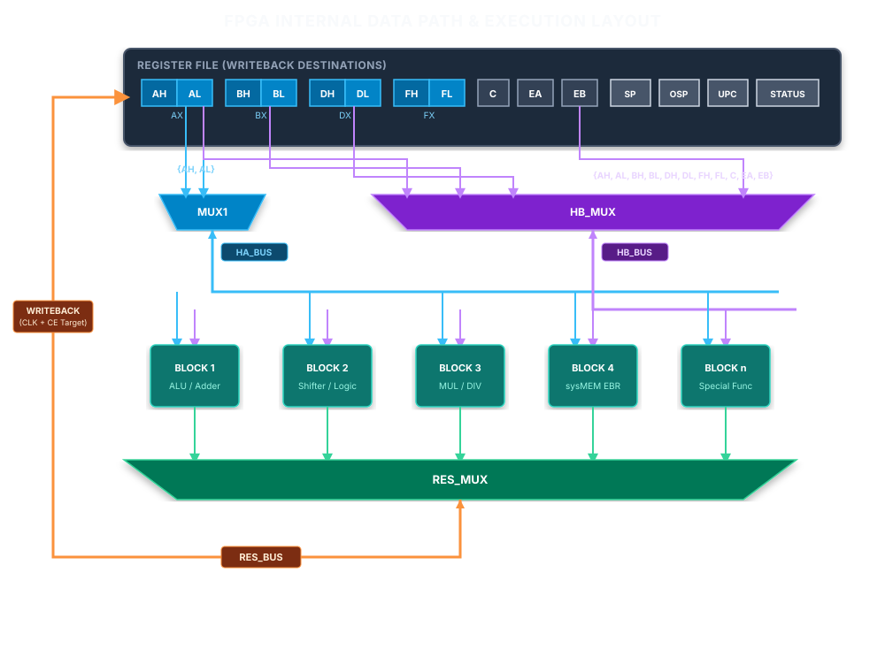

# Zx50 CPU Rev C4 Math & Stack Coprocessor Specification (FPU Rev 2)

This document specifies the high-level hardware architecture, operating theory, and instruction set architecture (ISA)
for the FPGA-based Floating-Point and Stack Coprocessor on the **Zx50 CPU Card (Rev C4)**.

- **High-Level Architecture & Hardware
  Interface:** [FPU_REV2.md](file:///Users/marc/Documents/z80/Zx50/fpu/fpu_rev2/FPU_REV2.md) (this document)
- **Low-Level Micro-Architecture &
  Implementation:** [SystemDesign.md](file:///Users/marc/Documents/z80/Zx50/fpu/fpu_rev2/SystemDesign.md)
- **Z80 Assembly Programmer's
  Guide:** [ProgrammersGuide.md](file:///Users/marc/Documents/z80/Zx50/fpu/fpu_rev2/ProgrammersGuide.md)
- **Development Roadmap:** [TODO.md](file:///Users/marc/Documents/z80/Zx50/fpu/fpu_rev2/TODO.md)

---

## System Overview & Hardware Architecture

The Zx50 FPU Rev 2 is an FPGA-based math accelerator and stack processor tightly coupled to the host Zilog Z80 CPU.




### Key Hardware Specifications

* **Host CPU:** Zilog Z80C @ 10 MHz (`CLK` / `BZCLK`).
* **Target FPGA:** **Lattice MachXO2-2000HC** (`LCMXO2-2000HC-4TG100I` / `U17`):
    * **Package:** 100-pin TQFP (14×14 mm, 0.5 mm pitch), 100% pin allocation (0 spare pins).
    * **Logic Capacity:** 2,112 LUT4s, 2,112 Registers.
    * **SysMEM EBR (Embedded Block RAM):** 8 true dual-port blocks (74 Kb / 9,216 Bytes total).
    * **Distributed RAM:** 16 Kb.
    * **Phase-Locked Loops (PLLs):** 1 on-chip PLL.
    * **Power Supply:** Single +3.3V rail for core and all I/O banks (`HC` variant).
* **Companion Flash:** **ISSI `IS25LP080D-JNLE-TR` (`U19`)** (1 MB / 8 Mbit Serial NOR Flash, Quad-SPI, 3.3V, 8 ns).
    * Signals: `F_CE_N`, `F_SCK`, `F_SI`, `F_SO`, `F_WP_N`, `F_HOLD_N`.
* **On-Board External SRAM:** **ISSI `IS61WV1288EEBLL-10HLI` (`U18`)** (128 KB, 128K×8, 10 ns access time with ECC,
  3.3V).
    * Signals: `CA[16:0]`, `CD[7:0]`, `M_CS_N` (`M_CE_N`), `M_OE_N`, `M_WE_N`.
* **Bus Level Translation:** TI `74CBTD3861` (`U12`, `U13`, `U14`) zero-delay bus switches clamping 5.0V Z80 signals to
  3.3V (`BA[15:0]`, `BD[7:0]`, control signals). MachXO2 3.3V LVCMOS outputs drive Z80 inputs ($V_{IH} \ge 2.0\text{V}$)
  directly and safely.
* **Clocking:**
    * External bus clock: **`ZCLK` / `BZCLK`** (5 MHz or 10 MHz, buffered via `U15` 74LVC1G17 to FPGA pin 38
      `PCLKT2_1`).
    * External shadow bus clock: **`MCLK` / `BMCLK`** (20 MHz or 40 MHz, buffered via `U16` 74LVC1G17 to FPGA pin 34
      `PCLKT2_0`), synchronous with ZCLK.
    * Internal FPGA core clock: **80 MHz** generated by the on-chip PLL from BMCLK (or up to 160 MHz for internal
      execution).

---

## Operating Modes & Boot Flow

The FPGA supports two distinct operational modes determined at power-on reset:

### Mode 1: Backplane Coprocessor (NUMA Cluster Mode)

* Default Zx50 distributed cluster operation (`LOCAL_RAM_EN = 0`).
* All Z80 memory cycles (`MREQ_N`) pass to the backplane to access NUMA cluster memory.
* The MachXO2 acts purely as the math coprocessor, decoding I/O ports `0x70` and `0x71` (and optional MMIO).
* On-board external SRAM is disabled (`M_CS_N = 1`).

### Mode 2: Standalone Single-Board Computer (SBC Mode)

* Activated via jumper or debug setting (`LOCAL_RAM_EN = 1` via `DBG3` sampled low at reset).
* The CPU card functions as an autonomous, self-contained single-board computer without external backplane memory cards.
* The FPGA acts as the system memory controller, intercepting `BMREQ_N` and driving `M_CS_N`, `M_OE_N`, and `M_WE_N` to
  provide zero-wait-state memory access to the on-board 128 KB SRAM across `CA[16:0]` and `CD[7:0]`.

### Flash Organization & Boot Configuration

The 1 MB external QSPI Flash is partitioned into 64 KB blocks:

* Production FPU microcode and math lookup tables.
* Debug/Diagnostic FPU microcode.
* Production Z80 BIOS / Monitor firmware.
* Diagnostic / Standalone CP/M bootloader.

Boot mode and image selection are controlled at reset by sampling the debug lines:

* **`DBG_N` & `DBG[2:0]`:** Select which microcode/table block and Z80 firmware block to load.
* **`DBG3`:** If sampled LOW on reset, enables on-board Z80 SRAM memory decoding (SBC mode).

### Sub-Millisecond Power-On Shadowing

At power-up reset:

1. The FPGA holds `Z80_RESET_N` low.
2. An autonomous QSPI hardware state machine reads the selected microcode and mathematical lookup tables from the
   `IS25LP080D` Flash in Quad-Output mode into internal SysMEM EBR:
   $$\text{Transfer Time for 8 KB at 66 MHz QSPI} \approx 248\ \mu\text{s}$$
3. In Standalone SBC mode, the FPGA copies 8 KB–16 KB of Z80 monitor/BIOS from Flash into the on-board external SRAM
   starting at `0x0000` (~500 µs).
4. Once shadowing is complete and verified, the FPGA releases `Z80_RESET_N`.
5. The Z80 exits reset with the FPU ready for immediate execution.

---

## Internal Memory Subsystem (SysMEM EBR)

The MachXO2-2000 provides **8 independent physical SysMEM EBR blocks** (9 Kbits / 1,152 bytes each, 9,216 bytes total
capacity).

Under the MachXO2 hardware architecture (Family Data Sheet Table 2.5):

* A single EBR block supports a maximum data width of **18 bits** in ROM/Single-Port mode (`512 × 18`), or **9 bits** in
  True Dual-Port mode (`1,024 × 9`).
* By cascading four EBR blocks (2 wide × 2 deep), the memory subsystem provides two completely symmetrical, native
  **32-bit single-cycle word access** memories: **`DATA_RAM`** (EBR 0–3, $1024 \times 32$ bits = 4,096 bytes) and
  **`CODE_ROM`** (EBR 4–7, $1024 \times 32$ bits = 4,096 bytes).
* High-speed host opcode queuing (the 32-byte **Operation Stack**) is implemented directly in
  **Distributed LUT-RAM** using PFU slices (~12 LUT4s, 0 EBR blocks), indexed by the **Operation Stack Pointer (OSP)**,
  completely isolating host opcode writes from the primary memory blocks.
* Z80 host data I/O on Port `0x70` uses dedicated 32-bit staging registers (**`HOST_IN`** on `HB_BUS` and **`HOST_OUT`**
  on `RES_BUS`), enabling standard Single-Port RAM mode for the stack and eliminating complex dual-port arbitration.

### Physical SysMEM EBR Allocation Map (8 Blocks Total = 100% Utilized)

```text
+------------------+-----------------------+-----------------------------------------------+------------+
| Physical EBR     | Diamond Configuration | Functional Allocation                         | Size       |
+------------------+-----------------------+-----------------------------------------------+------------+
| EBR 0, 1, 2, 3   | Cascaded Unified RAM  | DATA_RAM: Segregated RAM & ROM Space          | 4,096 B    |
| (4 Blocks)       | (1024 x 32-bit)       | • Lower 1 KB: Stack, Scratchpad, User Storage | (1024 W)   |
|                  |                       | • Upper 3 KB: Math Constants, Angles, Seeds   |            |
+------------------+-----------------------+-----------------------------------------------+------------+
| EBR 4, 5, 6, 7   | Cascaded Unified ROM  | CODE_ROM: Microcode Execution Store           | 4,096 B    |
| (4 Blocks)       | (1024 x 32-bit)       | • Unified UPC[9:0] execution (1024 words)     | (1024 W)   |
+------------------+-----------------------+-----------------------------------------------+------------+
| Distributed      | PFU Distributed       | • Operation Stack (OSP[4:0])                  | 32 Bytes   |
| LUT-RAM          | RAM (32 x 8-bit)      |   (Zero EBR blocks consumed)                  |            |
+------------------+-----------------------+-----------------------------------------------+------------+
Total EBR Utilization: 8 of 8 blocks (100% utilized, perfectly balanced 4 + 4)
```

### Segregated `DATA_RAM` Subsystem (EBR 0–3, 1024 Words × 32-Bit)

The 10-bit address space (`MEM_ADDR[9:0]`, `0x000`–`0x3FF`) is cleanly partitioned at word boundary `0x100` (256 words):
* **Lower 256 words (`0x000`–`0x0FF` / 1,024 Bytes):** **RAM Space** (`mem_addr[9:8] == 2'b00`)
* **Upper 768 words (`0x100`–`0x3FF` / 3,072 Bytes):** **ROM Space** (`mem_addr[9:8] != 2'b00`)

| Word Range (Hex) | Word Range (Dec) | Size (Words / Bytes) | Region | Content / Allocation | Addressing Mechanism |
| :--- | :--- | :--- | :--- | :--- | :--- |
| `0x000`–`0x07F` | 0..127 | 128 words / 512 B | **RAM** | **Hardware Math Stack** | `0x000 \| SP[6:0]` |
| `0x080`–`0x0BF` | 128..191 | 64 words / 256 B | **RAM** | **Scratchpad RAM `SCR[0..63]`** | `0x080 \| imm[5:0]` |
| `0x0C0`–`0x0CF` | 192..207 | 16 words / 64 B | **RAM** | **User Word Storage `USR[0..15]`** | `0x0C0 \| imm[3:0]` |
| `0x0D0`–`0x0FF` | 208..255 | 48 words / 192 B | **RAM** | **Working Headroom** (Dynamic storage) | Dynamic allocation |
| `0x100`–`0x13F` | 256..319 | 64 words / 256 B | **ROM** | **IEEE-754 Math Constants** ($\pi, e, \ln 2$, etc.) | `0x100 \| slot[5:0]` |
| `0x140`–`0x1FF` | 320..511 | 192 words / 768 B | **ROM** | **Math Headroom** (Float64 / FIR / Poly) | Reserved headroom |
| `0x200`–`0x27F` | 512..639 | 128 words / 512 B | **ROM** | **Trigonometric & CORDIC Angles** | `0x200 \| slot[6:0]` |
| `0x280`–`0x2FF` | 640..767 | 128 words / 512 B | **ROM** | **Chebyshev Polynomial Coefficients** | `0x280 \| slot[6:0]` |
| `0x300`–`0x3FF` | 768..1023 | 256 words / 1,024 B | **ROM** | **Interleaved RECIP / SQRT Seed LUTs**<br>• High 16b `[31:16]`: SQRT Seeds<br>• Low 16b `[15:0]`: RECIP Seeds | `0x300 \| slot[7:0]` |

### Hardware Write-Protection

Because the RAM/ROM boundary falls on the power-of-two address `0x100` (bit 8 or 9 set), write protection is implemented with a single 2-input gate in Verilog:

```verilog
// Write enable is asserted ONLY when writing within RAM region 0x000..0x0FF (mem_addr[9:8] == 2'b00)
assign data_ram_we = is_write & (mem_addr[9:8] == 2'b00);
```

Any unintended microcode write to addresses $\ge \text{0x100}$ is suppressed by hardware, guaranteeing that mathematical constants, CORDIC angles, and seed lookup tables cannot be overwritten or corrupted at runtime.

### Zero-Cost Addressing for ROM Lookup Tables (`LDC`)

To eliminate arithmetic adders and carry-chain propagation delays on the memory address path, each table base aligns to a power-of-two boundary in `DATA_RAM`. Table lookups (`LDC dst, TABLE, slot`) execute via zero-cost bitwise OR addressing:

* **`CONST` (`TABLE = 0`):** `0x100 | (slot & 0x3F)` $\to$ full 32-bit constant.
* **`TRIG`  (`TABLE = 1`):** `0x200 | (slot & 0x7F)` $\to$ full 32-bit angle.
* **`CHEB`  (`TABLE = 2`):** `0x280 | (slot & 0x7F)` $\to$ full 32-bit polynomial coefficient.
* **`RECIP` (`TABLE = 3`):** `0x300 | (slot & 0xFF)` $\to$ low 16-bit slice `[15:0]` zero-extended.
* **`SQRT`  (`TABLE = 4`):** `0x300 | (slot & 0xFF)` $\to$ high 16-bit slice `[31:16]` zero-extended.

Total FPGA hardware cost: **0 adders, 0 carry chains**, single-cycle lookup with automatic hardware bit-slicing for seeds.

### User Memory Allocation (Intermediate Storage)

A dedicated 64-byte block (`0x0C0`–`0x0CF`) in `DATA_RAM` is reserved specifically for fast user-level variable and
constant storage:

* **Organization:** Configured as 16 words of 32 bits (or 8 words of 64 bits), addressed as index `0x0` through `0xF`
  via `STU` and `LDU` instructions.
* **Purpose:** Allows the Z80 to stash and reload intermediate values directly between the Top of Stack ($TOS$) and
  internal FPGA memory using single-byte command writes (`CP [xxxx], TOS` and `CP TOS, [xxxx]`). This eliminates the
  significant I/O overhead of transferring operands back and forth across the 8-bit Z80 data bus (Port `0x70`) during
  complex multi-step evaluations (e.g., evaluating polynomials, holding loop invariants, or accumulating sums).
* **Isolation:** Physically isolated from the microcode scratchpad (`0x080`–`0x0BF`) and stack (`0x000`–`0x07F`), guaranteeing
  that user storage words remain untouched and preserved across all arithmetic opcode executions.

### Operation Stack & Batch Execution Queue

A 32-byte circular buffer in Distributed LUT-RAM stores up to 32 queued opcodes:

* **Indexed By:** Dedicated 5-bit register `OSP[4:0]` (Operation Stack Pointer, range 0..31).
* **Operating Modes:**
    * **Immediate Mode (`SET_IMMEDIATE`):** Arriving opcodes written to Port 0x71 are pushed to the operation stack at
      `[OSP]`, executed immediately by the micro-engine, and popped upon retirement.
    * **Batch Mode (`SET_BATCH`):** Arriving opcodes (except management commands) are queued sequentially into the
      operation stack without executing (`[OSP] <- opcode; OSP <- OSP + 1`).
    * **Batch Execution (`EXEC_BATCH`):** Micro-engine consumes and executes all queued opcodes from the operation stack
      back-to-back at 80 MHz, resetting `OSP` to 0 upon completion. This enables the Z80 to stream an entire formula of
      opcodes via `OTIR` without slow status polling between individual instructions.

### Unified Microcode Execution Store (`CODE_ROM`, EBR 4–7)

The four cascaded EBR blocks assigned to `CODE_ROM` (EBR 4–7) form a unified $1024 \times 32$-bit microcode store:

* **Sequencing:** Driven directly by `UPC[9:0]` (`0x000`–`0x3FF`), returning a 32-bit instruction word `INSTR[31:0]`
  each clock cycle with zero external multiplexers or banking logic.
* **Capacity:** 1,024 micro-instructions (doubled from the original 512-word limit). With ~548 words currently used by
  core arithmetic and control routines, 476 words of headroom remain available for full 32-bit CORDIC trigonometrics and
  prioritized 64-bit routines.
* **Autonomous Boot-Loading:** On system reset, the FPGA autonomous SPI boot-loader loads the unified 8 KB flash image
  in two sequential 1,024-word loops (Loop 1: Flash `0x0000..0x0FFF` $\to$ `DATA_RAM`; Loop 2: Flash `0x1000..0x1FFF` $\to$ `CODE_ROM`)
  before releasing the host Z80 CPU from reset.

---

## Complete 100-Pin Package Budget & Signal Allocation

On the **Zx50 CPU Card (Rev C4)**, the MachXO2-2000HC in TQFP-100 (`U17`) has 100% of its pins assigned with **0
remaining pins**:

| Signal Group             | Signal Names                            | Pin Count |  Direction   | Function                                                                                                        |
|--------------------------|-----------------------------------------|:---------:|:------------:|-----------------------------------------------------------------------------------------------------------------|
| **Host Address Bus**     | `BA[15:0]`                              |    16     |    Input     | Buffered Z80 address bus (via `U12`, `U13`, `U14` 74CBTD3861). Port decode (`0x70`/`0x71`) & SBC memory decode. |
| **Host Data Bus**        | `BD[7:0]`                               |     8     |    Inout     | Buffered Z80 data bus (via `U13` 74CBTD3861).                                                                   |
| **Host Control**         | `BIORQ_N`, `BMREQ_N`                    |     2     |    Input     | Buffered I/O and Memory cycle requests (`U12`).                                                                 |
|                          | `BRD_N`, `BWR_N`, `BM1_N`               |     3     |    Input     | Buffered Read, Write, and M1 machine cycle indicators (`U12`).                                                  |
|                          | `BRESET_N`                              |     1     |    Input     | Buffered active-low reset signal (`U12`).                                                                       |
|                          | `BWAIT_N`                               |     1     |    Output    | Active-high wait request driving gate of N-ch FET `Q4` (2N7002) to pull bus `~WAIT~` low.                       |
| **Host Clocks**          | `BZCLK`, `BMCLK`                        |     2     |    Input     | Buffered Z80 CPU clock (10 MHz) and Master clock (40 MHz) via `U15`/`U16` 74LVC1G17.                            |
| **External SRAM**        | `CA[16:0]`                              |    17     |    Output    | Private 17-bit address bus to 128KB SRAM (`U18` `IS61WV1288EEBLL-10HLI`).                                       |
|                          | `CD[7:0]`                               |     8     |    Inout     | Private 8-bit bidirectional data bus to SRAM.                                                                   |
|                          | `M_CS_N` (`M_CE_N`), `M_OE_N`, `M_WE_N` |     3     |    Output    | Private SRAM chip select, output enable, and write enable strobes.                                              |
| **Serial QSPI Flash**    | `F_CE_N`, `F_SCK`                       |     2     |    Output    | Chip select (`CSSPIN` pin 27) and serial clock (`CCLK` pin 31) for `U19` `IS25LP080D`.                          |
|                          | `F_SI`, `F_SO`, `F_WP_N`, `F_HOLD_N`    |     4     |    Inout     | Quad-SPI data lines (IO0–IO3 on pins 49, 32, 28, 30).                                                           |
| **Debug & Config**       | `DBG[3:0]`                              |     4     |    Inout     | Real-time debug / telemetry lines routed to header `J9` (pins 24, 25, 35, 36).                                  |
|                          | `DBG_N`                                 |     1     |    Input     | Debug enable jumper routed to header `J8` (pin 88).                                                             |
| **JTAG Programming**     | `TCK`, `TDI`, `TDO`, `TMS`, `JTAGENB`   |     5     |    Inout     | Dedicated JTAG interface routed to header `J7` (pins 91, 94, 95, 90, 82).                                       |
| **FPGA Config / Status** | `DONE`, `INIT_N`, `PROGRAM_N`           |     3     | Output/Input | Status LED `D4` (pin 76), Init strobe (pin 77), and reconfiguration switch `SW2` (pin 81).                      |
| **Power Supplies**       | `VCC` (Core), `VCCIO[5:0]`              |    11     |    Power     | Single +3.3V rail: Pins 5, 11, 23, 26, 46, 50, 55, 73, 80, 93, 100.                                             |
| **Ground**               | `GND`                                   |     8     |    Power     | Ground returns: Pins 6, 22, 33, 44, 56, 72, 79, 92.                                                             |
| **No Connect**           | `NC`                                    |     1     |      NC      | Pin 89.                                                                                                         |
| **Total Pins Accounted** |                                         |  **100**  |              | **100% of TQFP-100 pins allocated (0 remaining pins)**                                                          |

---

## Register & I/O Interface Protocol

The FPU occupies host I/O base addresses `0x70` and `0x71` in the Z80 I/O map:

| Port Address | Direction | Register Name | Hardware Interface Description                                                                |
|--------------|-----------|---------------|-----------------------------------------------------------------------------------------------|
| **`0x70`**   | Write     | `DATA_PUSH`   | Writes 1 byte to Top of Stack ($TOS$) on EBR Port A, auto-incrementing byte pointer $SP$.     |
| **`0x70`**   | Read      | `DATA_POP`    | Reads 1 byte from Top of Stack ($TOS$) on EBR Port A, auto-decrementing byte pointer $SP$.    |
| **`0x71`**   | Write     | `CMD_EXEC`    | Latches 8-bit user opcode to execution dispatcher, triggering the math core or operation stack. |
| **`0x71`**   | Read      | `STATUS`      | Returns 8-bit status flags (`BUSY`, `DIFF_SIGN`, `SIGN`, `CARRY`, `OVERFLOW`, `UNDERFLOW`, `ERR`, `ZERO`). |

### Status Register Interface

The 8-bit `STATUS` register provides runtime core state and arithmetic flag feedback. It is readable on Port `0x71` with
zero wait states.

> [!IMPORTANT]
> The authoritative bit definitions, flag behaviors, and Z80 polling conventions are defined
in [ProgrammersGuide.md](file:///Users/marc/Documents/z80/Zx50/fpu/fpu_rev2/ProgrammersGuide.md#2-status-register-status70).
The internal FPGA signal generation and trigger circuits are defined
in [SystemDesign.md](file:///Users/marc/Documents/z80/Zx50/fpu/fpu_rev2/SystemDesign.md#24-status-register-status70).

### Wait State & Handshake Circuitry

The CPU Card (Rev C4) incorporates dedicated hardware handshaking between the FPGA and the Z80 host:

1. **Wait Generation (`BWAIT_N` / `Q4`):**
    * FPGA pin 19 (`BWAIT_N`) drives the gate of N-channel MOSFET `Q4` (2N7002).
    * When asserted high, `Q4` pulls the open-drain host `~WAIT~` line low on the CPU bus.
    * Internal gating logic generates wait states according to:
      $$\text{BWAIT\_N} = \text{BLOCKING} \ \& \ \text{BUSY}$$
2. **Blocking Mode (Default):**
    * Upon receiving an arithmetic opcode write to Port `0x71`, the dispatcher immediately asserts `BWAIT_N` on the Z80
      clock edge.
    * The Z80 is held in wait states while the micro-engine executes at 80 MHz.
    * When execution finishes, `BUSY` is cleared, releasing `~WAIT~` and allowing the Z80 to resume synchronously on the
      next cycle.
3. **Non-Blocking Mode:**
    * Configured via management command. The FPGA accepts opcodes and asserts `BUSY = 1`, but leaves `BWAIT_N = 0`.
    * The Z80 is free to perform parallel background tasks, querying Port `0x71` to poll the `BUSY` flag.

### High-Throughput Memory-Mapped I/O Window (Optional MMIO)

In addition to Port I/O, the FPGA can optionally monitor an upper memory range (e.g. `0xFE00`–`0xFE7F`) to support
accelerated Z80 block transfers (`LDIR` / `LDDR`):

* `0xFE00`–`0xFE03`: Direct 32-bit TOS Push/Pop register window.
* `0xFE08`–`0xFE0F`: Direct 64-bit transfer window (`i64` / `f64`).
* `0xFE10`: Command trigger register.
* `0xFE20`–`0xFE7F`: Direct 64-byte vector/scratchpad buffer window.

---

## Stack Memory Architecture & Supported Data Types

The math stack is physically organized in internal SysMEM EBR as 64 words of up to 64 bits (8 bytes) each (located at
`0x0000`–`0x01FF`).

### Stack Architecture

* **`SP` (Stack Pointer):** 8-bit pointer addressing byte offsets within the 256-byte stack EBR block.
* **`TOS` (Top of Stack):** Operand at the current top of the stack (`[SP]`).
* **`NOS` (Next on Stack):** Operand directly underneath TOS.
* **Operand Discipline:** All stack reads are explicit `POP` operations ($SP \leftarrow SP - \text{bytes}$). All stack
  writes are explicit `PUSH` operations ($SP \leftarrow SP + \text{bytes}$).

### Supported Data Types

The stack memory stores raw byte streams in **Little-Endian** format. Interpretation is determined by the executed
opcode:

* **`i32`:** 32-bit signed 2's-complement integer (4 bytes).
* **`f32`:** 32-bit IEEE-754 single-precision floating point (4 bytes).
* **`i64`:** 64-bit signed 2's-complement integer (8 bytes).
* **`f64`:** 64-bit IEEE-754 double-precision floating point (8 bytes).

> [!NOTE]
> For binary layouts, dynamic ranges, and endianness diagrams,
see [ProgrammersGuide.md](file:///Users/marc/Documents/z80/Zx50/fpu/fpu_rev2/ProgrammersGuide.md#3-supported-data-formats--byte-ordering).

---

## Instruction Set Architecture & Software Conventions

The user instruction set consists of 8-bit macro-opcodes written to Port `0x71`.

### Instruction Categories

* **Arithmetic & Transcendental Operations:** Complete 60-operation arithmetic matrix covering addition, subtraction,
  multiplication, division, powers, roots, logs, exponentials, and trigonometric functions ($\sin, \cos, \tan$) across
  `i32`, `f32`, `i64`, and `f64`.
* **Stack & Format Conversion:** Word duplication (`DUP4`, `DUP8`), stack pointer clearance (`CLEAR_STACK`), and type
  conversions (`CONV_I32_I64`, `CONV_F32_F64`, etc.).
* **User Memory Caching:** Direct zero-bus-overhead stashing and reloading of intermediate variables between $TOS$ and
  internal SysMEM EBR slots (`CP [xxxx], TOS`, `CP TOS, [xxxx]`, `ZERO_MEM`).
* **Mathematical Constants:** High-speed single-instruction injection of fundamental mathematical constants
  ($\pi, e, \ln (2), \log_2 (e), \sqrt{2}, 1/\sqrt{2}$) in `f32` and `f64` directly from internal ROM onto the stack.
* **Operating Mode & Operation Stack Management:** Dynamic configuration of blocking mode (`SET_BLOCKING` / `SET_NONBLOCKING`),
  immediate mode (`SET_IMMEDIATE`), batch queuing into the operation stack (`SET_BATCH`), and batch execution (`EXEC_BATCH`).

> [!IMPORTANT]
> **Definitive Instruction Reference & Programming Guide:**
> The complete numerical opcode map, encoding tables, cycle timings, and end-to-end Z80 assembly programming examples
are documented
in [ProgrammersGuide.md](file:///Users/marc/Documents/z80/Zx50/fpu/fpu_rev2/ProgrammersGuide.md#4-user-opcode-reference-port-0x71-language).

---

## Execution Philosophy & Micro-Engine Overview

The Lattice MachXO2 implementation follows a deterministic hardware execution strategy:

### Dedicated Hardware ALU Primitives

Arithmetic operations are executed using single-cycle dedicated datapath blocks:

* **32-Bit Parallel Adder / Subtractor:** Single-cycle addition, subtraction, and comparison with carry-lookahead
  chains.
* **32-Bit Barrel Shifter:** Single-cycle arbitrary shifts (0–31 bits) for floating-point alignment and normalization.
* **Radix-4 Booth Multiplier:** High-throughput iterative multiplier retiring 2 bits per clock cycle (16 cycles for
  32-bit, 27 cycles for 53-bit double mantissa), natively supporting 2's complement with 0 EBR usage.
* **Leading-Zero Counter (LZC):** Single-cycle normalizer priority encoder.

### Micro-Sequencer Architecture

* Multi-cycle operations (division, square roots, transcendental functions, 64-bit expansions) are coordinated by an
  internal horizontal micro-sequencer fetching micro-instructions ($\mu$-ops) from runtime microcode RAM.
* The microcode engine operates on a dedicated physical register file (`AX`, `BX`, `DX`, `EA`, `EB`, `C`, `SP`, `OSP`,
  `UPC`).

> [!IMPORTANT]
> **Internal Implementation Reference:**
> For the internal register models, microcode ISA ($\mu$-ops), dispatcher state machine, microcode programs for each
user opcode, and FPGA gate budget calculations, refer
to [SystemDesign.md](file:///Users/marc/Documents/z80/Zx50/fpu/fpu_rev2/SystemDesign.md).

### ALU Block Isolation

**Synplify Pro Automatic Operand Isolation**:  Synplify Pro includes built-in compiler directives to infer operand
isolation automatically during synthesis:

You can add `/* syn_isolate_operands = 1 */` to specific block module declarations in Verilog.

The tool will automatically insert input-gating logic at the boundaries of large operators (like multipliers or complex
ALUs) to prevent unneeded switching activity.

---

## Simulation & Verification Architecture

The FPU verification suite validates the FPGA design against host Z80 bus transactions, QSPI Flash shadowing, and
arithmetic accuracy:

```text
tb_zx50_fpu (Testbench Top)
 ├── zx50_clock_bfm        (Glitch-free ZCLK 10 MHz / MCLK 40 MHz generator)
 ├── z80_host_bfm          (Z80 I/O and Memory Cycle Bus Functional Model)
 ├── is25lp080d_bfm        (ISSI 1MB QSPI Serial Flash Simulation Model)
 ├── is61wv1288_bfm        (ISSI 128KB High-Speed 8-bit SRAM Simulation Model)
 └── zx50_fpu_top          (MachXO2 Top-Level FPGA Design Under Test)
      ├── zx50_host_if     (Z80 Bus Interface & CDC Dispatcher)
      ├── zx50_qspi_loader (Autonomous Power-on Shadow Engine)
      ├── zx50_sysmem      (MachXO2 SysMEM Dual-Port EBR Wrapper)
      ├── zx50_microengine (Microcoded Sequencer & Register File)
      └── zx50_alu_core    (32-bit Parallel ALU Primitives)
```

### Verification Suites (`sim/`)

All testbenches follow pattern-based execution via `make`:

* `make run-init`: Verifies power-on reset, QSPI Flash boot shadowing, and default register states.
* `make run-stack`: Verifies Port `0x70` single-byte and multi-byte push/pop sequences and stack pointer tracking.
* `make run-cmd`: Verifies Port `0x71` command decoding, blocking `WAIT_N` handshakes, and status register flags.
* `make run-math`: Exhaustive test vector suites for integer and IEEE-754 single/double-precision math operations.
