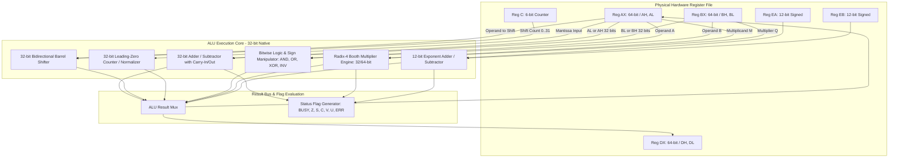
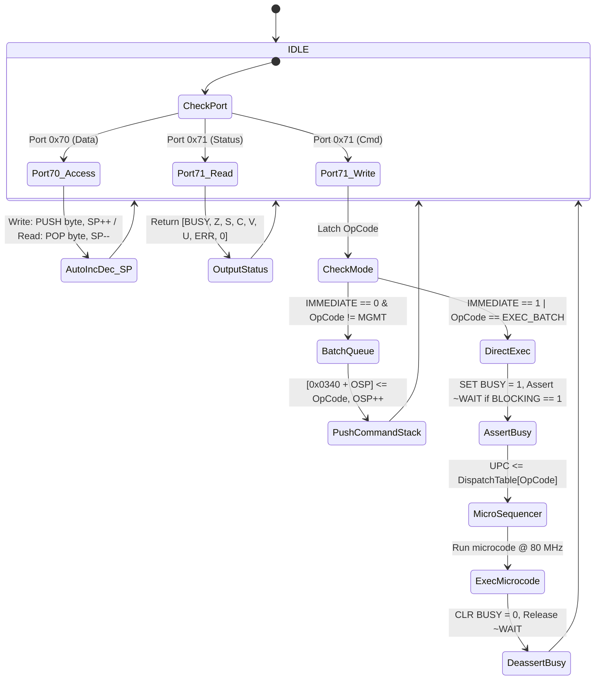

# Zx50 FPU Rev 2 Low-Level System Design

This document details the micro-architectural implementation of the FPGA-based Floating-Point and Stack Coprocessor on the **Zx50 CPU Card (Rev C4)**.

- **High-Level Architecture & ISA:** [FPU_REV2.md](file:///Users/marc/Documents/z80/Zx50/fpu/fpu_rev2/FPU_REV2.md)
- **Low-Level System Design:** `SystemDesign.md` (this document)
- **Development Roadmap:** [TODO.md](file:///Users/marc/Documents/z80/Zx50/fpu/fpu_rev2/TODO.md)

---

## 1. Design Constraints & Architectural Philosophy

The target device is the **Lattice MachXO2-2000HC-4TG100I** (`U17`), which provides:
* **2,112 LUT4s** and **2,112 Flip-Flops**.
* **8 True Dual-Port SysMEM EBR Blocks** (9,216 bytes total).
* **Single +3.3V Power Rail**, clocked at 80 MHz internally (from 40 MHz `BMCLK`).

### 1.1 Minimizing Hardware Registers vs. EBR Storage
To remain well within the 2,112 LUT4 budget while preserving high arithmetic throughput:
1. **Dedicated Flip-Flop Registers are Strictly Minimized:** Only operands actively engaged in single-cycle datapath operations (ALU inputs, accumulator, shift staging, exponent arithmetic, and status flags) are instantiated as discrete flip-flops.
2. **Bulk Storage Lives in EBR:** The 64-word hardware stack, the 64-byte user storage (`0x0300`–`0x033F`), the 256-byte vector scratchpad, mathematical lookup tables, and microcode execution memory reside entirely within dual-port SysMEM EBR.
3. **32-Bit Datapath Core with Multi-Cycle 64-Bit Sequencing:** The physical ALU primitives operate natively on 32-bit slices. 64-bit integer (`i64`) and double-precision float (`f64`) operations are synthesized across consecutive cycles under micro-sequencer control.

---

## 2. Register File Architecture

To keep hardware resource utilization low while providing sufficient scratchpad capacity for multi-word arithmetic and CORDIC transcendental algorithms, the physical register file consists of **six 32-bit data registers** (paired as three 64-bit working registers: `AX`, `BX`, `DX`), **two 12-bit exponent registers** (`EA`, `EB`), a **6-bit loop/shift counter** (`C`), and minimal control/status registers.

### 2.1 Physical Hardware Registers

```text
+-----------------------------------------------------------------------------------+
|                        PHYSICAL HARDWARE REGISTERS                                |
+-------------------+---------------------------------------------------+-----------+
| Register Name     | Description & Bit Width                           | FF Count  |
+-------------------+---------------------------------------------------+-----------+
| AH [31:0]         | Primary Accumulator High / Mantissa A High        | 32 FFs    |
| AL [31:0]         | Primary Accumulator Low  / Mantissa A Low / TOS   | 32 FFs    |
| BH [31:0]         | Operand B High           / Mantissa B High        | 32 FFs    |
| BL [31:0]         | Operand B Low            / Mantissa B Low / NOS   | 32 FFs    |
| DH [31:0]         | Spare / Product High     / Division Remainder High| 32 FFs    |
| DL [31:0]         | Spare / Product Low      / CORDIC Z Angle / Temp  | 32 FFs    |
| EA [11:0]         | Primary Working Exponent A (Signed 12-bit)        | 12 FFs    |
| EB [11:0]         | Secondary Working Exponent B (Signed 12-bit)      | 12 FFs    |
| C [5:0]           | Loop Counter & Shift Step Counter (Range 0..63)   | 6 FFs     |
| STATUS [7:0]      | System Status & Arithmetic Flags (BUSY,Z,S,C,V,U,E| 8 FFs     |
| SP [5:0]          | Hardware Stack Pointer (Index 0..63 in EBR)       | 6 FFs     |
| OSP [4:0]         | Operation Stack Pointer for Command Queue (0..31) | 5 FFs     |
| UPC [9:0]         | Microcode Program Counter (Address in EBR)        | 10 FFs    |
+-------------------+---------------------------------------------------+-----------+
Total Dedicated Flip-Flops:                                             251 FFs
```

> [!NOTE]
> **Carry / Borrow Staging:** Multi-precision carry propagation (e.g. 64-bit addition via two 32-bit steps) is handled natively by the arithmetic carry flag (`STATUS[4]`, `CARRY`) or an internal ALU pipeline latch. It is **not** an addressable general-purpose register and does not require explicit microcode operand addressing; micro-instructions simply invoke `ADD` vs `ADC` (Add with Carry) or `SUB` vs `SBB` (Subtract with Borrow).

### 2.2 Register Pairing & Functional Mapping

The 32-bit registers are paired into 64-bit compound registers:
* `AX = {AH[31:0], AL[31:0]}` (Primary Accumulator)
* `BX = {BH[31:0], BL[31:0]}` (Secondary Operand)
* `DX = {DH[31:0], DL[31:0]}` (Scratch / Product / Remainder / CORDIC Coordinate)

| Data Type | Primary Register (`AX`) | Secondary Register (`BX`) | Spare / Temp Register (`DX`) |
|---|---|---|---|
| **`i32` (32-bit Int)** | `AL` (holds 32-bit operand / result) | `BL` (holds second 32-bit operand) | `DL` (scratch / temp) |
| **`f32` (32-bit Float)**| `AL[22:0]` = Mantissa, `EA` = Exp, `AH[31]` = Sign | `BL[22:0]` = Mantissa, `EB` = Exp, `BH[31]` = Sign | `DL` (scratch / temp) |
| **`i64` (64-bit Int)** | `AX = {AH, AL}` (64-bit 2's complement value) | `BX = {BH, BL}` (64-bit 2's complement value) | `DX = {DH, DL}` (64-bit scratch) |
| **`f64` (64-bit Float)**| `AH[19:0]:AL` = 52-bit Mantissa, `EA` = Exp, `AH[31]` = Sign | `BH[19:0]:BL` = 52-bit Mantissa, `EB` = Exp, `BH[31]` = Sign | `DX = {DH, DL}` (52-bit temp) |

### 2.3 Roles of the Spare Register `DX = {DH, DL}`
Adding discrete hardware registers for `DX` yields major performance gains for multi-step math routines:
1. **Multiplication (32-bit & 64-bit):**
   * A 32-bit $\times$ 32-bit multiply produces a full 64-bit product directly in `AX = {AH, AL}` (or `DX = {DH, DL}`) without having to spill words to EBR.
   * A 64-bit $\times$ 64-bit integer multiply produces a full 128-bit product in `{DX, AX} = {DH, DL, AH, AL}` entirely in hardware registers.
2. **Integer & Mantissa Division:**
   * Natural hardware pair for division: `AX` receives the quotient while `DX` retains the remainder.
3. **CORDIC Transcendental Functions ($\sin, \cos, \arctan$):**
   * CORDIC evaluates planar vector rotation across three variables simultaneously:
     $$X_{i+1} = X_i \mp (Y_i \gg i), \quad Y_{i+1} = Y_i \pm (X_i \gg i), \quad Z_{i+1} = Z_i \mp \theta_i$$
   * Mapping $X \to \text{AX}$, $Y \to \text{BX}$, and the residual angle $Z \to \text{DX}$ enables CORDIC cross-additions to execute at **1 clock cycle per iteration**, completely avoiding EBR memory access bottlenecks during transcendental evaluations.

### 2.4 Status Register (`STATUS[7:0]`)

The 8-bit `STATUS` register reflects the runtime state of the arithmetic core and error flags. It is readable by the Z80 host via I/O Port `0x71`:

```text
+--------+--------+--------+--------+-----------+------------+-------+----------+
| Bit 7  | Bit 6  | Bit 5  | Bit 4  | Bit 3     | Bit 2      | Bit 1 | Bit 0    |
+--------+--------+--------+--------+-----------+------------+-------+----------+
| BUSY   | ZERO   | SIGN   | CARRY  | OVERFLOW  | UNDERFLOW  | ERR   | Reserved |
| (BSY)  | (ZF)   | (SF)   | (CF)   | (VF)      | (UF)       | (EF)  | (0)      |
+--------+--------+--------+--------+-----------+------------+-------+----------+
```

* **`BUSY` (Bit 7):** Set to `1` by hardware dispatcher upon receiving an execution opcode. Cleared to `0` via microcode (`CLR BUSY`) or hardware when the current operation completes.
* **`ZERO` (Bit 6, `ZF`):** Set if the ALU result is zero ($R = 0$).
* **`SIGN` (Bit 5, `SF`):** Set if the ALU result is negative (MSB $= 1$).
* **`CARRY` (Bit 4, `CF`):** Set on integer arithmetic carry out from addition or borrow from subtraction. Also acts as carry-in for multi-cycle 64-bit addition/subtraction (`ADC` / `SBB`).
* **`OVERFLOW` (Bit 3, `VF`):** Set on signed 2's complement arithmetic overflow, floating-point overflow to $\pm\infty$, or stack push overflow attempt ($SP + \text{bytes} > 256$).
* **`UNDERFLOW` (Bit 2, `UF`):** Set on floating-point underflow to zero/denormal, or stack pop underflow attempt ($SP = 0$).
* **`ERR` (Bit 1, `EF`):** Master error flag. Set high on illegal opcode, divide-by-zero, invalid operand (NaN), or stack boundary violations (underflow/overflow).
* **`Reserved` (Bit 0):** Always returns `0`.

#### Flag Updates
1. **ALU Auto-Update:** Arithmetic primitives (`alu_adder32`, `alu_logic32`, `alu_booth_mul`) automatically update `ZF`, `SF`, `CF`, and `VF` based on their outputs.
2. **Explicit Microcode Control:** Microcode can set or clear flags with no side effects using the `SET <flag>` and `CLR <flag>` $\mu$-ops (e.g. `SET BUSY`, `CLR BUSY`, `SET ERR`).
3. **Hardware Boundary Monitors:** The stack pointer hardware automatically forces `UNDERFLOW = 1` and `ERR = 1` if a `POP` is executed while $SP = 0$, and `OVERFLOW = 1` and `ERR = 1` if a `PUSH` is executed while the stack is full.

### 2.5 Control & Execution Mode Registers

Two dedicated single flip-flop mode flags control host handshaking and execution scheduling:

* **`BLOCKING` (1 FF):**
  * `1` (Default): Blocking mode. The FPGA asserts `BWAIT_N` (pulling host `~WAIT~` low) when `BUSY = 1`, holding the Z80 in wait states until completion.
  * `0`: Non-blocking mode. `BWAIT_N` is never asserted; the Z80 polls Port `0x71` bit 7 (`BUSY`).
  * Controlled via user management opcodes `SET_BLOCKING` (`0b1111_1110`) and `SET_NONBLOCKING` (`0b1111_1101`).
* **`IMMEDIATE` (1 FF):**
  * `1` (Default): Immediate mode. Each opcode written to Port `0x71` triggers immediate microcode dispatch.
  * `0`: Batch mode. Non-management opcodes written to Port `0x71` are pushed into the Command Stack (`0x0340`–`0x035F`) without executing. Execution begins only when `EXEC_BATCH` is received.
  * Controlled via user management opcodes `SET_IMMEDIATE` (`0b1111_1100`) and `SET_BATCH` (`0b1111_1011`).

### 2.6 Coupling with SysMEM Dual-Port EBR

The physical registers act as the **fast execution front-end** for the SysMEM EBR storage:

1. **Stack POP to Registers:**
   * When popping $TOS$ into `AX`: EBR read Port B fetches $TOS_{Low}$ into `AL` (Cycle 1) and $TOS_{High}$ into `AH` (Cycle 2), updating `SP <= SP - 1`.
2. **Stack PUSH from Registers:**
   * When pushing result `AX` to $TOS$: EBR write Port B stores `AL` and `AH` to address `Stack[SP]`, updating `SP <= SP + 1`.
3. **User Memory Copy (`CP [xxxx], TOS` / `CP TOS, [xxxx]`):**
   * Single-cycle or two-cycle word transfer directly between `AX` and the user memory block (`0x0300`–`0x033F`) via EBR Port B. No intermediate Z80 I/O cycles needed.

---

## 3. Microcode ISA: Arithmetic, Logic & Shifter Micro-Operations

> [!IMPORTANT]
> **Two-Layer Instruction Architecture:**
> 1. **User ISA (Host Port 0x71 Language):** The 8-bit macro-opcodes issued by the Z80 host CPU via I/O Port `0x71` (e.g. `ADD_I32`, `MUL_F64`, `SIN`, `PUSH_PI_32`, `EXEC_BATCH`), defined in [FPU_REV2.md](file:///Users/marc/Documents/z80/Zx50/fpu/fpu_rev2/FPU_REV2.md).
> 2. **Microcode ISA (Internal Micro-Operations / $\mu$-ops):** The low-level horizontal/vertical micro-instructions executed by the FPGA micro-sequencer on the physical datapath and register file (`AX`, `BX`, `DX`, `EA`, `EB`, `C`, `STATUS`, `SP`), defined across Section 3 and Section 4. Every user opcode dispatches to an internal microcode program composed of these $\mu$-ops.

The ALU consists of five independent functional primitives multiplexed into a common result bus, operating directly on the physical register file (`AX`, `BX`, `DX`, `EA`, `EB`, `C`):



### 3.1 32-Bit Parallel Adder / Subtractor (`alu_adder32`)
* **Architecture:** The physical adder is a 32-bit carry-lookahead unit. The target register is always the accumulator `A` (`AX` or `AL`). Operand width (32-bit vs. 64-bit) and cycle sequencing (1-cycle vs. 2-cycle) are **entirely implicit in the register names**.
* **Source Selection:** The source operand selects from `BX` or `DX` (for 64-bit operations) or `BL` or `DL` (for 32-bit operations).

#### Micro-Instructions & Register Transfers

| Instruction Syntax | Operation Width | Cycles | Execution & Flag Updates |
|---|:---:|:---:|---|
| **`ADD AL, {BL, DL}`** | 32-bit | 1 | `AL <- AL + src`, sets `CF`, `ZF`, `SF`, `OVF` |
| **`ADC AL, {BL, DL}`** | 32-bit | 1 | `AL <- AL + src + CF`, sets `CF`, `ZF`, `SF`, `OVF` |
| **`ADD AX, {BX, DX}`** | 64-bit | 2 | **Cycle 1:** `AL <- AL + src.L`, sets `CF`<br>**Cycle 2:** `AH <- AH + src.H + CF`, sets `CF`, `ZF` (combined), `SF`, `OVF` |
| **`ADC AX, {BX, DX}`** | 64-bit | 2 | **Cycle 1:** `AL <- AL + src.L + CF`, sets `CF`<br>**Cycle 2:** `AH <- AH + src.H + CF`, sets `CF`, `ZF` (combined), `SF`, `OVF` |
| **`SUB AL, {BL, DL}`** | 32-bit | 1 | `AL <- AL - src`, sets `CF` (borrow), `ZF`, `SF`, `OVF` |
| **`SBB AL, {BL, DL}`** | 32-bit | 1 | `AL <- AL - src - CF`, sets `CF` (borrow), `ZF`, `SF`, `OVF` |
| **`SUB AX, {BX, DX}`** | 64-bit | 2 | **Cycle 1:** `AL <- AL - src.L`, sets `CF` (borrow)<br>**Cycle 2:** `AH <- AH - src.H - CF`, sets `CF`, `ZF` (combined), `SF`, `OVF` |
| **`SBB AX, {BX, DX}`** | 64-bit | 2 | **Cycle 1:** `AL <- AL - src.L - CF`, sets `CF` (borrow)<br>**Cycle 2:** `AH <- AH - src.H - CF`, sets `CF`, `ZF` (combined), `SF`, `OVF` |
| **`CMP AL, {BL, DL}`** | 32-bit | 1 | Evaluates `AL - src`, sets `CF`, `ZF`, `SF`, `OVF` (`AL` unchanged) |
| **`CMP AX, {BX, DX}`** | 64-bit | 2 | Evaluates `AX - src`, sets `CF`, `ZF`, `SF`, `OVF` (`AX` unchanged) |

* **Estimated Complexity:** ~40 LUT4s (utilizing MachXO2 dedicated carry chains `CCU2C`).

### 3.2 32-Bit Bidirectional Barrel Shifter (`alu_shifter32`)
* **Architecture:** Executes single-cycle shifts on `AL` or two-cycle compound shifts on `AX = {AH, AL}`, controlled by register `C[5:0]`. Target is always `A`.

| Instruction Syntax | Operation Width | Cycles | Execution & Flag Updates |
|---|:---:|:---:|---|
| **`LSL AL, C`** | 32-bit | 1 | `AL <- AL << C[4:0]`, vacated LSBs filled with `0`. Sets `CF`, `ZF`, `SF`. |
| **`LSR AL, C`** | 32-bit | 1 | `AL <- AL >> C[4:0]`, vacated MSBs filled with `0`. Sets `CF`, `ZF`, `SF`, sets `STICKY` in `STATUS`. |
| **`ASR AL, C`** | 32-bit | 1 | `AL <- AL >>> C[4:0]`, MSB sign-extended. Sets `CF`, `ZF`, `SF`. |
| **`LSL AX, C`** | 64-bit | 2 | Cascaded shift left across `{AH, AL}` by `C` bits. Sets `CF`, `ZF`, `SF`. |
| **`LSR AX, C`** | 64-bit | 2 | Cascaded shift right across `{AH, AL}` by `C` bits. Sets `CF`, `ZF`, `SF`, sets `STICKY`. |
| **`ASR AX, C`** | 64-bit | 2 | Cascaded arithmetic shift right across `{AH, AL}` by `C` bits with sign extension. |

* **Estimated Complexity:** ~96 LUT4s (organized as a 5-stage multiplexer tree).

### 3.3 32-Bit Leading-Zero Counter (`alu_lzc32`)
* **Inputs:** Evaluates `AL` (32-bit mantissa) or `AX` (64-bit compound mantissa).
* **Micro-Operations & Register Transfers:**
  * **`LZC AL`:** Computes leading zero count: `C[5:0] <- LZC(AL)` (range 0..32). If `AL == 0`, sets `ZF <- 1`.
  * **`LZC AX`:** Evaluates `{AH, AL}`: if `AH != 0`, `C <- LZC(AH)`; else `C <- 32 + LZC(AL)`.
  * **Normalization Chaining:** In the subsequent cycle, `C` feeds the shifter and exponent unit:
    * `LSL AL, C` or `LSL AX, C` (normalizes mantissa).
    * `EA <- EA - C` (adjusts exponent to match normalization shift).
* **Estimated Complexity:** ~32 LUT4s.

### 3.4 Bitwise Logic & Sign Manipulator (`alu_logic32`)
* **Target:** Accumulator `A` (`AL` or `AX`). Source selects from `BX`, `DX`, `BL`, or `DL`.

| Instruction Syntax | Operation Width | Cycles | Execution & Flag Updates |
|---|:---:|:---:|---|
| **`AND AL, {BL, DL}`** | 32-bit | 1 | `AL <- AL & src`, sets `ZF`, `SF`, clears `CF <- 0`, `OVF <- 0` |
| **`OR AL, {BL, DL}`**  | 32-bit | 1 | `AL <- AL \| src`, sets `ZF`, `SF`, clears `CF <- 0`, `OVF <- 0` |
| **`XOR AL, {BL, DL}`** | 32-bit | 1 | `AL <- AL ^ src`, sets `ZF`, `SF`, clears `CF <- 0`, `OVF <- 0` |
| **`NOT AL`**           | 32-bit | 1 | `AL <- ~AL`, sets `ZF`, `SF`, clears `CF <- 0`, `OVF <- 0` |
| **`AND AX, {BX, DX}`** | 64-bit | 2 | `AL <- AL & src.L`, `AH <- AH & src.H`, sets flags |
| **`OR AX, {BX, DX}`**  | 64-bit | 2 | `AL <- AL \| src.L`, `AH <- AH \| src.H`, sets flags |
| **`XOR AX, {BX, DX}`** | 64-bit | 2 | `AL <- AL ^ src.L`, `AH <- AH ^ src.H`, sets flags |
| **`NOT AX`**           | 64-bit | 2 | `AL <- ~AL`, `AH <- ~AH`, sets flags |
| **`CHS`**              | Float Sign | 1 | `AH[31] <- ~AH[31]`, sets `SF <- AH[31]` (`AL` and `EA` unmodified) |
| **`ABS`**              | Float Sign | 1 | `AH[31] <- 0`, clears `SF <- 0` |

* **Estimated Complexity:** ~16 LUT4s.

### 3.5 12-Bit Exponent ALU (`alu_exp12`)
* **Inputs:** Primary exponent `EA[11:0]`, Secondary exponent `EB[11:0]`, Counter `C[5:0]`, Hardwired Biases (`BIAS_F32 = 127`, `BIAS_F64 = 1023`).
* **Micro-Operations & Register Transfers:**
  * **Exponent Difference (Mantissa Alignment):**
    * `C[5:0] <- EA - EB`.
    * If `EA < EB` (`CF` set / negative difference): micro-sequencer swaps `AX <-> BX` and `EA <-> EB`, setting `C <- EB - EA` (sets right-shift alignment count for smaller operand).
  * **Multiplication Exponent Addition:**
    * `EA <- EA + EB - BIAS`.
    * If `EA > MaxExp`: sets `OVF <- 1`, `ERR <- 1`.
    * If `EA <= 0`: sets `UF <- 1` (underflow / denormal).
  * **Division Exponent Subtraction:**
    * `EA <- EA - EB + BIAS`.
    * Sets `OVF` / `UF` / `ERR` if out of valid IEEE range.
  * **Post-Normalization Exponent Update:**
    * `EA <- EA - C` (deducts normalization shift count found by `alu_lzc32`).
    * Sets `UF` if exponent falls $\le 0$.
* **Estimated Complexity:** ~18 LUT4s (utilizing dedicated carry chains).

### 3.6 Radix-4 Modified Booth Multiplier (`alu_booth_mul`)
* **Inputs:** Multiplicand in `BL` (or `BX`), Multiplier in `AL` (or `AX`), Partial Product Accumulator initialized in `DX`.
* **Micro-Operations & Register Transfers:**
  1. **Initialization:**
     * `DH <- 0`, `DL <- 0` (clears product accumulator).
     * `C <- 16` (for 32-bit `i32` or `f32` mantissa) or `C <- 32` (for 64-bit `i64`).
     * Internal Booth latch: `Booth_Bit_Minus1 <- 0`.
  2. **Iterative Step (Repeated while `C != 0`):**
     * Inspects 3-bit window `{AL[1:0], Booth_Bit_Minus1}`:

| Window `{AL[1:0], Booth_Bit_Minus1}` | Operation on Partial Product | Action |
|:---:|:---:|---|
| `000` | $+0$ | `DX <- DX` (No addition) |
| `001` | $+1 \times BL$ | `DX <- DX + BL` (via `alu_adder32`) |
| `010` | $+1 \times BL$ | `DX <- DX + BL` |
| `011` | $+2 \times BL$ | `DX <- DX + (BL << 1)` |
| `100` | $-2 \times BL$ | `DX <- DX - (BL << 1)` |
| `101` | $-1 \times BL$ | `DX <- DX - BL` |
| `110` | $-1 \times BL$ | `DX <- DX - BL` |
| `111` | $+0$ | `DX <- DX` (No addition) |

     * **Combined 2-Bit Arithmetic Right Shift:**
       * `Booth_Bit_Minus1 <- AL[1]`.
       * Compound `{DX, AL}` arithmetic shifts right by 2 bits (`ASR 2`):
         * `DX <- DX >>> 2`
         * `AL <- {DX[1:0], AL[31:2]}`
     * Decrement counter: `C <- C - 1`.
  3. **Completion & Write-Back:**
     * **32-Bit Integer Multiply (`i32`):**
       * `AH <- DH`, `AL <- DL` (assembled into 64-bit compound product `AX = {AH, AL}`).
       * Sets `ZF`, `SF`, and `OVF` (if `AH` is not sign extension of `AL`).
     * **32-Bit Float Mantissa Multiply (`f32`):**
       * If bit 47 of product is set: `AL <- AL >> 1`, `EA <- EA + 1`.
     * **64-Bit Integer Multiply (`i64`):**
       * Full 128-bit product resides in `{DX, AX} = {DH, DL, AH, AL}`.
* **Performance & Latency:**
  * **32-Bit Integer / Mantissa (`i32`, `f32`):** Retires 32 bits in **16 clock cycles** (200 ns @ 80 MHz).
  * **53-Bit Double Mantissa (`f64`):** Retires 54 bits in **27 clock cycles** (337 ns @ 80 MHz).
  * **64-Bit Integer (`i64`):** Retires 64 bits in **32 clock cycles** (400 ns @ 80 MHz).
* **Key Advantages:**
  * **Native 2's Complement:** Handles signed integer multiplication directly without pre-converting to unsigned magnitudes.
  * **Zero EBR Memory:** Frees the 1,024-byte Quarter-Square EBR table for general microcode and math constants.
  * **Low Gate Count:** Adds only ~52 LUT4s for Booth muxing and loop state control.

---

## 4. Microcode ISA: Data Movement, Memory, Stack & Control Flow Micro-Operations

### 4.1 Stack Operations & Stack Pointer Semantics (`POP` and `PUSH`)

The execution stack resides in the SysMEM EBR block at `0x0000`–`0x00FF` (256 bytes = 64 $\times$ 32-bit words). All stack accesses strictly follow an explicit **`POP`** and **`PUSH`** discipline relative to the hardware Stack Pointer `SP`.

* **No direct writing to `NOS`:** All stack reads and writes occur strictly at `TOS` (`[SP]`).
* Every stack read is an explicit `POP` that decrements `SP`.
* Every stack write is an explicit `PUSH` that increments `SP`.

#### Stack Micro-Instructions

| Instruction Syntax | Width | Bytes | SP Action | Operation & Register Transfer |
|---|:---:|:---:|:---:|---|
| **`POP AL`**  | 32-bit | 4 | $SP \leftarrow SP - 4$ | `AL <- [SP]`, decrements $SP$ by 4 bytes (1 word) |
| **`POP BL`**  | 32-bit | 4 | $SP \leftarrow SP - 4$ | `BL <- [SP]`, decrements $SP$ by 4 bytes (1 word) |
| **`POP AX`**  | 64-bit | 8 | $SP \leftarrow SP - 8$ | `AX <- [SP]`, decrements $SP$ by 8 bytes (2 words) |
| **`POP BX`**  | 64-bit | 8 | $SP \leftarrow SP - 8$ | `BX <- [SP]`, decrements $SP$ by 8 bytes (2 words) |
| **`POP DL`**  | 32-bit | 4 | $SP \leftarrow SP - 4$ | `DL <- [SP]`, decrements $SP$ by 4 bytes (1 word) |
| **`POP DX`**  | 64-bit | 8 | $SP \leftarrow SP - 8$ | `DX <- [SP]`, decrements $SP$ by 8 bytes (2 words) |
| **`PUSH AL`** | 32-bit | 4 | $SP \leftarrow SP + 4$ | Increments $SP$ by 4 bytes, `[SP] <- AL` |
| **`PUSH BL`** | 32-bit | 4 | $SP \leftarrow SP + 4$ | Increments $SP$ by 4 bytes, `[SP] <- BL` |
| **`PUSH AX`** | 64-bit | 8 | $SP \leftarrow SP + 8$ | Increments $SP$ by 8 bytes, `[SP] <- AX` (two 32-bit writes) |
| **`PUSH BX`** | 64-bit | 8 | $SP \leftarrow SP + 8$ | Increments $SP$ by 8 bytes, `[SP] <- BX` (two 32-bit writes) |
| **`PUSH DL`** | 32-bit | 4 | $SP \leftarrow SP + 4$ | Increments $SP$ by 4 bytes, `[SP] <- DL` |
| **`PUSH DX`** | 64-bit | 8 | $SP \leftarrow SP + 8$ | Increments $SP$ by 8 bytes, `[SP] <- DX` (two 32-bit writes) |

#### Standard Microcode Execution Sequences

By adhering strictly to `POP` and `PUSH`, microcode state machines are completely uniform, deterministic, and eliminate any ambiguity over writing to TOS vs. NOS:

1. **Unary Operations (e.g. `SQRT`, `CHS`, `ABS`, `SIN`, `LN`):**
   * **32-Bit:**
     1. `POP AL` (Pops single operand from stack: $SP \leftarrow SP - 4$)
     2. *[Execute ALU math primitive / CORDIC / microcode]*
     3. `PUSH AL` (Pushes single result back: $SP \leftarrow SP + 4$)
     * *Net $SP$ change: 0 bytes.*
   * **64-Bit:**
     1. `POP AX` (Pops 64-bit operand: $SP \leftarrow SP - 8$)
     2. *[Execute ALU math primitive]*
     3. `PUSH AX` (Pushes 64-bit result: $SP \leftarrow SP + 8$)
     * *Net $SP$ change: 0 bytes.*

2. **Binary Operations (e.g. `ADD`, `SUB`, `MUL`, `DIV`, `POW`):**
   * Operands on stack: $NOS$ was pushed first, $TOS$ was pushed second.
   * **32-Bit:**
     1. `POP BL` (Pops TOS, the 2nd operand $B$: $SP \leftarrow SP - 4$)
     2. `POP AL` (Pops NOS, the 1st operand $A$: $SP \leftarrow SP - 4$)
     3. *[Execute math: e.g. `SUB AL, BL` computing $A - B$]*
     4. `PUSH AL` (Pushes single result back: $SP \leftarrow SP + 4$)
     * *Net $SP$ change: $-4$ bytes (stack shrinks by one 32-bit operand).*
   * **64-Bit:**
     1. `POP BX` (Pops TOS, 64-bit 2nd operand $B$: $SP \leftarrow SP - 8$)
     2. `POP AX` (Pops NOS, 64-bit 1st operand $A$: $SP \leftarrow SP - 8$)
     3. *[Execute math: e.g. `SUB AX, BX` computing $A - B$]*
     4. `PUSH AX` (Pushes 64-bit result back: $SP \leftarrow SP + 8$)
     * *Net $SP$ change: $-8$ bytes (stack shrinks by one 64-bit operand).*

#### Stack Boundary Protection

Explicit `POP` and `PUSH` operations simplify hardware limit enforcement:
* **Underflow Detection:** Any `POP` attempted when $SP = 0$ aborts the instruction and sets `STATUS[2]` (`UNDERFLOW`) and `STATUS[1]` (`ERR`).
* **Overflow Detection:** Any `PUSH` attempted when $SP + \text{bytes} > 256$ aborts the write and sets `STATUS[3]` (`OVERFLOW`) and `STATUS[1]` (`ERR`).

### 4.2 Scratchpad Operations (`SCR`)

A dedicated 256-byte vector and math scratchpad area is located in SysMEM EBR at `0x0200`–`0x02FF` (64 $\times$ 32-bit words). It is indexed by a 6-bit word address `[addr]` (0..63).

| Instruction Syntax | Direction | Register Transfers |
|---|:---:|---|
| **`SCR {AH, AL, BH, BL, DH, DL}, [addr]`** | Read | `reg <- Scratch[addr]` (Loads 32-bit word from scratchpad) |
| **`SCR [addr], {AH, AL, BH, BL, DH, DL}`** | Write | `Scratch[addr] <- reg` (Stores 32-bit word to scratchpad) |

* **Use Cases:** Staging Taylor series partial sums, storing CORDIC coordinate rotation intermediates ($X, Y, Z$), and polynomial coefficient caching without modifying or corrupting the user stack.

### 4.3 Immediate Loads (`LD`)

Loads a 32-bit immediate literal constant embedded in microcode ROM directly into a working register:
* **`LD {AH, AL, BH, BL, DH, DL}, <imm32>`**
* **`LD {AX, BX, DX}, <imm64>`** (Loads compound 64-bit constant in 2 clock cycles)
* **`LD SP, 0`** (Direct reset of the Stack Pointer)
* **`LD OSP, 0`** (Direct reset of the Operation Stack Pointer)

### 4.4 Register-to-Register Moves (`MOV`)

Fast single-cycle data transfers between dedicated registers:

| Instruction Syntax | Width | Description |
|---|:---:|---|
| **`MOV DH, {AH, BH}`** | 32-bit | Move accumulator/operand high word to spare high register `DH` |
| **`MOV {AH, BH}, DH`** | 32-bit | Restore high word from spare register `DH` |
| **`MOV DL, {AL, BL}`** | 32-bit | Move accumulator/operand low word to spare low register `DL` |
| **`MOV {AL, BL}, DL`** | 32-bit | Restore low word from spare register `DL` |
| **`MOV DX, {AX, BX}`** | 64-bit | Compound 64-bit move to spare register `DX` (2 cycles) |
| **`MOV {AX, BX}, DX`** | 64-bit | Compound 64-bit move from spare register `DX` (2 cycles) |
| **`MOV C, <imm6>`**    | 6-bit  | Load shift/loop counter `C` directly with immediate literal (0..63) |
| **`MOV C, AL[5:0]`**   | 6-bit  | Load shift/loop counter `C` from lower 6 bits of `AL` |
| **`MOV EA, EB`**       | 12-bit | Copy exponent register `EB` to `EA` |
| **`MOV EB, EA`**       | 12-bit | Copy exponent register `EA` to `EB` |

### 4.5 Jump, Branch & Flag Micro-Operations (`JNZ`, `JZ`, `LOOP`, `SET`, `CLR`)

Control flow within microcode programs is managed by conditional jumps, loop counters, and explicit flag assertions:

| Micro-Operation | Condition Tested | Action |
|---|---|---|
| **`JNZ offset`** | Zero Flag `ZF == 0` | Jump to microcode label/offset if result is non-zero |
| **`JZ offset`** | Zero Flag `ZF == 1` | Jump to microcode label/offset if result is zero |
| **`JNZ flag, offset`** | Specified `STATUS` flag `== 1` | Jump to label if flag is set (e.g. `UNDERFLOW`, `OVERFLOW`, `ERR`, `CARRY`, `SIGN`, `BUSY`) |
| **`JZ flag, offset`** | Specified `STATUS` flag `== 0` | Jump to label if flag is clear |
| **`LOOP offset`** | Counter `C != 0` | Decrements `C <= C - 1`; if `C != 0` jump to offset, else fall through |
| **`SET flag`** | None | Assert specified status flag with no side effects (`SET BUSY`, `SET ERR`) |
| **`CLR flag`** | None | Clear specified status flag with no side effects (`CLR BUSY`, `CLR ERR`, `CLR CARRY`) |

### 4.6 User Memory Isolation

> [!IMPORTANT]
> **Microcode has zero direct access to user storage memory.**
> User memory (`0x0300`–`0x033F`, 16 words $\times$ 4 bytes = 64 bytes) is strictly private user workspace. It is manipulated solely by the Z80 host bus interface through Port 0x71 opcodes:
> * `CP [xxxx], TOS` (Opcode `0b1101_xxxx`): Copies 4 or 8 bytes from TOS into user slot `xxxx`.
> * `CP TOS, [xxxx]` (Opcode `0b1110_xxxx`): Copies 4 or 8 bytes from user slot `xxxx` to TOS.
> * `ZERO_MEM` (Opcode `0b1111_0000`): Clears all 16 user slots.
> 
> Because microcode cannot address this memory, user variables are guaranteed to remain untouched across all arithmetic, transcendental, and CORDIC computations.

### 4.7 Command Stack & Batch Execution Engine (`0x0340`–`0x035F`)

To prevent the Z80 host CPU from incurring massive bus-poll overhead (writing an opcode $\to$ polling status register $\to$ checking `BUSY` $\to$ writing next opcode), the FPU incorporates a dedicated 32-byte **Command Stack** in SysMEM EBR managed by the 5-bit **`OSP[4:0]`** (Operation Stack Pointer) register.

#### Operating Modes & Management Commands

| Opcode | Mnemonic | Mode / Action |
|---|---|---|
| `0b1111_1100` | **`SET_IMMEDIATE`** | **Immediate Mode (Default):** Sets `IMMEDIATE = 1`. Each opcode written to Port 0x71 is pushed to `[OSP]`, immediately executed by the micro-engine, and popped upon completion. |
| `0b1111_1011` | **`SET_BATCH`**     | **Batch Mode:** Sets `IMMEDIATE = 0`. Arriving arithmetic, conversion, and constant opcodes are queued sequentially into the command stack (`[OSP] <- opcode; OSP <- OSP + 1`) without triggering immediate execution. Up to 32 opcodes can be queued. |
| `0b1111_1010` | **`EXEC_BATCH`**    | **Batch Execute:** Micro-engine asserts `BUSY = 1` (and `WAIT_N` if in blocking mode) and executes all queued opcodes back-to-back at 80 MHz from index 0 to `OSP - 1`. Resets $OSP \leftarrow 0$ upon completion. |
| `0b1100_0110` | **`CLEAR_STACK`**   | Resets both the Operand Stack Pointer $SP \leftarrow 0$ and the Operation Stack Pointer $OSP \leftarrow 0$. |

* **Unified Micro-Pipeline:** Both modes utilize the same queue mechanism: in immediate mode, the queue has a depth of 1 (push $\to$ execute $\to$ pop). In batch mode, the host streams a complete mathematical formula (e.g. via Z80 `OTIR` block I/O), then fires `EXEC_BATCH`, allowing the FPGA to evaluate the sequence entirely in hardware at wire speed.

### 4.8 Mathematical Constants in Microcode Program & ROM

Mathematical constants can be supplied in two ways:
1. **Embedded Immediate Literals in Microcode:** Because microcode words support immediate loads (`LD DL, <const>` or `LD DX, <const>`), constants can live directly inside the microcode ROM program space as literal values. This avoids consuming address lines or memory cycles for table lookups.
2. **Dedicated SysMEM EBR ROM Table (`0x0400`–`0x07FF`):** High-precision constants formatted as IEEE-754 Single Precision (`f32`) and Double Precision (`f64`).

---

## 5. Microcode Implementation of User OpCodes

This section specifies the internal microcode program executed for each user OpCode (as defined in [FPU_REV2.md](file:///Users/marc/Documents/z80/Zx50/fpu/fpu_rev2/FPU_REV2.md)).

### Execution Contracts & Preconditions
* **BUSY Verification:** The hardware dispatcher guarantees that `BUSY == 0` before initiating any new macro-opcode. Upon dispatch, `SET BUSY` is asserted.
* **Underflow Trapping:** Every `POP` primitive tests for stack underflow ($SP = 0$). If an underflow is detected, hardware immediately sets `UNDERFLOW = 1` and `ERR = 1`, and the microcode branches to the error exit.
* **Overflow Trapping:** Every `PUSH` primitive tests for stack capacity ($SP + \text{bytes} > 256$). If full, hardware sets `OVERFLOW = 1` and `ERR = 1`.
* **Clean Termination:** Every routine exits by clearing the busy flag (`CLR BUSY`), which immediately deasserts `BWAIT_N` (releasing the host `~WAIT~` line if `BLOCKING = 1`).

---

### 5.1 ALU Arithmetic Operations (60 Operations: 15 Ops $\times$ 4 Formats)

The 15 ALU math operations are implemented across four numeric data types (`i32`, `i64`, `f32`, `f64`).

#### 1. ADD `i32` (`0b0000_0000`)
```text
add_i32:
  SET BUSY
  POP BL
  JNZ UNDERFLOW, add_i32_error
  POP AL
  JNZ UNDERFLOW, add_i32_error
  ADD AL, BL
  PUSH AL
add_i32_error:
  CLR BUSY
```

#### 2. ADD `i64` (`0b0000_0010`)
```text
add_i64:
  SET BUSY
  POP BX
  JNZ UNDERFLOW, add_i64_error
  POP AX
  JNZ UNDERFLOW, add_i64_error
  ADD AX, BX
  PUSH AX
add_i64_error:
  CLR BUSY
```

#### 3. SUB `i32` (`0b0000_1000`)
```text
sub_i32:
  SET BUSY
  POP BL
  JNZ UNDERFLOW, sub_i32_error
  POP AL
  JNZ UNDERFLOW, sub_i32_error
  SUB AL, BL
  PUSH AL
sub_i32_error:
  CLR BUSY
```

#### 4. SUB `i64` (`0b0000_1010`)
```text
sub_i64:
  SET BUSY
  POP BX
  JNZ UNDERFLOW, sub_i64_error
  POP AX
  JNZ UNDERFLOW, sub_i64_error
  SUB AX, BX
  PUSH AX
sub_i64_error:
  CLR BUSY
```

#### 5. MUL `i32` (`0b0001_0000`)
```text
mul_i32:
  SET BUSY
  POP BL
  JNZ UNDERFLOW, mul_i32_error
  POP AL
  JNZ UNDERFLOW, mul_i32_error
  MUL AL, BL              ; Radix-4 Booth multiplier computes AL * BL in 16 cycles
  PUSH AL                 ; Push lower 32-bit product
mul_i32_error:
  CLR BUSY
```

#### 6. MUL `i64` (`0b0001_0010`)
```text
mul_i64:
  SET BUSY
  POP BX
  JNZ UNDERFLOW, mul_i64_error
  POP AX
  JNZ UNDERFLOW, mul_i64_error
  MUL AX, BX              ; Booth multiplier computes 64x64 in 32 cycles -> AX
  PUSH AX
mul_i64_error:
  CLR BUSY
```

#### 7. Floating-Point ADD `f32` (`0b0000_0001`)
```text
add_f32:
  SET BUSY
  POP BL                  ; Pop operand B
  JNZ UNDERFLOW, add_f32_error
  POP AL                  ; Pop operand A
  JNZ UNDERFLOW, add_f32_error
  ; 1. Unpack sign, exponent, and insert hidden 1 into mantissa:
  ;    EA <- AL[30:23], EB <- BL[30:23]
  ; 2. Exponent difference & mantissa alignment:
  SUB EB, EA              ; Exponent delta
  ; If delta > 0: swap operands or shift AL right by C
  LSR BL, C               ; Align smaller mantissa
  ; 3. Add mantissas:
  ADD AL, BL
  ; 4. Normalize result via Leading Zero Counter:
  LZC C, AL               ; Count leading zeros
  LSL AL, C               ; Normalize mantissa
  SUB EA, C               ; Adjust exponent
  ; 5. Pack IEEE-754 single precision word:
  PUSH AL
add_f32_error:
  CLR BUSY
```

#### 8. Floating-Point MUL `f32` (`0b0001_0001`)
```text
mul_f32:
  SET BUSY
  POP BL
  JNZ UNDERFLOW, mul_f32_error
  POP AL
  JNZ UNDERFLOW, mul_f32_error
  ; 1. Add exponents: EA <- EA + EB - 127 (bias adjustment)
  ; 2. Multiply 24-bit mantissas:
  MUL AL, BL              ; Booth multiplier produces 48-bit product in AX
  ; 3. Normalize & round:
  ;    If AH[15] == 1, shift right 1 and increment EA
  ; 4. Pack into IEEE-754 f32:
  PUSH AL
mul_f32_error:
  CLR BUSY
```

#### 9. Floating-Point Square Root `SQRT_F32` (`0b0100_0001`)
```text
sqrt_f32:
  SET BUSY
  POP AL
  JNZ UNDERFLOW, sqrt_f32_error
  JNZ SIGN, sqrt_f32_domain_error  ; Sqrt of negative number -> ERR
  ; Halve exponent: EA <- (EA - 127)/2 + 127
  ; Non-restoring square root iteration:
  MOV C, 24               ; 24 mantissa bits
sqrt_loop:
  ; Step square root bit-by-bit
  LOOP sqrt_loop
  PUSH AL
  CLR BUSY
sqrt_f32_domain_error:
  SET ERR
sqrt_f32_error:
  CLR BUSY
```

#### 10. Trigonometric Sine `SIN_F32` (`0b0101_1001`)
```text
sin_f32:
  SET BUSY
  POP AL                  ; Input angle theta
  JNZ UNDERFLOW, sin_f32_error
  ; Setup CORDIC planar registers:
  ; AX (X) <- 0x26DD3B6A (1/K constant)
  ; BX (Y) <- 0
  ; DX (Z) <- AL (target angle)
  MOV C, 24               ; 24 rotation stages
cordic_loop:
  ; In parallel or 3 cycles:
  ; X_next = X - (Y >> C)
  ; Y_next = Y + (X >> C)
  ; Z_next = Z - atan_table[C]
  LOOP cordic_loop
  ; BX now holds sin(theta)
  PUSH BL
sin_f32_error:
  CLR BUSY
```

---

### 5.2 Stack Operations (10 Operations)

#### 1. DUP4 (`0b1100_0000`)
```text
dup_4:
  SET BUSY
  POP AL
  JNZ UNDERFLOW, dup_4_error
  PUSH AL
  PUSH AL                 ; Second PUSH duplicates TOS (may flag OVERFLOW)
dup_4_error:
  CLR BUSY
```

#### 2. DUP8 (`0b1100_0001`)
```text
dup_8:
  SET BUSY
  POP AX
  JNZ UNDERFLOW, dup_8_error
  PUSH AX
  PUSH AX                 ; Second PUSH duplicates 64-bit TOS
dup_8_error:
  CLR BUSY
```

#### 3. CLEAR_STACK (`0b1100_0110`)
```text
clear_stack:
  SET BUSY
  LD SP, 0                ; Reset Operand Stack Pointer
  LD OSP, 0               ; Reset Command Queue Pointer
  CLR BUSY
```

#### 4. CONV_I32_I64 (`0b1100_1000`)
```text
conv_i32_i64:
  SET BUSY
  POP AL
  JNZ UNDERFLOW, conv_i32_i64_error
  ; Sign-extend 32-bit AL into AH:
  JNZ SIGN, sign_negative
  LD AH, 0x00000000
  JZ conv_i32_i64_push
sign_negative:
  LD AH, 0xFFFFFFFF
conv_i32_i64_push:
  PUSH AX                 ; Pushes 64-bit signed integer
conv_i32_i64_error:
  CLR BUSY
```

#### 5. CONV_F32_F64 (`0b1100_1001`)
```text
conv_f32_f64:
  SET BUSY
  POP AL
  JNZ UNDERFLOW, conv_f32_f64_error
  ; Re-bias exponent: E_64 <- E_32 - 127 + 1023
  ; Repack mantissa into 52-bit {AH[19:0], AL}:
  PUSH AX
conv_f32_f64_error:
  CLR BUSY
```

#### 6. CONV_I64_I32 (`0b1100_1010`)
```text
conv_i64_i32:
  SET BUSY
  POP AX
  JNZ UNDERFLOW, conv_i64_i32_error
  ; Check if upper 32 bits AH represent valid sign extension of AL:
  ; If not, SET OVERFLOW
  PUSH AL
conv_i64_i32_error:
  CLR BUSY
```

#### 7. CONV_F64_F32 (`0b1100_1011`)
```text
conv_f64_f32:
  SET BUSY
  POP AX
  JNZ UNDERFLOW, conv_f64_f32_error
  ; Re-bias exponent: E_32 <- E_64 - 1023 + 127
  ; Truncate/round 52-bit mantissa to 23 bits into AL:
  PUSH AL
conv_f64_f32_error:
  CLR BUSY
```

#### 8. CP [xxxx], TOS (`0b1101_xxxx`)
```text
cp_mem_tos:
  SET BUSY
  ; Hardware latch: offset = opcode[3:0]
  POP DL
  JNZ UNDERFLOW, cp_mem_tos_error
  [user_base || offset] = DL
cp_mem_tos_error:
  CLR BUSY
```

#### 9. CP TOS, [xxxx] (`0b1110_xxxx`)
```text
cp_tos_mem:
  SET BUSY
  ; Hardware latch: offset = opcode[3:0]
  DL = [user_base || offset]
  PUSH DL                 ; May result in OVERFLOW if stack full
  CLR BUSY
```

#### 10. ZERO_MEM (`0b1111_0000`)
```text
zero_mem:
  SET BUSY
  MOV C, 16               ; 16 user storage words
zero_mem_loop:
  [user_base || C] = 0
  LOOP zero_mem_loop
  CLR BUSY
```

---

### 5.3 Mathematical Constant Push Opcodes

Constants are loaded directly as immediate literals in the microcode program or from ROM, and pushed to the stack:

#### 32-Bit Constant Push Template (`PUSH_X_32`)
```text
push_X_32:
  SET BUSY
  LD DL, <constant_32>    ; Immediate 32-bit constant literal
  PUSH DL                 ; Pushes 32-bit float (may flag OVERFLOW)
  CLR BUSY
```

#### 64-Bit Constant Push Template (`PUSH_X_64`)
```text
push_X_64:
  SET BUSY
  LD DX, <constant_64>    ; Immediate 64-bit constant literal
  PUSH DX                 ; Pushes 64-bit float (may flag OVERFLOW)
  CLR BUSY
```

---

### 5.4 Management Operations

#### 1. RESET (`0b1111_1111`)
```text
reset:
  LD SP, 0                ; Clear Operand Stack Pointer
  LD OSP, 0               ; Clear Command Stack Pointer
  CLR BUSY                ; Clear all status flags
  CLR ZERO
  CLR SIGN
  CLR CARRY
  CLR OVERFLOW
  CLR UNDERFLOW
  CLR ERR
```

#### 2. SET_BLOCKING (`0b1111_1110`) & SET_NONBLOCKING (`0b1111_1101`)
```text
set_blocking:
  BLOCKING <= 1           ; Set BLOCKING flip-flop
  CLR BUSY

set_nonblocking:
  BLOCKING <= 0           ; Clear BLOCKING flip-flop
  CLR BUSY
```

#### 3. SET_IMMEDIATE (`0b1111_1100`) & SET_BATCH (`0b1111_1011`)
```text
set_immediate:
  IMMEDIATE <= 1          ; Set IMMEDIATE flip-flop
  CLR BUSY

set_batch:
  IMMEDIATE <= 0          ; Clear IMMEDIATE flip-flop
  CLR BUSY
```

#### 4. EXEC_BATCH (`0b1111_1010`)
```text
exec_batch:
  SET BUSY
  ; Iterate command queue from index 0 to OSP - 1:
  ; For each opcode in Command_Stack:
  ;   Dispatch to opcode microcode entry point
  ;   Execute microcode until CLR BUSY equivalent
  LD OSP, 0               ; Reset Command Stack Pointer upon completion
  CLR BUSY
```

---

## 6. Dispatcher Logic

The Dispatcher is the hardware front-end state machine that bridges the Z80 host bus (Ports `0x70` and `0x71`) to the internal SysMEM EBR and micro-engine:



### 6.1 Port `0x70` Data I/O Handling (`DATA_PUSH` / `DATA_POP`)
* **Write (Push):** The Z80 writes a data byte to Port `0x70`. The hardware writes the byte into `Stack[SP]` on EBR Port A and automatically increments $SP \leftarrow SP + 1$.
* **Read (Pop):** The Z80 reads a data byte from Port `0x70`. The hardware reads the byte from `Stack[SP - 1]` and automatically decrements $SP \leftarrow SP - 1$.
* **Zero Overhead:** Streamed block transfers (`OTIR` / `INIR`) transfer 4-byte or 8-byte numbers directly without requiring opcode dispatches.

### 6.2 Port `0x71` Opcode & Status Handling
* **Read (Status):** Returns the 8-bit `STATUS` register (`[BUSY, ZERO, SIGN, CARRY, OVERFLOW, UNDERFLOW, ERR, 0]`). Zero wait states inserted.
* **Write (Opcode):**
  1. If `IMMEDIATE == 1`: The opcode is latched, `BUSY` is asserted, and the dispatch table sets the microcode program counter:
     $$\text{UPC} \leftarrow \text{DispatchTable}[\text{Opcode}]$$
  2. If `IMMEDIATE == 0` (Batch Mode) and opcode is not a management command: The opcode is written to SysMEM EBR Command Stack at `0x0340 + OSP`, and $OSP \leftarrow OSP + 1$.
  3. If opcode is `EXEC_BATCH` (`0b1111_1010`): The sequencer iterates through all queued commands in EBR back-to-back at 80 MHz.

### 6.3 Handshaking & `~WAIT` State Management
* Handshake signal `BWAIT_N` directly drives the open-drain N-channel FET `Q4` connected to host `~WAIT~`:
  $$\text{BWAIT\_N} = \text{BLOCKING} \ \& \ \text{BUSY}$$
* When `BLOCKING = 1`, writing any execution opcode to Port `0x71` immediately pulls host `~WAIT~` low on the Z80 clock edge, holding the processor until microcode finishes and clears `BUSY`.

---

## 7. Hardware Resource & Gate Budget Estimation

Based on MachXO2-2000 slice utilization:

| Subsystem Component | Estimated LUT4s | Estimated FFs | Dedicated EBR |
|---|:---:|:---:|:---:|
| **32-Bit Adder/Subtractor (`alu_adder32`)** | 40 | 0 | 0 |
| **32-Bit Barrel Shifter (`alu_shifter32`)** | 96 | 0 | 0 |
| **Radix-4 Booth Multiplier (`alu_booth_mul`)** | 52 | 10 | 0 |
| **Leading-Zero Counter (`alu_lzc32`)** | 32 | 0 | 0 |
| **Bitwise / Sign Logic (`alu_logic32`)** | 16 | 0 | 0 |
| **12-Bit Exponent ALU (`alu_exp12`)** | 18 | 0 | 0 |
| **Dedicated Register File (`AX`, `BX`, `DX`, `EA`, `EB`, `C`, `OSP`, `MODES`)** | 32 | 253 | 0 |
| **ALU Result Multiplexers & Datapath Steering** | 76 | 0 | 0 |
| **Micro-Sequencer Logic & Opcode Decode** | 120 | 32 | 0 |
| **Host Z80 Bus Interface (`BA`, `BD`, Port Decoder, Dispatcher)** | 85 | 50 | 0 |
| **Autonomous QSPI Flash Boot Loader** | 85 | 60 | 0 |
| **EBR Memory Subsystem (Stack, Microcode, Math Constants)** | 0 | 0 | 7 Blocks |
| **Total Estimated Utilization** | **~652 LUT4s** | **~405 FFs** | **7 EBR Blocks** |
| **Available on MachXO2-2000HC** | **2,112 LUT4s** | **2,112 FFs** | **8 EBR Blocks** |
| **Resource Margin** | **~69% Free** | **~80% Free** | **1 EBR Block Free (~12%)** |

> [!NOTE]
> The complete coprocessor architecture—encompassing the 32-bit ALU primitives, Radix-4 Booth multiplier, discrete register file with `DX` scratchpad, hardware stack boundary trapping, batch command queue, and dual-mode dispatcher—consumes only **~652 LUT4s** (~31% of the MachXO2-2000) and **405 FFs** (~19%). This leaves ample headroom for board-level peripherals, memory banking, and QSPI boot controllers.
