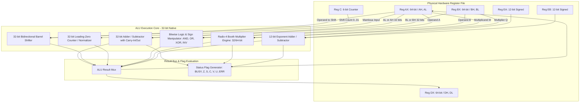

# Zx50 FPU Rev 2 Low-Level System Design

This document details the micro-architectural implementation of the FPGA-based Floating-Point and Stack Coprocessor on the **Zx50 CPU Card (Rev C4)**.

- **High-Level Architecture & ISA:** [FPU_REV2.md](file:///Users/marc/Documents/z80/Zx50/fpu/fpu_rev2/FPU_REV2.md)
- **Low-Level System Design:** `SystemDesign.md` (this document)
- **Development Roadmap:** [TODO.md](file:///Users/marc/Documents/z80/Zx50/fpu/fpu_rev2/TODO.md)

---

## 1. Design Constraints & Architectural Philosophy

The target device is the **Lattice MachXO2-2000HC-4TG100I** (`U17`), which provides:
* **2,112 LUT4s** and **2,112 Flip-Flops**.
* **8 True Dual-Port SysMEM EBR Blocks** (9,216 bytes total).
* **Single +3.3V Power Rail**, clocked at 80 MHz internally (from 40 MHz `BMCLK`).

### 1.1 Minimizing Hardware Registers vs. EBR Storage
To remain well within the 2,112 LUT4 budget while preserving high arithmetic throughput:
1. **Dedicated Flip-Flop Registers are Strictly Minimized:** Only operands actively engaged in single-cycle datapath operations (ALU inputs, accumulator, shift staging, exponent arithmetic, and status flags) are instantiated as discrete flip-flops.
2. **Bulk Storage Lives in EBR:** The 64-word hardware stack, the 64-byte user storage (`0x0300`–`0x033F`), the 256-byte vector scratchpad, mathematical lookup tables, and microcode execution memory reside entirely within dual-port SysMEM EBR.
3. **32-Bit Datapath Core with Multi-Cycle 64-Bit Sequencing:** The physical ALU primitives operate natively on 32-bit slices. 64-bit integer (`i64`) and double-precision float (`f64`) operations are synthesized across consecutive cycles under micro-sequencer control.

---

## 2. Register File Architecture

To keep hardware resource utilization low while providing sufficient scratchpad capacity for multi-word arithmetic and CORDIC transcendental algorithms, the physical register file consists of **six 32-bit data registers** (paired as three 64-bit working registers: `AX`, `BX`, `DX`), **two 12-bit exponent registers** (`EA`, `EB`), a **6-bit loop/shift counter** (`C`), and minimal control/status registers.

### 2.1 Physical Hardware Registers

```text
+-----------------------------------------------------------------------------------+
|                        PHYSICAL HARDWARE REGISTERS                                |
+-------------------+---------------------------------------------------+-----------+
| Register Name     | Description & Bit Width                           | FF Count  |
+-------------------+---------------------------------------------------+-----------+
| AH [31:0]         | Primary Accumulator High / Mantissa A High        | 32 FFs    |
| AL [31:0]         | Primary Accumulator Low  / Mantissa A Low / TOS   | 32 FFs    |
| BH [31:0]         | Operand B High           / Mantissa B High        | 32 FFs    |
| BL [31:0]         | Operand B Low            / Mantissa B Low / NOS   | 32 FFs    |
| DH [31:0]         | Spare / Product High     / Division Remainder High| 32 FFs    |
| DL [31:0]         | Spare / Product Low      / CORDIC Z Angle / Temp  | 32 FFs    |
| EA [11:0]         | Primary Working Exponent A (Signed 12-bit)        | 12 FFs    |
| EB [11:0]         | Secondary Working Exponent B (Signed 12-bit)      | 12 FFs    |
| C [5:0]           | Loop Counter & Shift Step Counter (Range 0..63)   | 6 FFs     |
| STATUS [7:0]      | System Status & Arithmetic Flags (BUSY,Z,S,C,V,U,E| 8 FFs     |
| SP [5:0]          | Hardware Stack Pointer (Index 0..63 in EBR)       | 6 FFs     |
| UPC [9:0]         | Microcode Program Counter (Address in EBR)        | 10 FFs    |
+-------------------+---------------------------------------------------+-----------+
Total Dedicated Flip-Flops:                                             246 FFs
```

> [!NOTE]
> **Carry / Borrow Staging:** Multi-precision carry propagation (e.g. 64-bit addition via two 32-bit steps) is handled natively by the arithmetic carry flag (`STATUS[4]`, `CARRY`) or an internal ALU pipeline latch. It is **not** an addressable general-purpose register and does not require explicit microcode operand addressing; micro-instructions simply invoke `ADD` vs `ADC` (Add with Carry) or `SUB` vs `SBB` (Subtract with Borrow).

### 2.2 Register Pairing & Functional Mapping

The 32-bit registers are paired into 64-bit compound registers:
* `AX = {AH[31:0], AL[31:0]}` (Primary Accumulator)
* `BX = {BH[31:0], BL[31:0]}` (Secondary Operand)
* `DX = {DH[31:0], DL[31:0]}` (Scratch / Product / Remainder / CORDIC Coordinate)

| Data Type | Primary Register (`AX`) | Secondary Register (`BX`) | Spare / Temp Register (`DX`) |
|---|---|---|---|
| **`i32` (32-bit Int)** | `AL` (holds 32-bit operand / result) | `BL` (holds second 32-bit operand) | `DL` (scratch / temp) |
| **`f32` (32-bit Float)**| `AL[22:0]` = Mantissa, `EA` = Exp, `AH[31]` = Sign | `BL[22:0]` = Mantissa, `EB` = Exp, `BH[31]` = Sign | `DL` (scratch / temp) |
| **`i64` (64-bit Int)** | `AX = {AH, AL}` (64-bit 2's complement value) | `BX = {BH, BL}` (64-bit 2's complement value) | `DX = {DH, DL}` (64-bit scratch) |
| **`f64` (64-bit Float)**| `AH[19:0]:AL` = 52-bit Mantissa, `EA` = Exp, `AH[31]` = Sign | `BH[19:0]:BL` = 52-bit Mantissa, `EB` = Exp, `BH[31]` = Sign | `DX = {DH, DL}` (52-bit temp) |

### 2.3 Roles of the Spare Register `DX = {DH, DL}`
Adding discrete hardware registers for `DX` yields major performance gains for multi-step math routines:
1. **Multiplication (32-bit & 64-bit):**
   * A 32-bit $\times$ 32-bit multiply produces a full 64-bit product directly in `AX = {AH, AL}` (or `DX = {DH, DL}`) without having to spill words to EBR.
   * A 64-bit $\times$ 64-bit integer multiply produces a full 128-bit product in `{DX, AX} = {DH, DL, AH, AL}` entirely in hardware registers.
2. **Integer & Mantissa Division:**
   * Natural hardware pair for division: `AX` receives the quotient while `DX` retains the remainder.
3. **CORDIC Transcendental Functions ($\sin, \cos, \arctan$):**
   * CORDIC evaluates planar vector rotation across three variables simultaneously:
     $$X_{i+1} = X_i \mp (Y_i \gg i), \quad Y_{i+1} = Y_i \pm (X_i \gg i), \quad Z_{i+1} = Z_i \mp \theta_i$$
   * Mapping $X \to \text{AX}$, $Y \to \text{BX}$, and the residual angle $Z \to \text{DX}$ enables CORDIC cross-additions to execute at **1 clock cycle per iteration**, completely avoiding EBR memory access bottlenecks during transcendental evaluations.

### 2.4 Coupling with SysMEM Dual-Port EBR

The physical registers act as the **fast execution front-end** for the SysMEM EBR storage:

1. **Stack POP to Registers:**
   * When popping $TOS$ into `AX`: EBR read Port B fetches $TOS_{Low}$ into `AL` (Cycle 1) and $TOS_{High}$ into `AH` (Cycle 2), updating `SP <= SP - 1`.
2. **Stack PUSH from Registers:**
   * When pushing result `AX` to $TOS$: EBR write Port B stores `AL` and `AH` to address `Stack[SP]`, updating `SP <= SP + 1`.
3. **User Memory Copy (`CP [xxxx], TOS` / `CP TOS, [xxxx]`):**
   * Single-cycle or two-cycle word transfer directly between `AX` and the user memory block (`0x0300`–`0x033F`) via EBR Port B. No intermediate Z80 I/O cycles needed.

---

## 3. ALU Hardware Primitives & Execution Datapath

The ALU consists of five independent functional primitives multiplexed into a common result bus, operating directly on the physical register file (`AX`, `BX`, `DX`, `EA`, `EB`, `C`):



### 3.1 32-Bit Parallel Adder / Subtractor (`alu_adder32`)
* **Architecture:** The physical adder is a 32-bit carry-lookahead unit. The target register is always the accumulator `A` (`AX` or `AL`). Operand width (32-bit vs. 64-bit) and cycle sequencing (1-cycle vs. 2-cycle) are **entirely implicit in the register names**.
* **Source Selection:** The source operand selects from `BX` or `DX` (for 64-bit operations) or `BL` or `DL` (for 32-bit operations).

#### Micro-Instructions & Register Transfers

| Instruction Syntax | Operation Width | Cycles | Execution & Flag Updates |
|---|:---:|:---:|---|
| **`ADD AL, {BL, DL}`** | 32-bit | 1 | `AL <- AL + src`, sets `CF`, `ZF`, `SF`, `OVF` |
| **`ADC AL, {BL, DL}`** | 32-bit | 1 | `AL <- AL + src + CF`, sets `CF`, `ZF`, `SF`, `OVF` |
| **`ADD AX, {BX, DX}`** | 64-bit | 2 | **Cycle 1:** `AL <- AL + src.L`, sets `CF`<br>**Cycle 2:** `AH <- AH + src.H + CF`, sets `CF`, `ZF` (combined), `SF`, `OVF` |
| **`ADC AX, {BX, DX}`** | 64-bit | 2 | **Cycle 1:** `AL <- AL + src.L + CF`, sets `CF`<br>**Cycle 2:** `AH <- AH + src.H + CF`, sets `CF`, `ZF` (combined), `SF`, `OVF` |
| **`SUB AL, {BL, DL}`** | 32-bit | 1 | `AL <- AL - src`, sets `CF` (borrow), `ZF`, `SF`, `OVF` |
| **`SBB AL, {BL, DL}`** | 32-bit | 1 | `AL <- AL - src - CF`, sets `CF` (borrow), `ZF`, `SF`, `OVF` |
| **`SUB AX, {BX, DX}`** | 64-bit | 2 | **Cycle 1:** `AL <- AL - src.L`, sets `CF` (borrow)<br>**Cycle 2:** `AH <- AH - src.H - CF`, sets `CF`, `ZF` (combined), `SF`, `OVF` |
| **`SBB AX, {BX, DX}`** | 64-bit | 2 | **Cycle 1:** `AL <- AL - src.L - CF`, sets `CF` (borrow)<br>**Cycle 2:** `AH <- AH - src.H - CF`, sets `CF`, `ZF` (combined), `SF`, `OVF` |
| **`CMP AL, {BL, DL}`** | 32-bit | 1 | Evaluates `AL - src`, sets `CF`, `ZF`, `SF`, `OVF` (`AL` unchanged) |
| **`CMP AX, {BX, DX}`** | 64-bit | 2 | Evaluates `AX - src`, sets `CF`, `ZF`, `SF`, `OVF` (`AX` unchanged) |

* **Estimated Complexity:** ~40 LUT4s (utilizing MachXO2 dedicated carry chains `CCU2C`).

### 3.2 32-Bit Bidirectional Barrel Shifter (`alu_shifter32`)
* **Architecture:** Executes single-cycle shifts on `AL` or two-cycle compound shifts on `AX = {AH, AL}`, controlled by register `C[5:0]`. Target is always `A`.

| Instruction Syntax | Operation Width | Cycles | Execution & Flag Updates |
|---|:---:|:---:|---|
| **`LSL AL, C`** | 32-bit | 1 | `AL <- AL << C[4:0]`, vacated LSBs filled with `0`. Sets `CF`, `ZF`, `SF`. |
| **`LSR AL, C`** | 32-bit | 1 | `AL <- AL >> C[4:0]`, vacated MSBs filled with `0`. Sets `CF`, `ZF`, `SF`, sets `STICKY` in `STATUS`. |
| **`ASR AL, C`** | 32-bit | 1 | `AL <- AL >>> C[4:0]`, MSB sign-extended. Sets `CF`, `ZF`, `SF`. |
| **`LSL AX, C`** | 64-bit | 2 | Cascaded shift left across `{AH, AL}` by `C` bits. Sets `CF`, `ZF`, `SF`. |
| **`LSR AX, C`** | 64-bit | 2 | Cascaded shift right across `{AH, AL}` by `C` bits. Sets `CF`, `ZF`, `SF`, sets `STICKY`. |
| **`ASR AX, C`** | 64-bit | 2 | Cascaded arithmetic shift right across `{AH, AL}` by `C` bits with sign extension. |

* **Estimated Complexity:** ~96 LUT4s (organized as a 5-stage multiplexer tree).

### 3.3 32-Bit Leading-Zero Counter (`alu_lzc32`)
* **Inputs:** Evaluates `AL` (32-bit mantissa) or `AX` (64-bit compound mantissa).
* **Micro-Operations & Register Transfers:**
  * **`LZC AL`:** Computes leading zero count: `C[5:0] <- LZC(AL)` (range 0..32). If `AL == 0`, sets `ZF <- 1`.
  * **`LZC AX`:** Evaluates `{AH, AL}`: if `AH != 0`, `C <- LZC(AH)`; else `C <- 32 + LZC(AL)`.
  * **Normalization Chaining:** In the subsequent cycle, `C` feeds the shifter and exponent unit:
    * `LSL AL, C` or `LSL AX, C` (normalizes mantissa).
    * `EA <- EA - C` (adjusts exponent to match normalization shift).
* **Estimated Complexity:** ~32 LUT4s.

### 3.4 Bitwise Logic & Sign Manipulator (`alu_logic32`)
* **Target:** Accumulator `A` (`AL` or `AX`). Source selects from `BX`, `DX`, `BL`, or `DL`.

| Instruction Syntax | Operation Width | Cycles | Execution & Flag Updates |
|---|:---:|:---:|---|
| **`AND AL, {BL, DL}`** | 32-bit | 1 | `AL <- AL & src`, sets `ZF`, `SF`, clears `CF <- 0`, `OVF <- 0` |
| **`OR AL, {BL, DL}`**  | 32-bit | 1 | `AL <- AL \| src`, sets `ZF`, `SF`, clears `CF <- 0`, `OVF <- 0` |
| **`XOR AL, {BL, DL}`** | 32-bit | 1 | `AL <- AL ^ src`, sets `ZF`, `SF`, clears `CF <- 0`, `OVF <- 0` |
| **`NOT AL`**           | 32-bit | 1 | `AL <- ~AL`, sets `ZF`, `SF`, clears `CF <- 0`, `OVF <- 0` |
| **`AND AX, {BX, DX}`** | 64-bit | 2 | `AL <- AL & src.L`, `AH <- AH & src.H`, sets flags |
| **`OR AX, {BX, DX}`**  | 64-bit | 2 | `AL <- AL \| src.L`, `AH <- AH \| src.H`, sets flags |
| **`XOR AX, {BX, DX}`** | 64-bit | 2 | `AL <- AL ^ src.L`, `AH <- AH ^ src.H`, sets flags |
| **`NOT AX`**           | 64-bit | 2 | `AL <- ~AL`, `AH <- ~AH`, sets flags |
| **`CHS`**              | Float Sign | 1 | `AH[31] <- ~AH[31]`, sets `SF <- AH[31]` (`AL` and `EA` unmodified) |
| **`ABS`**              | Float Sign | 1 | `AH[31] <- 0`, clears `SF <- 0` |

* **Estimated Complexity:** ~16 LUT4s.

### 3.5 12-Bit Exponent ALU (`alu_exp12`)
* **Inputs:** Primary exponent `EA[11:0]`, Secondary exponent `EB[11:0]`, Counter `C[5:0]`, Hardwired Biases (`BIAS_F32 = 127`, `BIAS_F64 = 1023`).
* **Micro-Operations & Register Transfers:**
  * **Exponent Difference (Mantissa Alignment):**
    * `C[5:0] <- EA - EB`.
    * If `EA < EB` (`CF` set / negative difference): micro-sequencer swaps `AX <-> BX` and `EA <-> EB`, setting `C <- EB - EA` (sets right-shift alignment count for smaller operand).
  * **Multiplication Exponent Addition:**
    * `EA <- EA + EB - BIAS`.
    * If `EA > MaxExp`: sets `OVF <- 1`, `ERR <- 1`.
    * If `EA <= 0`: sets `UF <- 1` (underflow / denormal).
  * **Division Exponent Subtraction:**
    * `EA <- EA - EB + BIAS`.
    * Sets `OVF` / `UF` / `ERR` if out of valid IEEE range.
  * **Post-Normalization Exponent Update:**
    * `EA <- EA - C` (deducts normalization shift count found by `alu_lzc32`).
    * Sets `UF` if exponent falls $\le 0$.
* **Estimated Complexity:** ~18 LUT4s (utilizing dedicated carry chains).

### 3.6 Radix-4 Modified Booth Multiplier (`alu_booth_mul`)
* **Inputs:** Multiplicand in `BL` (or `BX`), Multiplier in `AL` (or `AX`), Partial Product Accumulator initialized in `DX`.
* **Micro-Operations & Register Transfers:**
  1. **Initialization:**
     * `DH <- 0`, `DL <- 0` (clears product accumulator).
     * `C <- 16` (for 32-bit `i32` or `f32` mantissa) or `C <- 32` (for 64-bit `i64`).
     * Internal Booth latch: `Booth_Bit_Minus1 <- 0`.
  2. **Iterative Step (Repeated while `C != 0`):**
     * Inspects 3-bit window `{AL[1:0], Booth_Bit_Minus1}`:

| Window `{AL[1:0], Booth_Bit_Minus1}` | Operation on Partial Product | Action |
|:---:|:---:|---|
| `000` | $+0$ | `DX <- DX` (No addition) |
| `001` | $+1 \times BL$ | `DX <- DX + BL` (via `alu_adder32`) |
| `010` | $+1 \times BL$ | `DX <- DX + BL` |
| `011` | $+2 \times BL$ | `DX <- DX + (BL << 1)` |
| `100` | $-2 \times BL$ | `DX <- DX - (BL << 1)` |
| `101` | $-1 \times BL$ | `DX <- DX - BL` |
| `110` | $-1 \times BL$ | `DX <- DX - BL` |
| `111` | $+0$ | `DX <- DX` (No addition) |

     * **Combined 2-Bit Arithmetic Right Shift:**
       * `Booth_Bit_Minus1 <- AL[1]`.
       * Compound `{DX, AL}` arithmetic shifts right by 2 bits (`ASR 2`):
         * `DX <- DX >>> 2`
         * `AL <- {DX[1:0], AL[31:2]}`
     * Decrement counter: `C <- C - 1`.
  3. **Completion & Write-Back:**
     * **32-Bit Integer Multiply (`i32`):**
       * `AH <- DH`, `AL <- DL` (assembled into 64-bit compound product `AX = {AH, AL}`).
       * Sets `ZF`, `SF`, and `OVF` (if `AH` is not sign extension of `AL`).
     * **32-Bit Float Mantissa Multiply (`f32`):**
       * If bit 47 of product is set: `AL <- AL >> 1`, `EA <- EA + 1`.
     * **64-Bit Integer Multiply (`i64`):**
       * Full 128-bit product resides in `{DX, AX} = {DH, DL, AH, AL}`.
* **Performance & Latency:**
  * **32-Bit Integer / Mantissa (`i32`, `f32`):** Retires 32 bits in **16 clock cycles** (200 ns @ 80 MHz).
  * **53-Bit Double Mantissa (`f64`):** Retires 54 bits in **27 clock cycles** (337 ns @ 80 MHz).
  * **64-Bit Integer (`i64`):** Retires 64 bits in **32 clock cycles** (400 ns @ 80 MHz).
* **Key Advantages:**
  * **Native 2's Complement:** Handles signed integer multiplication directly without pre-converting to unsigned magnitudes.
  * **Zero EBR Memory:** Frees the 1,024-byte Quarter-Square EBR table for general microcode and math constants.
  * **Low Gate Count:** Adds only ~52 LUT4s for Booth muxing and loop state control.

---

## 4. Microcode Memory, Stack & Data Movement Architecture

### 4.1 Stack Operations & Stack Pointer Semantics (`POP` and `PUSH`)

The execution stack resides in the SysMEM EBR block at `0x0000`–`0x00FF` (256 bytes = 64 $\times$ 32-bit words). All stack accesses strictly follow an explicit **`POP`** and **`PUSH`** discipline relative to the hardware Stack Pointer `SP`.

* **No direct writing to `NOS`:** All stack reads and writes occur strictly at `TOS` (`[SP]`).
* Every stack read is an explicit `POP` that decrements `SP`.
* Every stack write is an explicit `PUSH` that increments `SP`.

#### Stack Micro-Instructions

| Instruction Syntax | Width | Bytes | SP Action | Operation & Register Transfer |
|---|:---:|:---:|:---:|---|
| **`POP AL`**  | 32-bit | 4 | $SP \leftarrow SP - 4$ | `AL <- [SP]`, decrements $SP$ by 4 bytes (1 word) |
| **`POP BL`**  | 32-bit | 4 | $SP \leftarrow SP - 4$ | `BL <- [SP]`, decrements $SP$ by 4 bytes (1 word) |
| **`POP AX`**  | 64-bit | 8 | $SP \leftarrow SP - 8$ | `AX <- [SP]`, decrements $SP$ by 8 bytes (2 words) |
| **`POP BX`**  | 64-bit | 8 | $SP \leftarrow SP - 8$ | `BX <- [SP]`, decrements $SP$ by 8 bytes (2 words) |
| **`PUSH AL`** | 32-bit | 4 | $SP \leftarrow SP + 4$ | Increments $SP$ by 4 bytes, `[SP] <- AL` |
| **`PUSH BL`** | 32-bit | 4 | $SP \leftarrow SP + 4$ | Increments $SP$ by 4 bytes, `[SP] <- BL` |
| **`PUSH AX`** | 64-bit | 8 | $SP \leftarrow SP + 8$ | Increments $SP$ by 8 bytes, `[SP] <- AX` (two 32-bit writes) |
| **`PUSH BX`** | 64-bit | 8 | $SP \leftarrow SP + 8$ | Increments $SP$ by 8 bytes, `[SP] <- BX` (two 32-bit writes) |

#### Standard Microcode Execution Sequences

By adhering strictly to `POP` and `PUSH`, microcode state machines are completely uniform, deterministic, and eliminate any ambiguity over writing to TOS vs. NOS:

1. **Unary Operations (e.g. `SQRT`, `CHS`, `ABS`, `SIN`, `LN`):**
   * **32-Bit:**
     1. `POP AL` (Pops single operand from stack: $SP \leftarrow SP - 4$)
     2. *[Execute ALU math primitive / CORDIC / microcode]*
     3. `PUSH AL` (Pushes single result back: $SP \leftarrow SP + 4$)
     * *Net $SP$ change: 0 bytes.*
   * **64-Bit:**
     1. `POP AX` (Pops 64-bit operand: $SP \leftarrow SP - 8$)
     2. *[Execute ALU math primitive]*
     3. `PUSH AX` (Pushes 64-bit result: $SP \leftarrow SP + 8$)
     * *Net $SP$ change: 0 bytes.*

2. **Binary Operations (e.g. `ADD`, `SUB`, `MUL`, `DIV`, `POW`):**
   * Operands on stack: $NOS$ was pushed first, $TOS$ was pushed second.
   * **32-Bit:**
     1. `POP BL` (Pops TOS, the 2nd operand $B$: $SP \leftarrow SP - 4$)
     2. `POP AL` (Pops NOS, the 1st operand $A$: $SP \leftarrow SP - 4$)
     3. *[Execute math: e.g. `SUB AL, BL` computing $A - B$]*
     4. `PUSH AL` (Pushes single result back: $SP \leftarrow SP + 4$)
     * *Net $SP$ change: $-4$ bytes (stack shrinks by one 32-bit operand).*
   * **64-Bit:**
     1. `POP BX` (Pops TOS, 64-bit 2nd operand $B$: $SP \leftarrow SP - 8$)
     2. `POP AX` (Pops NOS, 64-bit 1st operand $A$: $SP \leftarrow SP - 8$)
     3. *[Execute math: e.g. `SUB AX, BX` computing $A - B$]*
     4. `PUSH AX` (Pushes 64-bit result back: $SP \leftarrow SP + 8$)
     * *Net $SP$ change: $-8$ bytes (stack shrinks by one 64-bit operand).*

#### Stack Boundary Protection

Explicit `POP` and `PUSH` operations simplify hardware limit enforcement:
* **Underflow Detection:** Any `POP` attempted when $SP = 0$ aborts the instruction and sets `STATUS[6]` (`ERR`) and `STATUS[1]` (`UF`).
* **Overflow Detection:** Any `PUSH` attempted when $SP + \text{bytes} > 256$ aborts the write and sets `STATUS[6]` (`ERR`) and `STATUS[5]` (`OVF`).

### 4.2 Scratchpad Operations (`SCR`)

A dedicated 256-byte vector and math scratchpad area is located in SysMEM EBR at `0x0200`–`0x02FF` (64 $\times$ 32-bit words). It is indexed by a 6-bit word address `[addr]` (0..63).

| Instruction Syntax | Direction | Register Transfers |
|---|:---:|---|
| **`SCR {AH, AL, BH, BL, DH, DL}, [addr]`** | Read | `reg <- Scratch[addr]` (Loads 32-bit word from scratchpad) |
| **`SCR [addr], {AH, AL, BH, BL, DH, DL}`** | Write | `Scratch[addr] <- reg` (Stores 32-bit word to scratchpad) |

* **Use Cases:** Staging Taylor series partial sums, storing CORDIC coordinate rotation intermediates ($X, Y, Z$), and polynomial coefficient caching without modifying or corrupting the user stack.

### 4.3 Immediate Loads (`LD`)

Loads a 32-bit immediate literal constant embedded in microcode ROM directly into a working register:
* **`LD {AH, AL, BH, BL}, <imm32>`**
* *Simplified model:* Direct load into accumulator `LD AL, <imm32>`, followed by `MOV` to secondary registers if needed.

### 4.4 Register-to-Register Moves (`MOV`)

Fast single-cycle data transfers between dedicated registers:

| Instruction Syntax | Width | Description |
|---|:---:|---|
| **`MOV DH, {AH, BH}`** | 32-bit | Move accumulator/operand high word to spare high register `DH` |
| **`MOV {AH, BH}, DH`** | 32-bit | Restore high word from spare register `DH` |
| **`MOV DL, {AL, BL}`** | 32-bit | Move accumulator/operand low word to spare low register `DL` |
| **`MOV {AL, BL}, DL`** | 32-bit | Restore low word from spare register `DL` |
| **`MOV DX, {AX, BX}`** | 64-bit | Compound 64-bit move to spare register `DX` (2 cycles) |
| **`MOV {AX, BX}, DX`** | 64-bit | Compound 64-bit move from spare register `DX` (2 cycles) |
| **`MOV C, AL[5:0]`**   | 6-bit  | Load shift/loop counter `C` from lower 6 bits of `AL` |
| **`MOV EA, EB`**       | 12-bit | Copy exponent register `EB` to `EA` |
| **`MOV EB, EA`**       | 12-bit | Copy exponent register `EA` to `EB` |

### 4.5 User Memory Isolation

> [!IMPORTANT]
> **Microcode has zero direct access to user storage memory.**
> User memory (`0x0300`–`0x033F`, 16 words $\times$ 4 bytes = 64 bytes) is strictly private user workspace. It is manipulated solely by the Z80 host bus interface through Port 0x71 opcodes:
> * `CP [xxxx], TOS` (Opcode `0b1101_xxxx`): Copies 4 or 8 bytes from TOS into user slot `xxxx`.
> * `CP TOS, [xxxx]` (Opcode `0b1110_xxxx`): Copies 4 or 8 bytes from user slot `xxxx` to TOS.
> * `ZERO_MEM` (Opcode `0b1111_0000`): Clears all 16 user slots.
> 
> Because microcode cannot address this memory, user variables are guaranteed to remain untouched across all arithmetic, transcendental, and CORDIC computations.

### 4.6 Mathematical Constants in ROM & Push Opcodes

A dedicated table in SysMEM EBR ROM (`0x0400`–`0x07FF`) stores high-precision mathematical constants formatted as both IEEE-754 Single Precision (`f32`) and Double Precision (`f64`):

| Constant | Symbol / Value | IEEE-754 Single (`f32`, 32-bit) | IEEE-754 Double (`f64`, 64-bit) | User Push Opcode (`fff` = Format) |
|---|---|:---:|:---:|:---:|
| **Pi** | $\pi \approx 3.14159265358979323846$ | `0x40490FDB` | `0x400921FB_54442D18` | **`PUSH_PI`** (`0b1001_0fff`) |
| **Euler's Number** | $e \approx 2.71828182845904523536$ | `0x402DF854` | `0x4005BF0A_8B145769` | **`PUSH_E`** (`0b1001_1fff`) |
| **Natural Log of 2** | $\ln(2) \approx 0.69314718055994530942$ | `0x3F317218` | `0x3FE62E42_FEFA39EF` | **`PUSH_LN2`** (`0b1010_0fff`) |
| **Base-2 Log of e** | $\log_2(e) \approx 1.44269504088896340736$ | `0x3FB8AA3B` | `0x3FF71547_652B82FE` | **`PUSH_LOG2E`** (`0b1010_1fff`) |
| **Base-2 Log of 10** | $\log_2(10) \approx 3.32192809488736234787$ | `0x40549A78` | `0x400A934F_0979A371` | **`PUSH_LOG2_10`** (`0b1011_0fff`) |
| **Base-10 Log of 2** | $\log_{10}(2) \approx 0.30102999566398119521$ | `0x3E9A209B` | `0x3FD34413_509F79FF` | **`PUSH_LOG10_2`** (`0b1011_1fff`) |
| **Square Root of 2** | $\sqrt{2} \approx 1.41421356237309504880$ | `0x3FB504F3` | `0x3FF6A09E_667F3BCD` | **`PUSH_SQRT2`** (`0b1000_1fff`) |
| **Inverse Sqrt of 2**| $1/\sqrt{2} \approx 0.70710678118654752440$ | `0x3F3504F3` | `0x3FE6A09E_667F3BCD` | **`PUSH_INV_SQRT2`** (`0b1100_0010` / `fff`) |

* **Execution Flow:** When a `PUSH_<CONST>` opcode is received on Port 0x71:
  1. Microcode loads constant words from ROM table into `AL` (`f32`) or `AX` (`f64`).
  2. Adjusts stack pointer: $SP \leftarrow SP + 1$ (for 32-bit `f32`) or $SP \leftarrow SP + 2$ (for 64-bit `f64`).
  3. Writes value to new top of stack: `LD TOS, AL` or `LD TOS, AX`.

---

## 5. Hardware Resource & Gate Budget Estimation

Based on MachXO2-2000 slice utilization:

| Subsystem Component | Estimated LUT4s | Estimated FFs | Dedicated EBR |
|---|:---:|:---:|:---:|
| **32-Bit Adder/Subtractor (`alu_adder32`)** | 40 | 0 | 0 |
| **32-Bit Barrel Shifter (`alu_shifter32`)** | 96 | 0 | 0 |
| **Radix-4 Booth Multiplier (`alu_booth_mul`)** | 52 | 10 | 0 |
| **Leading-Zero Counter (`alu_lzc32`)** | 32 | 0 | 0 |
| **Bitwise / Sign Logic (`alu_logic32`)** | 16 | 0 | 0 |
| **12-Bit Exponent ALU (`alu_exp12`)** | 18 | 0 | 0 |
| **Dedicated Register File (`AX`, `BX`, `DX`, `EA`, `EB`, `C`)** | 32 | 246 | 0 |
| **ALU Result Multiplexers & Datapath Steering** | 76 | 0 | 0 |
| **Micro-Sequencer Logic & Opcode Decode** | 120 | 32 | 0 |
| **Host Z80 Bus Interface (`BA`, `BD`, Port Decoder)** | 75 | 45 | 0 |
| **Autonomous QSPI Flash Boot Loader** | 85 | 60 | 0 |
| **EBR Memory Subsystem (Stack, Microcode, Math Constants)** | 0 | 0 | 7 Blocks |
| **Total Estimated Utilization** | **~642 LUT4s** | **~393 FFs** | **7 EBR Blocks** |
| **Available on MachXO2-2000HC** | **2,112 LUT4s** | **2,112 FFs** | **8 EBR Blocks** |
| **Resource Margin** | **~70% Free** | **~81% Free** | **1 EBR Block Free (~12%)** |

> [!NOTE]
> The complete ALU, Radix-4 multiplier, and expanded 6-register data file (`AX`, `BX`, `DX`) consumes only **~642 LUT4s** (~30% of the MachXO2-2000) and **393 FFs** (~18%). Having discrete registers for `DX` eliminates EBR memory bottlenecks during 64-bit multiplications, quotient/remainder divisions, and CORDIC planar rotations, while still leaving over 1,470 LUT4s and 1,700 FFs free for transcendental algorithms, edge-case rounding, and the SBC memory controller.
