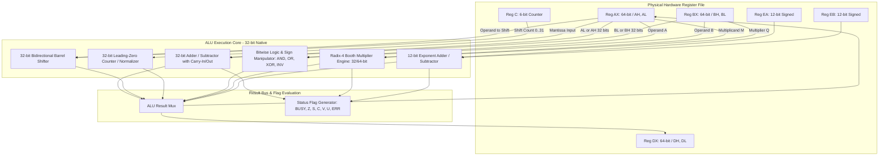
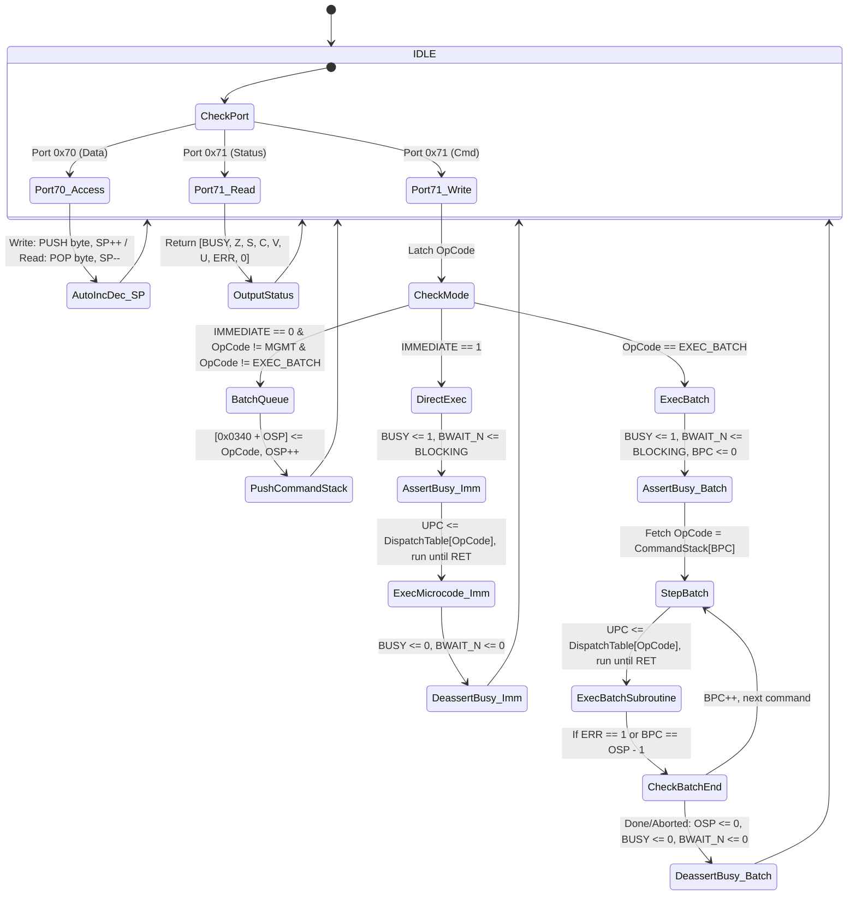

# Zx50 FPU Rev 2 Low-Level System Design

This document details the micro-architectural implementation of the FPGA-based Floating-Point and Stack Coprocessor on the **Zx50 CPU Card (Rev C4)**.

- **High-Level Architecture & Hardware Interface:** [FPU_REV2.md](file:///Users/marc/Documents/z80/Zx50/fpu/fpu_rev2/FPU_REV2.md)
- **Low-Level Micro-Architecture & Implementation:** [SystemDesign.md](file:///Users/marc/Documents/z80/Zx50/fpu/fpu_rev2/SystemDesign.md) (this document)
- **Z80 Assembly Programmer's Guide:** [ProgrammersGuide.md](file:///Users/marc/Documents/z80/Zx50/fpu/fpu_rev2/ProgrammersGuide.md)
- **Development Roadmap:** [TODO.md](file:///Users/marc/Documents/z80/Zx50/fpu/fpu_rev2/TODO.md)

---

## 1. Design Constraints & Architectural Philosophy

The target device is the **Lattice MachXO2-2000HC-4TG100I** (`U17`), which provides:
* **2,112 LUT4s** and **2,112 Flip-Flops**.
* **8 True Dual-Port SysMEM EBR Blocks** (9,216 bytes total).
* **Single +3.3V Power Rail**, clocked at 80 MHz internally (from 40 MHz `BMCLK`).

### 1.1 Minimizing Hardware Registers vs. EBR Storage
To remain well within the 2,112 LUT4 budget while preserving high arithmetic throughput:
1. **Dedicated Flip-Flop Registers are Strictly Minimized:** Only operands actively engaged in single-cycle datapath operations (ALU inputs, accumulator, shift staging, exponent arithmetic, and status flags) are instantiated as discrete flip-flops.
2. **Bulk Storage Lives in EBR:** The 64-word hardware stack, the 64-byte user storage (`0x0300`–`0x033F`), the 256-byte vector scratchpad, mathematical lookup tables, and microcode execution memory reside entirely within dual-port SysMEM EBR.
3. **32-Bit Datapath Core with Multi-Cycle 64-Bit Sequencing:** The physical ALU primitives operate natively on 32-bit slices. 64-bit integer (`i64`) and double-precision float (`f64`) operations are synthesized across consecutive cycles under micro-sequencer control.

---

## 2. Register File Architecture

To keep hardware resource utilization low while providing sufficient scratchpad capacity for multi-word arithmetic and CORDIC transcendental algorithms, the physical register file consists of **eight 32-bit data registers** (paired as four 64-bit working registers: `AX`, `BX`, `DX`, `FX`), **two 12-bit exponent registers** (`EA`, `EB`), a **6-bit loop/shift counter** (`C`), and minimal control/status registers.

### 2.1 Physical Hardware Registers

```text
+-----------------------------------------------------------------------------------+
|                        PHYSICAL HARDWARE REGISTERS                                |
+-------------------+---------------------------------------------------+-----------+
| Register Name     | Description & Bit Width                           | FF Count  |
+-------------------+---------------------------------------------------+-----------+
| AH [31:0]         | Primary Accumulator High / Mantissa A High        | 32 FFs    |
| AL [31:0]         | Primary Accumulator Low  / Mantissa A Low / TOS   | 32 FFs    |
| BH [31:0]         | Operand B High           / Mantissa B High        | 32 FFs    |
| BL [31:0]         | Operand B Low            / Mantissa B Low / NOS   | 32 FFs    |
| DH [31:0]         | Dedicated Math High      / Division Remainder High| 32 FFs    |
| DL [31:0]         | Dedicated Math Low       / CORDIC Z Angle         | 32 FFs    |
| FH [31:0]         | Pure Scratch High        / Staging & Conversion   | 32 FFs    |
| FL [31:0]         | Pure Scratch Low         / Staging & Immediate    | 32 FFs    |
| EA [11:0]         | Primary Working Exponent A (Signed 12-bit)        | 12 FFs    |
| EB [11:0]         | Secondary Working Exponent B (Signed 12-bit)      | 12 FFs    |
| C [5:0]           | Loop Counter & Shift Step Counter (Range 0..63)   | 6 FFs     |
| STATUS [7:0]      | System Status & Arithmetic Flags (BUSY,Z,S,C,V,U,E| 8 FFs     |
| SP [5:0]          | Hardware Stack Pointer (Index 0..63 in EBR)       | 6 FFs     |
| OSP [4:0]         | Operation Stack Pointer for Command Queue (0..31) | 5 FFs     |
| UPC [9:0]         | Microcode Program Counter (Address in EBR)        | 10 FFs    |
+-------------------+---------------------------------------------------+-----------+
Total Dedicated Flip-Flops:                                             315 FFs
```

> [!NOTE]
> **Carry / Borrow Staging:** Multi-precision carry propagation (e.g. 64-bit addition via two 32-bit steps) is handled natively by the arithmetic carry flag (`STATUS[4]`, `CARRY`) or an internal ALU pipeline latch. It is **not** an addressable general-purpose register and does not require explicit microcode operand addressing; micro-instructions simply invoke `ADD` vs `ADC` (Add with Carry) or `SUB` vs `SBB` (Subtract with Borrow).

### 2.2 Register Pairing & Functional Mapping

The 32-bit registers are paired into 64-bit compound registers:
* `AX = {AH[31:0], AL[31:0]}` (Primary Accumulator / TOS)
* `BX = {BH[31:0], BL[31:0]}` (Secondary Operand / NOS)
* `DX = {DH[31:0], DL[31:0]}` (Dedicated First-Class Math Register)
* `FX = {FH[31:0], FL[31:0]}` (Pure Hardware Scratchpad / Staging)

| Data Type | Primary Register (`AX`) | Secondary Register (`BX`) | Math Register (`DX`) | Pure Scratch (`FX`) |
|---|---|---|---|---|
| **`i32` (32-bit Int)** | `AL` (32-bit result) | `BL` (second operand) | `DL` (math / div remainder) | `FL` (volatile scratch) |
| **`f32` (32-bit Float)**| `AL[22:0]` = Mantissa | `BL[22:0]` = Mantissa | `DL` (math / coordinate) | `FL` (volatile scratch) |
| **`i64` (64-bit Int)** | `AX = {AH, AL}` (64-bit) | `BX = {BH, BL}` (64-bit) | `DX = {DH, DL}` (math 64) | `FX = {FH, FL}` (volatile 64) |
| **`f64` (64-bit Float)**| `AH[19:0]:AL` = Mantissa | `BH[19:0]:BL` = Mantissa | `DX = {DH, DL}` (math 52) | `FX = {FH, FL}` (volatile 64) |

### 2.3 Roles of Math Register `DX` vs. Scratch Register `FX`

To prevent register clobber bugs during complex algorithms (such as multi-cycle division or transcendental evaluations):

1. **`DX = {DH, DL}` (Dedicated First-Class Math Register - Preserved across Helpers):**
   * **Multiplication:** Produces high 64 bits of 128-bit product in `{DX, AX}`.
   * **Division:** Holds 32-bit or 64-bit quotient/remainder.
   * **CORDIC:** Holds the residual angle coordinate $Z$.
   * **Preservation Contract:** Helper subroutines, constant pushes, and memory copies **must never clobber `DX`**.
2. **`FX = {FH, FL}` (Pure Volatile Scratch Register - No Preservation Guaranteed):**
   * Dedicated for immediate constant loading (`LD FL, <imm32>`), user memory staging (`cp_mem_tos`), format packing/unpacking, and temporary sign extraction.
   * **Volatile Contract:** Any microcode subroutine may freely clobber `FX` without saving it.

### 2.4 Register Volatility & Preservation Contract

| Register | Classification | Lifetime / Preservation Contract |
|---|:---:|---|
| **`AX`** (`AH`, `AL`) | Working / TOS | Holds primary ALU operand and returns operation result. Volatile across macro-opcodes. |
| **`BX`** (`BH`, `BL`) | Working / NOS | Holds secondary ALU operand. Volatile across macro-opcodes. |
| **`DX`** (`DH`, `DL`) | Math Working  | **Preserved across microcode helper calls** (constant pushes, memory transfers). Volatile across macro-opcodes. |
| **`FX`** (`FH`, `FL`) | Pure Scratch  | **Volatile everywhere.** Freely destroyed by any micro-op, helper call, or constant push. |
| **`EA`, `EB`**         | Exponent      | Working exponent arithmetic. Preserved within float routines; volatile across macro-opcodes. |
| **`C`**                | Counter       | Loop and shift counter. Volatile across subroutines. |
| **`SCR [0..63]`**      | EBR Memory    | **Persistent on-chip scratchpad (256 bytes).** Preserved until explicitly overwritten. Used for spilling registers during multi-word algorithms. |

### 2.5 Status Register (`STATUS[7:0]`)

> [!NOTE]
> The authoritative software definition, bit layout, and Z80 polling conventions for the `STATUS[7:0]` register are specified in [ProgrammersGuide.md](file:///Users/marc/Documents/z80/Zx50/fpu/fpu_rev2/ProgrammersGuide.md#2-status-register-status70). This section documents the internal FPGA hardware signal generation and trigger sources.

```text
+--------+--------+--------+--------+-----------+------------+-------+----------+
| Bit 7  | Bit 6  | Bit 5  | Bit 4  | Bit 3     | Bit 2      | Bit 1 | Bit 0    |
+--------+--------+--------+--------+-----------+------------+-------+----------+
| BUSY   | ZERO   | SIGN   | CARRY  | OVERFLOW  | UNDERFLOW  | ERR   | Reserved |
| (BSY)  | (ZF)   | (SF)   | (CF)   | (VF)      | (UF)       | (EF)  | (0)      |
+--------+--------+--------+--------+-----------+------------+-------+----------+
```

#### Internal Hardware Flag Triggers
1. **ALU Auto-Update:** Dedicated arithmetic primitives (`alu_adder32`, `alu_logic32`, `alu_booth_mul`) automatically update `ZF`, `SF`, `CF`, and `VF` based on their datapath outputs.
2. **Explicit Microcode Control:** Microcode can set or clear flags with no side effects using the `SET <flag>` and `CLR <flag>` $\mu$-ops (e.g. `SET BUSY`, `CLR BUSY`, `SET ERR`).
3. **Hardware Boundary Monitors:** The stack pointer hardware automatically forces `UNDERFLOW = 1` and `ERR = 1` if a `POP` is executed while $SP = 0$, and `OVERFLOW = 1` and `ERR = 1` if a `PUSH` exceeds the 256-byte stack limit.

### 2.5 Control & Execution Mode Registers

Two dedicated single flip-flop mode flags control host handshaking and execution scheduling:

* **`BLOCKING` (1 FF):**
  * `1` (Default): Blocking mode. The FPGA asserts `BWAIT_N` (pulling host `~WAIT~` low) when `BUSY = 1`, holding the Z80 in wait states until completion.
  * `0`: Non-blocking mode. `BWAIT_N` is never asserted; the Z80 polls Port `0x71` bit 7 (`BUSY`).
  * Controlled via user management opcodes `SET_BLOCKING` (`0b1111_1110`) and `SET_NONBLOCKING` (`0b1111_1101`).
* **`IMMEDIATE` (1 FF):**
  * `1` (Default): Immediate mode. Each opcode written to Port `0x71` triggers immediate microcode dispatch.
  * `0`: Batch mode. Non-management opcodes written to Port `0x71` are pushed into the Command Stack (`0x0340`–`0x035F`) without executing. Execution begins only when `EXEC_BATCH` is received.
  * Controlled via user management opcodes `SET_IMMEDIATE` (`0b1111_1100`) and `SET_BATCH` (`0b1111_1011`).

### 2.6 Coupling with SysMEM Dual-Port EBR

The physical registers act as the **fast execution front-end** for the SysMEM EBR storage:

1. **Stack POP to Registers:**
   * When popping $TOS$ into `AX`: EBR read Port B fetches $TOS_{Low}$ into `AL` (Cycle 1) and $TOS_{High}$ into `AH` (Cycle 2), updating `SP <= SP - 1`.
2. **Stack PUSH from Registers:**
   * When pushing result `AX` to $TOS$: EBR write Port B stores `AL` and `AH` to address `Stack[SP]`, updating `SP <= SP + 1`.
3. **User Memory Copy (`CP [xxxx], TOS` / `CP TOS, [xxxx]`):**
   * Single-cycle or two-cycle word transfer directly between `AX` and the user memory block (`0x0300`–`0x033F`) via EBR Port B. No intermediate Z80 I/O cycles needed.

---

## 3. Microcode ISA: Arithmetic, Logic & Shifter Micro-Operations

> [!IMPORTANT]
> **Two-Layer Instruction Architecture:**
> 1. **User ISA (Host Port 0x71 Language):** The 8-bit macro-opcodes issued by the Z80 host CPU via I/O Port `0x71` (e.g. `ADD_I32`, `MUL_F64`, `SIN`, `PUSH_PI_32`, `EXEC_BATCH`), defined in [FPU_REV2.md](file:///Users/marc/Documents/z80/Zx50/fpu/fpu_rev2/FPU_REV2.md).
> 2. **Microcode ISA (Internal Micro-Operations / $\mu$-ops):** The low-level horizontal/vertical micro-instructions executed by the FPGA micro-sequencer on the physical datapath and register file (`AX`, `BX`, `DX`, `EA`, `EB`, `C`, `STATUS`, `SP`), defined across Section 3 and Section 4. Every user opcode dispatches to an internal microcode program composed of these $\mu$-ops.

The ALU consists of five independent functional primitives multiplexed into a common result bus, operating directly on the physical register file (`AX`, `BX`, `DX`, `EA`, `EB`, `C`):



### 3.1 32-Bit Parallel Adder / Subtractor (`alu_adder32`)
* **Architecture:** The physical adder is a 32-bit carry-lookahead unit. The target register is always the accumulator `A` (`AX` or `AL`). Operand width (32-bit vs. 64-bit) and cycle sequencing (1-cycle vs. 2-cycle) are **entirely implicit in the register names**.
* **Source Selection:** The source operand selects from `BX` or `DX` (for 64-bit operations) or `BL` or `DL` (for 32-bit operations).

#### Micro-Instructions & Register Transfers

| Instruction Syntax | Operation Width | Cycles | Execution & Flag Updates |
|---|:---:|:---:|---|
| **`ADD AL, {BL, DL}`** | 32-bit | 1 | `AL <- AL + src`, sets `CF`, `ZF`, `SF`, `OVF` |
| **`ADC AL, {BL, DL}`** | 32-bit | 1 | `AL <- AL + src + CF`, sets `CF`, `ZF`, `SF`, `OVF` |
| **`ADD AX, {BX, DX}`** | 64-bit | 2 | **Cycle 1:** `AL <- AL + src.L`, sets `CF`<br>**Cycle 2:** `AH <- AH + src.H + CF`, sets `CF`, `ZF` (combined), `SF`, `OVF` |
| **`ADC AX, {BX, DX}`** | 64-bit | 2 | **Cycle 1:** `AL <- AL + src.L + CF`, sets `CF`<br>**Cycle 2:** `AH <- AH + src.H + CF`, sets `CF`, `ZF` (combined), `SF`, `OVF` |
| **`SUB AL, {BL, DL}`** | 32-bit | 1 | `AL <- AL - src`, sets `CF` (borrow), `ZF`, `SF`, `OVF` |
| **`SBB AL, {BL, DL}`** | 32-bit | 1 | `AL <- AL - src - CF`, sets `CF` (borrow), `ZF`, `SF`, `OVF` |
| **`SUB AX, {BX, DX}`** | 64-bit | 2 | **Cycle 1:** `AL <- AL - src.L`, sets `CF` (borrow)<br>**Cycle 2:** `AH <- AH - src.H - CF`, sets `CF`, `ZF` (combined), `SF`, `OVF` |
| **`SBB AX, {BX, DX}`** | 64-bit | 2 | **Cycle 1:** `AL <- AL - src.L - CF`, sets `CF` (borrow)<br>**Cycle 2:** `AH <- AH - src.H - CF`, sets `CF`, `ZF` (combined), `SF`, `OVF` |
| **`CMP AL, {BL, DL}`** | 32-bit | 1 | Evaluates `AL - src`, sets `CF`, `ZF`, `SF`, `OVF` (`AL` unchanged) |
| **`CMP AX, {BX, DX}`** | 64-bit | 2 | Evaluates `AX - src`, sets `CF`, `ZF`, `SF`, `OVF` (`AX` unchanged) |

* **Estimated Complexity:** ~40 LUT4s (utilizing MachXO2 dedicated carry chains `CCU2C`).

### 3.2 32-Bit Bidirectional Barrel Shifter (`alu_shifter32`)
* **Architecture:** Executes single-cycle shifts on `AL` or two-cycle compound shifts on `AX = {AH, AL}`, controlled by register `C[5:0]`. Target is always `A`.

| Instruction Syntax | Operation Width | Cycles | Execution & Flag Updates |
|---|:---:|:---:|---|
| **`LSL AL, C`** | 32-bit | 1 | `AL <- AL << C[4:0]`, vacated LSBs filled with `0`. Sets `CF`, `ZF`, `SF`. |
| **`LSR AL, C`** | 32-bit | 1 | `AL <- AL >> C[4:0]`, vacated MSBs filled with `0`. Sets `CF`, `ZF`, `SF`, sets `STICKY` in `STATUS`. |
| **`ASR AL, C`** | 32-bit | 1 | `AL <- AL >>> C[4:0]`, MSB sign-extended. Sets `CF`, `ZF`, `SF`. |
| **`LSL AX, C`** | 64-bit | 2 | Cascaded shift left across `{AH, AL}` by `C` bits. Sets `CF`, `ZF`, `SF`. |
| **`LSR AX, C`** | 64-bit | 2 | Cascaded shift right across `{AH, AL}` by `C` bits. Sets `CF`, `ZF`, `SF`, sets `STICKY`. |
| **`ASR AX, C`** | 64-bit | 2 | Cascaded arithmetic shift right across `{AH, AL}` by `C` bits with sign extension. |

* **Estimated Complexity:** ~96 LUT4s (organized as a 5-stage multiplexer tree).

### 3.3 32-Bit Leading-Zero Counter (`alu_lzc32`)
* **Inputs:** Evaluates `AL` (32-bit mantissa) or `AX` (64-bit compound mantissa).
* **Micro-Operations & Register Transfers:**
  * **`LZC AL`:** Computes leading zero count: `C[5:0] <- LZC(AL)` (range 0..32). If `AL == 0`, sets `ZF <- 1`.
  * **`LZC AX`:** Evaluates `{AH, AL}`: if `AH != 0`, `C <- LZC(AH)`; else `C <- 32 + LZC(AL)`.
  * **Normalization Chaining:** In the subsequent cycle, `C` feeds the shifter and exponent unit:
    * `LSL AL, C` or `LSL AX, C` (normalizes mantissa).
    * `EA <- EA - C` (adjusts exponent to match normalization shift).
* **Estimated Complexity:** ~32 LUT4s.

### 3.4 Bitwise Logic & Sign Manipulator (`alu_logic32`)
* **Target:** Accumulator `A` (`AL` or `AX`). Source selects from `BX`, `DX`, `BL`, or `DL`.

| Instruction Syntax | Operation Width | Cycles | Execution & Flag Updates |
|---|:---:|:---:|---|
| **`AND AL, {BL, DL}`** | 32-bit | 1 | `AL <- AL & src`, sets `ZF`, `SF`, clears `CF <- 0`, `OVF <- 0` |
| **`OR AL, {BL, DL}`**  | 32-bit | 1 | `AL <- AL \| src`, sets `ZF`, `SF`, clears `CF <- 0`, `OVF <- 0` |
| **`XOR AL, {BL, DL}`** | 32-bit | 1 | `AL <- AL ^ src`, sets `ZF`, `SF`, clears `CF <- 0`, `OVF <- 0` |
| **`NOT AL`**           | 32-bit | 1 | `AL <- ~AL`, sets `ZF`, `SF`, clears `CF <- 0`, `OVF <- 0` |
| **`AND AX, {BX, DX}`** | 64-bit | 2 | `AL <- AL & src.L`, `AH <- AH & src.H`, sets flags |
| **`OR AX, {BX, DX}`**  | 64-bit | 2 | `AL <- AL \| src.L`, `AH <- AH \| src.H`, sets flags |
| **`XOR AX, {BX, DX}`** | 64-bit | 2 | `AL <- AL ^ src.L`, `AH <- AH ^ src.H`, sets flags |
| **`NOT AX`**           | 64-bit | 2 | `AL <- ~AL`, `AH <- ~AH`, sets flags |
| **`CHS`**              | Float Sign | 1 | `AH[31] <- ~AH[31]`, sets `SF <- AH[31]` (`AL` and `EA` unmodified) |
| **`ABS`**              | Float Sign | 1 | `AH[31] <- 0`, clears `SF <- 0` |

* **Estimated Complexity:** ~16 LUT4s.

### 3.5 12-Bit Exponent ALU (`alu_exp12`)
* **Inputs:** Primary exponent `EA[11:0]`, Secondary exponent `EB[11:0]`, Counter `C[5:0]`, Hardwired Biases (`BIAS_F32 = 127`, `BIAS_F64 = 1023`).
* **Micro-Operations & Register Transfers:**
  * **Exponent Difference (Mantissa Alignment):**
    * `C[5:0] <- EA - EB`.
    * If `EA < EB` (`CF` set / negative difference): micro-sequencer swaps `AX <-> BX` and `EA <-> EB`, setting `C <- EB - EA` (sets right-shift alignment count for smaller operand).
  * **Multiplication Exponent Addition:**
    * `EA <- EA + EB - BIAS`.
    * If `EA > MaxExp`: sets `OVF <- 1`, `ERR <- 1`.
    * If `EA <= 0`: sets `UF <- 1` (underflow / denormal).
  * **Division Exponent Subtraction:**
    * `EA <- EA - EB + BIAS`.
    * Sets `OVF` / `UF` / `ERR` if out of valid IEEE range.
  * **Post-Normalization Exponent Update:**
    * `EA <- EA - C` (deducts normalization shift count found by `alu_lzc32`).
    * Sets `UF` if exponent falls $\le 0$.
* **Estimated Complexity:** ~18 LUT4s (utilizing dedicated carry chains).

### 3.6 Radix-4 Modified Booth Multiplier (`alu_booth_mul`)
* **Inputs:** Multiplicand in `BL` (or `BX`), Multiplier in `AL` (or `AX`), Partial Product Accumulator initialized in `DX`.
* **Micro-Operations & Register Transfers:**
  1. **Initialization:**
     * `DH <- 0`, `DL <- 0` (clears product accumulator).
     * `C <- 16` (for 32-bit `i32` or `f32` mantissa) or `C <- 32` (for 64-bit `i64`).
     * Internal Booth latch: `Booth_Bit_Minus1 <- 0`.
  2. **Iterative Step (Repeated while `C != 0`):**
     * Inspects 3-bit window `{AL[1:0], Booth_Bit_Minus1}`:

| Window `{AL[1:0], Booth_Bit_Minus1}` | Operation on Partial Product | Action |
|:---:|:---:|---|
| `000` | $+0$ | `DX <- DX` (No addition) |
| `001` | $+1 \times BL$ | `DX <- DX + BL` (via `alu_adder32`) |
| `010` | $+1 \times BL$ | `DX <- DX + BL` |
| `011` | $+2 \times BL$ | `DX <- DX + (BL << 1)` |
| `100` | $-2 \times BL$ | `DX <- DX - (BL << 1)` |
| `101` | $-1 \times BL$ | `DX <- DX - BL` |
| `110` | $-1 \times BL$ | `DX <- DX - BL` |
| `111` | $+0$ | `DX <- DX` (No addition) |

     * **Combined 2-Bit Arithmetic Right Shift:**
       * `Booth_Bit_Minus1 <- AL[1]`.
       * Compound `{DX, AL}` arithmetic shifts right by 2 bits (`ASR 2`):
         * `DX <- DX >>> 2`
         * `AL <- {DX[1:0], AL[31:2]}`
     * Decrement counter: `C <- C - 1`.
  3. **Completion & Write-Back:**
     * **32-Bit Integer Multiply (`i32`):**
       * `AH <- DH`, `AL <- DL` (assembled into 64-bit compound product `AX = {AH, AL}`).
       * Sets `ZF`, `SF`, and `OVF` (if `AH` is not sign extension of `AL`).
     * **32-Bit Float Mantissa Multiply (`f32`):**
       * If bit 47 of product is set: `AL <- AL >> 1`, `EA <- EA + 1`.
     * **64-Bit Integer Multiply (`i64`):**
       * Full 128-bit product resides in `{DX, AX} = {DH, DL, AH, AL}`.
* **Performance & Latency:**
  * **32-Bit Integer / Mantissa (`i32`, `f32`):** Retires 32 bits in **16 clock cycles** (200 ns @ 80 MHz).
  * **53-Bit Double Mantissa (`f64`):** Retires 54 bits in **27 clock cycles** (337 ns @ 80 MHz).
  * **64-Bit Integer (`i64`):** Retires 64 bits in **32 clock cycles** (400 ns @ 80 MHz).
* **Key Advantages:**
  * **Native 2's Complement:** Handles signed integer multiplication directly without pre-converting to unsigned magnitudes.
  * **Zero EBR Memory:** Frees the 1,024-byte Quarter-Square EBR table for general microcode and math constants.
  * **Low Gate Count:** Adds only ~52 LUT4s for Booth muxing and loop state control.

---

## 4. Microcode ISA: Architecture, Summary Table & Instruction Reference Manual

The microcode engine is a deterministic, vertically encoded 32-bit execution unit executing directly out of SysMEM EBR microcode ROM (`0x0400`–`0x07FF`) at 80 MHz. Every microcode word is 32 bits wide.

### 4.1 Micro-Instruction Word Format & Register Encoding

#### 32-Bit Micro-Instruction Word Layout

```text
 31        26 25  24     22 21    19 18        16 15                               0
+------------+---+---------+--------+------------+----------------------------------+
|   OPCODE   | W |   DST   |  SRC   | FLAG_COND  | IMMEDIATE / SCR_ADDR / OFFSET    |
|   [5:0]    |   |  [2:0]  | [2:0]  |   [2:0]    |             [15:0]               |
+------------+---+---------+--------+------------+----------------------------------+
```

* **`OPCODE [31:26]` (6 bits):** Primary micro-operation code (up to 64 micro-ops).
* **`W [25]` (1 bit):** Data width flag:
  * `0` = 32-bit operation (`AL`, `BL`, `DL`, `FL`).
  * `1` = 64-bit operation (`AX`, `BX`, `DX`, `FX`).
* **`DST [24:22]` (3 bits) & `SRC [21:19]` (3 bits):** Physical register selectors:
  * `000` = `AL` / `AX` (Accumulator / TOS)
  * `001` = `BL` / `BX` (Operand B / NOS)
  * `010` = `DL` / `DX` (Dedicated Math Register)
  * `011` = `FL` / `FX` (Pure Volatile Scratch Register)
  * `100` = `AH` (Direct High Accumulator Access)
  * `101` = `BH` (Direct High Operand B Access)
  * `110` = `DH` (Direct High Math Register Access)
  * `111` = `FH` (Direct High Scratch Register Access)
* **`FLAG_COND [18:16]` (3 bits):** Flag selector for conditional branch instructions (`JNZ flag` / `JZ flag`):
  * `000` = `ZERO` (`ZF`, Bit 6)
  * `001` = `SIGN` (`SF`, Bit 5)
  * `010` = `CARRY` (`CF`, Bit 4)
  * `011` = `OVERFLOW` (`VF`, Bit 3)
  * `100` = `UNDERFLOW` (`UF`, Bit 2)
  * `101` = `ERR` (`EF`, Bit 1)
  * `110` = `BUSY` (`BSY`, Bit 7 - dispatch testing)
  * `111` = Unconditional
* **`IMMEDIATE / OFFSET [15:0]` (16 bits):**
  * Immediate literal value (for 6-bit counter `C`, 12-bit exponents, or signed jump offset).
  * 6-bit SysMEM scratchpad word address `[addr]` (`0x0200`–`0x02FF`).
  * For full 32-bit immediate loads (`LD reg, <imm32>`), the 32-bit literal occupies the immediately following microcode word in EBR ROM.

---

### 4.2 Microcode ISA Summary Table

The table below summarizes all microcode operations. Flag notation follows standard conventions:
* **`X`**: Modified according to operation result.
* **`0`**: Cleared to 0.
* **`1`**: Set to 1.
* **`-`**: Unaffected (retains previous state).

| Opcode | Mnemonic & Operands | Width | RTL Operation | Cycles | Registers Modified | Clobbers | BSY | Z | S | C | V | U | ERR |
|:---:|---|:---:|---|:---:|---|:---:|:---:|:---:|:---:|:---:|:---:|:---:|:---:|
| `0x01` | **`ADD AL, src`** | 32 | $AL \leftarrow AL + src$ | 1 | `AL` | Flags | - | X | X | X | X | - | - |
| `0x01` | **`ADD AX, src`** | 64 | $AX \leftarrow AX + src$ | 2 | `AX = {AH, AL}` | Flags | - | X | X | X | X | - | - |
| `0x02` | **`ADC AL, src`** | 32 | $AL \leftarrow AL + src + CARRY$ | 1 | `AL` | Flags | - | X | X | X | X | - | - |
| `0x02` | **`ADC AX, src`** | 64 | $AX \leftarrow AX + src + CARRY$ | 2 | `AX = {AH, AL}` | Flags | - | X | X | X | X | - | - |
| `0x03` | **`SUB AL, src`** | 32 | $AL \leftarrow AL - src$ | 1 | `AL` | Flags | - | X | X | X | X | - | - |
| `0x03` | **`SUB AX, src`** | 64 | $AX \leftarrow AX - src$ | 2 | `AX = {AH, AL}` | Flags | - | X | X | X | X | - | - |
| `0x04` | **`SBB AL, src`** | 32 | $AL \leftarrow AL - src - CARRY$ | 1 | `AL` | Flags | - | X | X | X | X | - | - |
| `0x04` | **`SBB AX, src`** | 64 | $AX \leftarrow AX - src - CARRY$ | 2 | `AX = {AH, AL}` | Flags | - | X | X | X | X | - | - |
| `0x05` | **`MUL AL, BL`**  | 32 | $AX \leftarrow AL \times BL$ | 16 | `AX = {AH, AL}` | Flags | - | X | X | 0 | X | - | - |
| `0x05` | **`MUL AX, BX`**  | 64 | $\{DX, AX\} \leftarrow AX \times BX$ | 32 | `AX, DX` | Flags | - | X | X | 0 | X | - | - |
| `0x06` | **`NEG AL`**      | 32 | $AL \leftarrow 0 - AL$ | 1 | `AL` | Flags | - | X | X | X | X | - | - |
| `0x06` | **`NEG AX`**      | 64 | $AX \leftarrow 0 - AX$ | 2 | `AX = {AH, AL}` | Flags | - | X | X | X | X | - | - |
| `0x08` | **`LSL AL, C`**   | 32 | $AL \leftarrow AL \ll C$ | 1 | `AL` | Flags | - | X | X | X | 0 | - | - |
| `0x08` | **`LSL AX, C`**   | 64 | $AX \leftarrow AX \ll C$ | 2 | `AX = {AH, AL}` | Flags | - | X | X | X | 0 | - | - |
| `0x09` | **`LSR AL, C`**   | 32 | $AL \leftarrow AL \gg C$ (Zero fill) | 1 | `AL` | Flags | - | X | X | X | 0 | - | - |
| `0x09` | **`LSR AX, C`**   | 64 | $AX \leftarrow AX \gg C$ (Zero fill) | 2 | `AX = {AH, AL}` | Flags | - | X | X | X | 0 | - | - |
| `0x0A` | **`ASR AL, C`**   | 32 | $AL \leftarrow AL \gg C$ (Sign fill) | 1 | `AL` | Flags | - | X | X | X | 0 | - | - |
| `0x0A` | **`ASR AX, C`**   | 64 | $AX \leftarrow AX \gg C$ (Sign fill) | 2 | `AX = {AH, AL}` | Flags | - | X | X | X | 0 | - | - |
| `0x0B` | **`LZC C, AL`**   | 32 | $C \leftarrow \text{CountLeadingZeros}(AL)$ | 1 | `C` | Flags | - | X | 0 | - | - | - | - |
| `0x0B` | **`LZC C, AX`**   | 64 | $C \leftarrow \text{CountLeadingZeros}(AX)$ | 1 | `C` | Flags | - | X | 0 | - | - | - | - |
| `0x0C` | **`AND AL, src`** | 32 | $AL \leftarrow AL \ \& \ src$ | 1 | `AL` | Flags | - | X | X | 0 | 0 | - | - |
| `0x0D` | **`OR AL, src`**  | 32 | $AL \leftarrow AL \ \| \ src$ | 1 | `AL` | Flags | - | X | X | 0 | 0 | - | - |
| `0x0E` | **`XOR AL, src`** | 32 | $AL \leftarrow AL \oplus src$ | 1 | `AL` | Flags | - | X | X | 0 | 0 | - | - |
| `0x10` | **`EXP_ADD EA, EB`** | 12 | $EA \leftarrow EA + EB$ | 1 | `EA` | Flags | - | - | - | - | X | X | - |
| `0x11` | **`EXP_SUB EA, EB`** | 12 | $EA \leftarrow EA - EB$ | 1 | `EA` | Flags | - | - | - | - | X | X | - |
| `0x18` | **`POP reg`**     | 32 | $reg \leftarrow [SP]; SP \leftarrow SP - 4$ | 1 | `reg`, `SP` | Flags | - | - | - | - | - | X | X |
| `0x18` | **`POP reg64`**   | 64 | $reg64 \leftarrow [SP]; SP \leftarrow SP - 8$ | 2 | `reg64`, `SP` | Flags | - | - | - | - | - | X | X |
| `0x19` | **`PUSH reg`**    | 32 | $SP \leftarrow SP + 4; [SP] \leftarrow reg$ | 1 | `SP`, EBR Stack | Flags | - | - | - | - | X | - | X |
| `0x19` | **`PUSH reg64`**  | 64 | $SP \leftarrow SP + 8; [SP] \leftarrow reg64$ | 2 | `SP`, EBR Stack | Flags | - | - | - | - | X | - | X |
| `0x20` | **`SCR reg, [addr]`** | 32 | $reg \leftarrow \text{Scratch}[addr]$ | 1 | `reg` | None | - | - | - | - | - | - | - |
| `0x21` | **`SCR [addr], reg`** | 32 | $\text{Scratch}[addr] \leftarrow reg$ | 1 | EBR Scratch | None | - | - | - | - | - | - | - |
| `0x24` | **`LD reg, <imm32>`** | 32 | $reg \leftarrow \text{Immediate32}$ | 2 | `reg` | None | - | - | - | - | - | - | - |
| `0x24` | **`LD reg64, <imm64>`**| 64 | $reg64 \leftarrow \text{Immediate64}$ | 3 | `reg64` | None | - | - | - | - | - | - | - |
| `0x28` | **`MOV dst, src`**| 32 | $dst \leftarrow src$ | 1 | `dst` | None | - | - | - | - | - | - | - |
| `0x28` | **`MOV dst64, src64`**| 64 | $dst64 \leftarrow src64$ | 2 | `dst64` | None | - | - | - | - | - | - | - |
| `0x30` | **`JNZ offset`**  | - | If $ZF == 0$: $UPC \leftarrow UPC + \text{offset}$ | 1 | `UPC` | None | - | - | - | - | - | - | - |
| `0x31` | **`JZ offset`**   | - | If $ZF == 1$: $UPC \leftarrow UPC + \text{offset}$ | 1 | `UPC` | None | - | - | - | - | - | - | - |
| `0x32` | **`JNZ flag, offset`**| - | If $\text{flag} == 1$: $UPC \leftarrow UPC + \text{offset}$ | 1 | `UPC` | None | - | - | - | - | - | - | - |
| `0x33` | **`JZ flag, offset`** | - | If $\text{flag} == 0$: $UPC \leftarrow UPC + \text{offset}$ | 1 | `UPC` | None | - | - | - | - | - | - | - |
| `0x34` | **`DJNZ offset`** | - | $C \leftarrow C - 1$; if $C \neq 0$: jump | 1 | `C`, `UPC` | Flags | - | X | - | - | - | - | - |
| `0x38` | **`RET`**         | - | Return to Dispatcher Execution Loop | 1 | `UPC` | None | - | - | - | - | - | - | - |
| `0x3C` | **`SET flag`**    | - | Set specified flag (`ERR`, `OVERFLOW`) | 1 | `STATUS` | Specified Flag | - | - | - | - | * | * | 1 |
| `0x3D` | **`CLR flag`**    | - | Clear specified flag (`CARRY`, `ERR`) | 1 | `STATUS` | Specified Flag | - | - | - | 0 | - | - | 0 |

---

### 4.3 Detailed Micro-Instruction Reference Manual (Leventhal Format)

Each microcode instruction is specified below according to the standardized Leventhal reference layout.

```
================================================================================
ADD AL, src / ADD AX, src — ADD REGISTER TO ACCUMULATOR
================================================================================
```

#### Status Flags Affected
```text
  BSY    Z     S     C     V     U    ERR
+-----+-----+-----+-----+-----+-----+-----+
|  -  |  X  |  X  |  X  |  X  |  -  |  -  |
+-----+-----+-----+-----+-----+-----+-----+
```
* **`BSY`**: Unaffected (owned by Dispatcher).
* **`Z`**: Set to 1 if result is zero (`0x00000000` / `0x00000000_00000000`); reset to 0 otherwise.
* **`S`**: Set to 1 if most significant bit of result is 1; reset to 0 otherwise.
* **`C`**: Set to 1 if carry occurred out of MSB; reset to 0 otherwise.
* **`V`**: Set to 1 if two's-complement signed overflow occurred; reset to 0 otherwise.
* **`U`**, **`ERR`**: Unaffected.

#### Register Transfer & Datapath Flow
```text
+-------------------+        +---------------------------------------------+
| AL [31:0] / AX    | <----+ | ALU Adder: (AL / AX) + src                  |
+-------------------+        +---------------------------------------------+
                             | src = BL/BX, DL/DX, FL/FX                   |
+-------------------+        +---------------------------------------------+
| UPC [9:0]         | <----+ | UPC + 1                                     |
+-------------------+        +---------------------------------------------+
```

#### Instruction Word Format
```text
 31        26 25  24     22 21    19 18                                       0
+------------+---+---------+--------+------------------------------------------+
|   000001   | W |   DST   |  SRC   |                 Unused                   |
+------------+---+---------+--------+------------------------------------------+
```
* `W = 0`: 32-bit `ADD AL, src` (1 cycle). `DST = 000` (`AL`), `SRC` = `001` (`BL`), `010` (`DL`), `011` (`FL`).
* `W = 1`: 64-bit `ADD AX, src` (2 cycles: Cycle 1 computes $AL \leftarrow AL + src_L$, Cycle 2 computes $AH \leftarrow AH + src_H + C$).

#### Description
Adds the contents of the specified source register (`BL/BX`, `DL/DX`, or `FL/FX`) to Accumulator `AL` or compound register `AX`. Employs the physical 32-bit carry-lookahead adder slice (`alu_adder32`).
* In 32-bit mode (`W = 0`), execution takes **1 clock cycle** (12.5 ns @ 80 MHz).
* In 64-bit mode (`W = 1`), execution takes **2 consecutive clock cycles** using internal carry latch staging.

#### Registers Affected & Side Effects
* **Destination Modified:** `AL` (32-bit) or `AX = {AH, AL}` (64-bit).
* **Source Preserved:** `src` (`BL`, `DL`, or `FL`) is completely unchanged. Math register `DX` is preserved when not selected as destination.
* **Clobbers:** Arithmetic flags (`Z`, `S`, `C`, `V`).

#### Concrete Numeric Example
```text
Suppose AL = 0x7FFFFFFF (maximum positive 32-bit integer).
Source BL  = 0x00000001.

After execution of ADD AL, BL:
  AL = 0x7FFFFFFF = 0111_1111_1111_1111_1111_1111_1111_1111
  BL = 0x00000001 = 0000_0000_0000_0000_0000_0000_0000_0001
  ----------------------------------------------------------
  AL = 0x80000000 = 1000_0000_0000_0000_0000_0000_0000_0000
                    |
                    +---> Bit 31 = 1: sets SIGN (S) to 1
  No unsigned carry-out: sets CARRY (C) to 0
  Non-zero result: sets ZERO (Z) to 0
  Positive + Positive gave Negative: sets OVERFLOW (V) to 1
```

---

```
================================================================================
ADC AL, src / ADC AX, src — ADD REGISTER TO ACCUMULATOR WITH CARRY
================================================================================
```

#### Status Flags Affected
```text
  BSY    Z     S     C     V     U    ERR
+-----+-----+-----+-----+-----+-----+-----+
|  -  |  X  |  X  |  X  |  X  |  -  |  -  |
+-----+-----+-----+-----+-----+-----+-----+
```
* **`BSY`**: Unaffected.
* **`Z`**: Set to 1 if result is zero; reset to 0 otherwise.
* **`S`**: Set to 1 if MSB of result is 1; reset to 0 otherwise.
* **`C`**: Set to 1 if carry occurred out of MSB; reset to 0 otherwise.
* **`V`**: Set to 1 if signed two's-complement overflow occurred; reset to 0 otherwise.

#### Register Transfer & Datapath Flow
```text
AL [31:0] <- AL [31:0] + src [31:0] + STATUS[4] (CARRY)
UPC       <- UPC + 1
```

#### Instruction Word Format
`OPCODE = 000010`. `W = 0` (32-bit, 1 cycle) or `W = 1` (64-bit, 2 cycles). `DST = 000` (`AL`), `SRC` selects source register.

#### Description
Adds the contents of the source register plus the incoming Carry flag (`STATUS[4]`) to Accumulator `AL` or `AX`. Used for multi-precision addition (e.g. 96-bit or 128-bit extended mantissa accumulation).

#### Concrete Numeric Example
```text
Suppose AL = 0xFFFFFFFF, BL = 0x00000000, and CARRY = 1.
After execution of ADC AL, BL:
  AL + BL + C = 0xFFFFFFFF + 0 + 1 = 0x00000000 (Carry = 1)
  Result is zero: sets ZERO (Z) to 1
  Bit 31 is 0: sets SIGN (S) to 0
  Unsigned carry occurred: sets CARRY (C) to 1
  Signed overflow did not occur: sets OVERFLOW (V) to 0
```

---

```
================================================================================
SUB AL, src / SUB AX, src — SUBTRACT REGISTER FROM ACCUMULATOR
================================================================================
```

#### Status Flags Affected
```text
  BSY    Z     S     C     V     U    ERR
+-----+-----+-----+-----+-----+-----+-----+
|  -  |  X  |  X  |  X  |  X  |  -  |  -  |
+-----+-----+-----+-----+-----+-----+-----+
```
* **`Z`**: Set to 1 if result is zero ($AL == src$); reset to 0 otherwise.
* **`S`**: Set to 1 if MSB of result is 1; reset to 0 otherwise.
* **`C`**: Set to 1 if borrow occurred ($AL < src$ unsigned); reset to 0 otherwise.
* **`V`**: Set to 1 if signed two's-complement overflow occurred; reset to 0 otherwise.

#### Register Transfer & Datapath Flow
```text
AL [31:0] <- AL [31:0] - src [31:0]
UPC       <- UPC + 1
```

#### Instruction Word Format
`OPCODE = 000011`. `W = 0` (32-bit, 1 cycle) or `W = 1` (64-bit, 2 cycles).

#### Description
Subtracts the source register from `AL` or `AX`. Evaluated as $AL + \overline{src} + 1$ using `alu_adder32` with subtract control asserted. In 64-bit mode (`W = 1`), subtraction proceeds across 2 cycles ($AL - src_L$, then $AH - src_H - \text{Borrow}$).

#### Concrete Numeric Example
```text
Suppose AL = 0x00000005, BL = 0x00000008.
After execution of SUB AL, BL:
  AL - BL = 5 - 8 = -3 = 0xFFFFFFFD
  Bit 31 = 1: sets SIGN (S) to 1
  Borrow occurred (5 < 8): sets CARRY (C) to 1
  Non-zero result: sets ZERO (Z) to 0
  No signed overflow: sets OVERFLOW (V) to 0
```

---

```
================================================================================
SBB AL, src / SBB AX, src — SUBTRACT WITH BORROW
================================================================================
```

#### Status Flags Affected
```text
  BSY    Z     S     C     V     U    ERR
+-----+-----+-----+-----+-----+-----+-----+
|  -  |  X  |  X  |  X  |  X  |  -  |  -  |
+-----+-----+-----+-----+-----+-----+-----+
```

#### Register Transfer & Datapath Flow
```text
AL [31:0] <- AL [31:0] - src [31:0] - STATUS[4] (BORROW/CARRY)
UPC       <- UPC + 1
```

#### Instruction Word Format
`OPCODE = 000100`. `W = 0` (32-bit, 1 cycle) or `W = 1` (64-bit, 2 cycles).

#### Description
Subtracts the source register and incoming borrow flag from `AL` or `AX`. Used for chained multi-word subtraction.

---

```
================================================================================
MUL AL, BL / MUL AX, BX — RADIX-4 BOOTH MULTIPLICATION
================================================================================
```

#### Status Flags Affected
```text
  BSY    Z     S     C     V     U    ERR
+-----+-----+-----+-----+-----+-----+-----+
|  -  |  X  |  X  |  0  |  X  |  -  |  -  |
+-----+-----+-----+-----+-----+-----+-----+
```
* **`Z`**: Set to 1 if product is zero; reset to 0 otherwise.
* **`S`**: Set to 1 if MSB of product is 1; reset to 0 otherwise.
* **`C`**: Cleared to 0.
* **`V`**: In 32-bit mode, set to 1 if high product word `AH` is not the sign extension of `AL`. In 64-bit mode, set if high 64 bits (`DX`) are not sign extension of `AX`.

#### Register Transfer & Datapath Flow
```text
32-bit: AX [63:0]      <- AL [31:0] * BL [31:0]         (Takes 16 clock cycles)
64-bit: {DX, AX}[127:0] <- AX [63:0] * BX [63:0]        (Takes 32 clock cycles)
UPC                    <- UPC + 1
```

#### Instruction Word Format
`OPCODE = 000101`. `W = 0` (32-bit, 16 cycles) or `W = 1` (64-bit, 32 cycles).

#### Description
Performs hardware 2's complement multiplication using the dedicated Radix-4 Booth multiplier unit (`alu_booth_mul`). Retires 2 bits of multiplier per cycle:
* 32-bit multiply produces full 64-bit result in compound accumulator `AX = {AH, AL}` in **16 clock cycles** (200 ns @ 80 MHz).
* 64-bit multiply produces full 128-bit result across `{DX, AX} = {DH, DL, AH, AL}` in **32 clock cycles** (400 ns @ 80 MHz).
* Math register `DX` receives the upper 64 bits during 64-bit multiply; scratch register `FX` is **not clobbered**.

---

```
================================================================================
NEG AL / NEG AX — TWO'S COMPLEMENT NEGATE
================================================================================
```

#### Status Flags Affected
```text
  BSY    Z     S     C     V     U    ERR
+-----+-----+-----+-----+-----+-----+-----+
|  -  |  X  |  X  |  X  |  X  |  -  |  -  |
+-----+-----+-----+-----+-----+-----+-----+
```

#### Register Transfer & Datapath Flow
```text
AL [31:0] <- 0 - AL [31:0]
UPC       <- UPC + 1
```

#### Description
Replaces contents of Accumulator with its two's complement negation ($0 - AL$). Evaluated through `alu_adder32` with input A forced to zero. Carry is set to 1 for all non-zero operands; Overflow is set if negating maximum negative value (`0x80000000`).

---

```
================================================================================
LSL AL, C / LSL AX, C — LOGICAL SHIFT LEFT
================================================================================
```

#### Status Flags Affected
```text
  BSY    Z     S     C     V     U    ERR
+-----+-----+-----+-----+-----+-----+-----+
|  -  |  X  |  X  |  X  |  0  |  -  |  -  |
+-----+-----+-----+-----+-----+-----+-----+
```
* **`C`**: Receives the last bit shifted out from MSB.
* **`V`**: Cleared to 0.

#### Register Transfer & Datapath Flow
```text
AL [31:0] <- AL [31:0] << C [5:0]    (Zero filled on right)
UPC       <- UPC + 1
```

#### Instruction Word Format
`OPCODE = 001000`. `W = 0` (32-bit, 1 cycle) or `W = 1` (64-bit, 2 cycles). Shift magnitude taken directly from counter `C[5:0]`.

#### Description
Shifts contents of `AL` or `AX` to the left by `C` bit positions in a single clock cycle using the dedicated logarithmic barrel shifter (`alu_shifter32`). Zeroes enter the least significant bit positions.

---

```
================================================================================
LSR AL, C / LSR AX, C — LOGICAL SHIFT RIGHT
================================================================================
```

#### Status Flags Affected
```text
  BSY    Z     S     C     V     U    ERR
+-----+-----+-----+-----+-----+-----+-----+
|  -  |  X  |  X  |  X  |  0  |  -  |  -  |
+-----+-----+-----+-----+-----+-----+-----+
```
* **`C`**: Receives the last bit shifted out from bit 0.

#### Register Transfer & Datapath Flow
```text
AL [31:0] <- AL [31:0] >> C [5:0]    (Zero filled on left)
UPC       <- UPC + 1
```

#### Description
Shifts `AL` or `AX` right logically by `C` positions in 1 cycle. Zeroes enter the MSB.

---

```
================================================================================
ASR AL, C / ASR AX, C — ARITHMETIC SHIFT RIGHT
================================================================================
```

#### Status Flags Affected
```text
  BSY    Z     S     C     V     U    ERR
+-----+-----+-----+-----+-----+-----+-----+
|  -  |  X  |  X  |  X  |  0  |  -  |  -  |
+-----+-----+-----+-----+-----+-----+-----+
```

#### Register Transfer & Datapath Flow
```text
AL [31:0] <- AL [31:0] >>> C [5:0]   (Sign bit copied into vacated bits)
UPC       <- UPC + 1
```

#### Description
Shifts `AL` or `AX` right arithmetically by `C` positions in 1 cycle. Preserves the algebraic sign by replicating the most significant bit. Used for 2's complement division by powers of 2.

---

```
================================================================================
LZC C, AL / LZC C, AX — COUNT LEADING ZEROES
================================================================================
```

#### Status Flags Affected
```text
  BSY    Z     S     C     V     U    ERR
+-----+-----+-----+-----+-----+-----+-----+
|  -  |  X  |  0  |  -  |  -  |  -  |  -  |
+-----+-----+-----+-----+-----+-----+-----+
```
* **`Z`**: Set to 1 if input operand is zero (`C` set to 32 or 64).

#### Register Transfer & Datapath Flow
```text
C [5:0] <- CountLeadingZeros(AL [31:0])
UPC     <- UPC + 1
```

#### Description
Calculates the number of leading zero bits in `AL` (range 0..32) or `AX` (range 0..64) in a single clock cycle using priority encoding tree (`alu_lzc32`). Result is loaded directly into loop/shift counter `C`. Critical for single-cycle IEEE-754 mantissa normalization.

---

```
================================================================================
AND / OR / XOR AL, src — BITWISE LOGICAL OPERATIONS
================================================================================
```

#### Status Flags Affected
```text
  BSY    Z     S     C     V     U    ERR
+-----+-----+-----+-----+-----+-----+-----+
|  -  |  X  |  X  |  0  |  0  |  -  |  -  |
+-----+-----+-----+-----+-----+-----+-----+
```
* **`C`**, **`V`**: Always cleared to 0.

#### Register Transfer & Datapath Flow
```text
AL [31:0] <- AL [31:0] (OP) src [31:0]
UPC       <- UPC + 1
```

#### Instruction Word Format
`OPCODE = 001100` (`AND`), `001101` (`OR`), `001110` (`XOR`).

#### Description
Performs bitwise boolean logic between `AL` and `src` (`BL`, `DL`, `FL`) in 1 clock cycle.

---

```
================================================================================
EXP_ADD EA, EB / EXP_SUB EA, EB — EXPONENT ARITHMETIC
================================================================================
```

#### Status Flags Affected
```text
  BSY    Z     S     C     V     U    ERR
+-----+-----+-----+-----+-----+-----+-----+
|  -  |  -  |  -  |  -  |  X  |  X  |  -  |
+-----+-----+-----+-----+-----+-----+-----+
```
* **`V`**: Set to 1 if exponent addition results in floating-point overflow ($EA > +1023$).
* **`U`**: Set to 1 if exponent subtraction results in floating-point underflow ($EA < -1022$).

#### Register Transfer & Datapath Flow
```text
EXP_ADD: EA [11:0] <- EA [11:0] + EB [11:0]
EXP_SUB: EA [11:0] <- EA [11:0] - EB [11:0]
UPC     <- UPC + 1
```

#### Description
Performs 12-bit signed addition or subtraction on working exponent registers using dedicated slice `alu_exp12`. Directly flags IEEE exponent overflow (`OVERFLOW`) or underflow (`UNDERFLOW`).

---

```
================================================================================
POP reg / POP reg64 — POP OPERAND FROM STACK
================================================================================
```

#### Status Flags Affected
```text
  BSY    Z     S     C     V     U    ERR
+-----+-----+-----+-----+-----+-----+-----+
|  -  |  -  |  -  |  -  |  -  |  X  |  X  |
+-----+-----+-----+-----+-----+-----+-----+
```
* **`U`**, **`ERR`**: If stack underflow occurs ($SP == 0$), `U` and `ERR` are set to 1, and the register write is inhibited.

#### Register Transfer & Datapath Flow
```text
32-bit: reg   <- EBR_Stack [SP]; SP <- SP - 4       (1 clock cycle)
64-bit: reg64 <- EBR_Stack [SP]; SP <- SP - 8       (2 clock cycles)
UPC           <- UPC + 1
```

#### Instruction Word Format
`OPCODE = 011000`. `W = 0` (32-bit `POP AL, BL, DL, FL`) or `W = 1` (64-bit `POP AX, BX, DX, FX`).

#### Description
Reads the top 4 or 8 bytes from the hardware stack in SysMEM EBR, decrements `SP`, and stores the value in the destination register.
* **Registers Modified:** Destination register and Stack Pointer `SP`.
* **Preservation Note:** Popping into `FL` or `FX` leaves math register `DX` completely intact.

---

```
================================================================================
PUSH reg / PUSH reg64 — PUSH OPERAND ONTO STACK
================================================================================
```

#### Status Flags Affected
```text
  BSY    Z     S     C     V     U    ERR
+-----+-----+-----+-----+-----+-----+-----+
|  -  |  -  |  -  |  -  |  X  |  -  |  X  |
+-----+-----+-----+-----+-----+-----+-----+
```
* **`V`**, **`ERR`**: If stack overflow occurs ($SP + \text{bytes} > 256$), `OVERFLOW` and `ERR` are set to 1, and the stack memory write is inhibited.

#### Register Transfer & Datapath Flow
```text
32-bit: SP <- SP + 4; EBR_Stack [SP] <- reg         (1 clock cycle)
64-bit: SP <- SP + 8; EBR_Stack [SP] <- reg64       (2 clock cycles)
UPC        <- UPC + 1
```

#### Instruction Word Format
`OPCODE = 011001`. `W = 0` (32-bit `PUSH AL, BL, DL, FL`) or `W = 1` (64-bit `PUSH AX, BX, DX, FX`).

#### Description
Increments `SP` by 4 or 8 bytes and writes the register contents to the top of the stack.

---

```
================================================================================
SCR reg, [addr] / SCR [addr], reg — SCRATCHPAD EBR ACCESS
================================================================================
```

#### Status Flags Affected
```text
  BSY    Z     S     C     V     U    ERR
+-----+-----+-----+-----+-----+-----+-----+
|  -  |  -  |  -  |  -  |  -  |  -  |  -  |
+-----+-----+-----+-----+-----+-----+-----+
```
* Flags completely unaffected.

#### Register Transfer & Datapath Flow
```text
SCR reg, [addr]: reg                <- SysMEM_Scratch [0x0200 + (addr << 2)]
SCR [addr], reg: SysMEM_Scratch [0x0200 + (addr << 2)] <- reg
UPC             <- UPC + 1
```

#### Instruction Word Format
`OPCODE = 100000` (Read) / `100001` (Write). `addr[5:0]` specifies 1 of 64 words (256 bytes) in dedicated EBR scratchpad.

#### Description
Transfers 32-bit words between registers (`AL, BL, DL, FL, AH, BH, DH, FH`) and internal 256-byte scratchpad RAM. Used for local variable spilling and multi-word algorithmic staging without touching user memory or the stack.

---

```
================================================================================
LD reg, <imm> — LOAD IMMEDIATE LITERAL
================================================================================
```

#### Status Flags Affected
```text
  BSY    Z     S     C     V     U    ERR
+-----+-----+-----+-----+-----+-----+-----+
|  -  |  -  |  -  |  -  |  -  |  -  |  -  |
+-----+-----+-----+-----+-----+-----+-----+
```

#### Register Transfer & Datapath Flow
```text
reg <- Immediate_Literal
UPC <- UPC + 1 (or +2 for 32/64-bit multi-word literal)
```

#### Description
Loads an immediate numeric literal from microcode ROM into a register. When loading scratch register `FL` or `FX`, math register `DX` is untouched:
* `LD FL, <imm32>`: Loads 32-bit float or integer constant in 2 cycles.
* `LD FX, <imm64>`: Loads 64-bit double constant in 3 cycles.
* `LD C, <imm6>`: Direct load of loop counter `C`.

---

```
================================================================================
MOV dst, src — REGISTER-TO-REGISTER MOVE
================================================================================
```

#### Status Flags Affected
```text
  BSY    Z     S     C     V     U    ERR
+-----+-----+-----+-----+-----+-----+-----+
|  -  |  -  |  -  |  -  |  -  |  -  |  -  |
+-----+-----+-----+-----+-----+-----+-----+
```

#### Register Transfer & Datapath Flow
```text
dst <- src
UPC <- UPC + 1
```

#### Description
Direct register transfer in 1 cycle (32-bit) or 2 cycles (64-bit). Supports moves between `AX`, `BX`, `DX`, `FX`, exponent registers `EA`, `EB`, and counter `C`.

---

```
================================================================================
JNZ / JZ offset — CONDITIONAL JUMP ON ZERO FLAG
================================================================================
```

#### Status Flags Affected
```text
  BSY    Z     S     C     V     U    ERR
+-----+-----+-----+-----+-----+-----+-----+
|  -  |  -  |  -  |  -  |  -  |  -  |  -  |
+-----+-----+-----+-----+-----+-----+-----+
```

#### Register Transfer & Datapath Flow
```text
JNZ: If STATUS[6] (ZF) == 0: UPC <- UPC + offset; Else: UPC <- UPC + 1
JZ:  If STATUS[6] (ZF) == 1: UPC <- UPC + offset; Else: UPC <- UPC + 1
```

#### Description
Branches relative to `UPC` by signed 16-bit offset based on the state of the Zero flag. Takes 1 clock cycle.

---

```
================================================================================
JNZ flag, offset / JZ flag, offset — CONDITIONAL JUMP ON STATUS FLAG
================================================================================
```

#### Status Flags Affected
```text
  BSY    Z     S     C     V     U    ERR
+-----+-----+-----+-----+-----+-----+-----+
|  -  |  -  |  -  |  -  |  -  |  -  |  -  |
+-----+-----+-----+-----+-----+-----+-----+
```

#### Register Transfer & Datapath Flow
```text
JNZ flag: If STATUS [flag] == 1: UPC <- UPC + offset; Else: UPC <- UPC + 1
JZ flag:  If STATUS [flag] == 0: UPC <- UPC + offset; Else: UPC <- UPC + 1
```

#### Description
Tests any specified `STATUS` bit (`UNDERFLOW`, `OVERFLOW`, `ERR`, `CARRY`, `SIGN`, `BUSY`) and branches accordingly. Used for error trapping and sign testing.

---

```
================================================================================
DJNZ offset — DECREMENT COUNTER C AND JUMP IF NOT ZERO
================================================================================
```

#### Status Flags Affected
```text
  BSY    Z     S     C     V     U    ERR
+-----+-----+-----+-----+-----+-----+-----+
|  -  |  X  |  -  |  -  |  -  |  -  |  -  |
+-----+-----+-----+-----+-----+-----+-----+
```
* **`Z`**: Set to 1 when counter `C` reaches zero.

#### Register Transfer & Datapath Flow
```text
C <- C - 1
If C != 0: UPC <- UPC + offset
Else:      UPC <- UPC + 1
```

#### Description
Decrements 6-bit loop counter `C` ($C \leftarrow C - 1$). If $C \neq 0$, takes the branch; otherwise falls through to the next microcode instruction. Aligned with the Z80 `DJNZ` instruction behavior.

---

```
================================================================================
RET — RETURN FROM MICROCODE SUBROUTINE
================================================================================
```

#### Status Flags Affected
```text
  BSY    Z     S     C     V     U    ERR
+-----+-----+-----+-----+-----+-----+-----+
|  -  |  -  |  -  |  -  |  -  |  -  |  -  |
+-----+-----+-----+-----+-----+-----+-----+
```

#### Register Transfer & Datapath Flow
```text
Return to Dispatcher Execution FSM
```

#### Description
Terminates execution of the current microcode routine and returns control to the hardware Dispatcher FSM.
* In Immediate Mode: Causes Dispatcher to deassert `BUSY <= 0`, releasing host `~WAIT~`.
* In Batch Mode: Causes Dispatcher to fetch the next queued opcode from the Command Stack, holding `BUSY <= 1` continuously until all commands finish.

---

```
================================================================================
SET flag / CLR flag — EXPLICIT STATUS FLAG MANIPULATION
================================================================================
```

#### Status Flags Affected
```text
  BSY    Z     S     C     V     U    ERR
+-----+-----+-----+-----+-----+-----+-----+
|  -  |  -  |  -  |  *  |  *  |  *  |  *  |
+-----+-----+-----+-----+-----+-----+-----+
```
* Explicitly modifies the targeted bit in `STATUS[7:0]`.

#### Description
Directly sets or clears an individual status flag with zero datapath side effects:
* `SET ERR`: Asserts error latch `STATUS[1]`.
* `SET OVERFLOW`: Asserts overflow latch `STATUS[3]`.
* `CLR CARRY`: Clears arithmetic carry flag `STATUS[4]` prior to multi-cycle loops.
* **Architectural Restriction:** Microcode cannot modify `BUSY` (`STATUS[7]`); `BUSY` is exclusively owned by the Dispatcher FSM.

---

### 4.4 Hardware Execution Stack & Boundary Protection

The execution stack resides in SysMEM EBR block at `0x0000`–`0x00FF` (256 bytes = 64 $\times$ 32-bit words), governed by Stack Pointer `SP[5:0]`. All stack accesses strictly follow the explicit **`POP`** and **`PUSH`** discipline:

* **No direct writing to `NOS`:** Stack reads and writes occur strictly at `TOS` (`[SP]`).
* Every stack read is an explicit `POP` that decrements `SP`.
* Every stack write is an explicit `PUSH` that increments `SP`.

#### Standard Microcode Execution Sequences

1. **Unary Operations (e.g. `SQRT`, `CHS`, `ABS`, `SIN`, `LN`):**
   * **32-Bit:**
     1. `POP AL` ($SP \leftarrow SP - 4$)
     2. *[Execute math]*
     3. `PUSH AL` ($SP \leftarrow SP + 4$)
     * *Net $SP$ change: 0 bytes.*
   * **64-Bit:**
     1. `POP AX` ($SP \leftarrow SP - 8$)
     2. *[Execute math]*
     3. `PUSH AX` ($SP \leftarrow SP + 8$)
     * *Net $SP$ change: 0 bytes.*

2. **Binary Operations (e.g. `ADD`, `SUB`, `MUL`, `DIV`):**
   * **32-Bit:**
     1. `POP BL` (Pops TOS, 2nd operand $B$: $SP \leftarrow SP - 4$)
     2. `POP AL` (Pops NOS, 1st operand $A$: $SP \leftarrow SP - 4$)
     3. *[Execute math: e.g. `SUB AL, BL` computing $A - B$]*
     4. `PUSH AL` (Pushes result back: $SP \leftarrow SP + 4$)
     * *Net $SP$ change: $-4$ bytes.*
   * **64-Bit:**
     1. `POP BX` (Pops TOS, 64-bit 2nd operand $B$: $SP \leftarrow SP - 8$)
     2. `POP AX` (Pops NOS, 64-bit 1st operand $A$: $SP \leftarrow SP - 8$)
     3. *[Execute math: e.g. `SUB AX, BX` computing $A - B$]*
     4. `PUSH AX` (Pushes result back: $SP \leftarrow SP + 8$)
     * *Net $SP$ change: $-8$ bytes.*

#### Stack Boundary Protection
* **Underflow Detection:** Attempting `POP` when $SP = 0$ aborts and sets `UNDERFLOW` (`STATUS[2]`) and `ERR` (`STATUS[1]`).
* **Overflow Detection:** Attempting `PUSH` when $SP + \text{bytes} > 256$ aborts write and sets `OVERFLOW` (`STATUS[3]`) and `ERR` (`STATUS[1]`).

---

### 4.5 User Memory Isolation

> [!IMPORTANT]
> **Microcode has zero direct access to user storage memory.**
> User memory (`0x0300`–`0x033F`, 16 words $\times$ 4 bytes = 64 bytes) is strictly private user workspace. It is manipulated solely by the Z80 host bus interface through Port 0x71 opcodes (`CP [xxxx], TOS`, `CP TOS, [xxxx]`, `ZERO_MEM`). User variables remain completely isolated from internal scratch operations.

---

### 4.6 Command Stack & Batch Execution Engine (`0x0340`–`0x035F`)

To prevent host bus-poll overhead, the FPU incorporates a dedicated 32-byte **Command Stack** in SysMEM EBR managed by `OSP[4:0]`:
* `SET_IMMEDIATE` (`0xFC`): Immediate execution per opcode.
* `SET_BATCH` (`0xFB`): Opcodes queued into Command Stack without immediate execution.
* `EXEC_BATCH` (`0xFA`): Dispatcher asserts `BUSY = 1` and runs all queued opcodes back-to-back at 80 MHz, holding `BWAIT_N` continuously until completion.
* `CLEAR_STACK` (`0xC6`): Clears both $SP \leftarrow 0$ and $OSP \leftarrow 0$.

---

### 4.7 Mathematical Constants Architecture

Mathematical constants are loaded in two ways:
1. **Embedded Immediate Literals in Microcode:** Immediate loads into volatile scratch register `FL` / `FX` (`LD FL, <const>` or `LD FX, <const>`), preserving math register `DX`.
2. **Dedicated SysMEM EBR ROM Table (`0x0400`–`0x07FF`):** High-precision constants formatted as IEEE-754 Single Precision (`f32`) and Double Precision (`f64`).

---

## 5. Microcode Implementation of User OpCodes

This section specifies the internal microcode program executed for each user OpCode (the complete macro-instruction set is formally defined in [ProgrammersGuide.md](file:///Users/marc/Documents/z80/Zx50/fpu/fpu_rev2/ProgrammersGuide.md#4-user-opcode-reference-port-0x71-language)).

### Dispatcher Ownership of BUSY & Host Handshaking

$$\text{BWAIT\_N} = \text{BLOCKING} \ \& \ \text{BUSY}$$

> [!IMPORTANT]
> The `BUSY` status flag and wait-state generation are strictly controlled by the **hardware dispatcher**, NEVER by individual microcode programs:
> * **In Immediate Mode:** The dispatcher asserts `BUSY = 1` upon receiving the opcode on Port 0x71. When `BLOCKING = 1`, this instantly asserts `BWAIT_N` (pulling host `~WAIT~` low). The dispatcher executes the microcode subroutine. When the routine returns (`RET`), the dispatcher deasserts `BUSY = 0` (releasing `~WAIT~`).
> * **In Batch Mode:** `BUSY` remains `0` while opcodes are queued to the Command Stack. When `EXEC_BATCH` is issued, the dispatcher asserts `BUSY = 1` and **holds `BUSY` high across the entire sequence of queued microcode operations**. If individual microcode routines cleared `BUSY`, `BWAIT_N` would deassert on the very first instruction, prematurely waking up the Z80 in the middle of the batch! Holding `BUSY` high at the dispatcher level ensures that $\text{BWAIT\_N}$ remains cleanly asserted throughout the entire batch computation without glitches or premature host wakeups.
> * **Underflow & Overflow Trapping:** `POP` primitives check $SP = 0$ (setting `UNDERFLOW = 1` and `ERR = 1`); `PUSH` primitives check stack limits (setting `OVERFLOW = 1` and `ERR = 1`). On error, routines set flags and execute `RET` to return control to the dispatcher.

---

### 5.1 ALU Arithmetic Operations (60 Operations: 15 Ops $\times$ 4 Formats)

The 15 ALU math operations are implemented across four numeric data types (`i32`, `i64`, `f32`, `f64`).

#### 1. ADD `i32` (`0b0000_0000`)
```text
add_i32:
  POP BL
  JNZ UNDERFLOW, add_i32_error
  POP AL
  JNZ UNDERFLOW, add_i32_error
  ADD AL, BL
  PUSH AL
  RET
add_i32_error:
  SET ERR
  RET
```

#### 2. ADD `i64` (`0b0000_0010`)
```text
add_i64:
  POP BX
  JNZ UNDERFLOW, add_i64_error
  POP AX
  JNZ UNDERFLOW, add_i64_error
  ADD AX, BX
  PUSH AX
  RET
add_i64_error:
  SET ERR
  RET
```

#### 3. SUB `i32` (`0b0000_1000`)
```text
sub_i32:
  POP BL
  JNZ UNDERFLOW, sub_i32_error
  POP AL
  JNZ UNDERFLOW, sub_i32_error
  SUB AL, BL
  PUSH AL
  RET
sub_i32_error:
  SET ERR
  RET
```

#### 4. SUB `i64` (`0b0000_1010`)
```text
sub_i64:
  POP BX
  JNZ UNDERFLOW, sub_i64_error
  POP AX
  JNZ UNDERFLOW, sub_i64_error
  SUB AX, BX
  PUSH AX
  RET
sub_i64_error:
  SET ERR
  RET
```

#### 5. MUL `i32` (`0b0001_0000`)
```text
mul_i32:
  POP BL
  JNZ UNDERFLOW, mul_i32_error
  POP AL
  JNZ UNDERFLOW, mul_i32_error
  MUL AL, BL              ; Radix-4 Booth multiplier computes AL * BL in 16 cycles
  PUSH AL                 ; Push lower 32-bit product
  RET
mul_i32_error:
  SET ERR
  RET
```

#### 6. MUL `i64` (`0b0001_0010`)
```text
mul_i64:
  POP BX
  JNZ UNDERFLOW, mul_i64_error
  POP AX
  JNZ UNDERFLOW, mul_i64_error
  MUL AX, BX              ; Booth multiplier computes 64x64 in 32 cycles -> AX
  PUSH AX
  RET
mul_i64_error:
  SET ERR
  RET
```

#### 7. Floating-Point ADD `f32` (`0b0000_0001`)
```text
add_f32:
  POP BL                  ; Pop operand B
  JNZ UNDERFLOW, add_f32_error
  POP AL                  ; Pop operand A
  JNZ UNDERFLOW, add_f32_error
  ; 1. Unpack sign, exponent, and insert hidden 1 into mantissa:
  ;    EA <- AL[30:23], EB <- BL[30:23]
  ; 2. Exponent difference & mantissa alignment:
  SUB EB, EA              ; Exponent delta
  ; If delta > 0: swap operands or shift AL right by C
  LSR BL, C               ; Align smaller mantissa
  ; 3. Add mantissas:
  ADD AL, BL
  ; 4. Normalize result via Leading Zero Counter:
  LZC C, AL               ; Count leading zeros
  LSL AL, C               ; Normalize mantissa
  SUB EA, C               ; Adjust exponent
  ; 5. Pack IEEE-754 single precision word:
  PUSH AL
  RET
add_f32_error:
  SET ERR
  RET
```

#### 8. Floating-Point MUL `f32` (`0b0001_0001`)
```text
mul_f32:
  POP BL
  JNZ UNDERFLOW, mul_f32_error
  POP AL
  JNZ UNDERFLOW, mul_f32_error
  ; 1. Add exponents: EA <- EA + EB - 127 (bias adjustment)
  ; 2. Multiply 24-bit mantissas:
  MUL AL, BL              ; Booth multiplier produces 48-bit product in AX
  ; 3. Normalize & round:
  ;    If AH[15] == 1, shift right 1 and increment EA
  ; 4. Pack into IEEE-754 f32:
  PUSH AL
  RET
mul_f32_error:
  SET ERR
  RET
```

#### 9. Floating-Point Square Root `SQRT_F32` (`0b0100_0001`)
```text
sqrt_f32:
  POP AL
  JNZ UNDERFLOW, sqrt_f32_error
  JNZ SIGN, sqrt_f32_domain_error  ; Sqrt of negative number -> ERR
  ; Halve exponent: EA <- (EA - 127)/2 + 127
  ; Non-restoring square root iteration:
  MOV C, 24               ; 24 mantissa bits
sqrt_loop:
  ; Step square root bit-by-bit
  DJNZ sqrt_loop
  PUSH AL
  RET
sqrt_f32_domain_error:
  SET ERR
  RET
sqrt_f32_error:
  SET ERR
  RET
```

#### 10. Trigonometric Sine `SIN_F32` (`0b0101_1001`)
```text
sin_f32:
  POP AL                  ; Input angle theta
  JNZ UNDERFLOW, sin_f32_error
  ; Setup CORDIC planar registers:
  ; AX (X) <- 0x26DD3B6A (1/K constant)
  ; BX (Y) <- 0
  ; DX (Z) <- AL (target angle)
  MOV C, 24               ; 24 rotation stages
cordic_loop:
  ; In parallel or 3 cycles:
  ; X_next = X - (Y >> C)
  ; Y_next = Y + (X >> C)
  ; Z_next = Z - atan_table[C]
  DJNZ cordic_loop
  ; BX now holds sin(theta)
  PUSH BL
  RET
sin_f32_error:
  SET ERR
  RET
```

---

### 5.2 Stack Operations (10 Operations)

##### 1. DUP4 (`0b1100_0000`)
```text
dup_4:
  POP AL
  JNZ UNDERFLOW, dup_4_error
  PUSH AL
  PUSH AL                 ; Second PUSH duplicates TOS (may flag OVERFLOW)
  RET
dup_4_error:
  SET ERR
  RET
```

#### 2. DUP8 (`0b1100_0001`)
```text
dup_8:
  POP AX
  JNZ UNDERFLOW, dup_8_error
  PUSH AX
  PUSH AX                 ; Second PUSH duplicates 64-bit TOS
  RET
dup_8_error:
  SET ERR
  RET
```

#### 3. CLEAR_STACK (`0b1100_0110`)
```text
clear_stack:
  LD SP, 0                ; Reset Operand Stack Pointer
  LD OSP, 0               ; Reset Command Queue Pointer
  RET
```

#### 4. CONV_I32_I64 (`0b1100_1000`)
```text
conv_i32_i64:
  POP AL
  JNZ UNDERFLOW, conv_i32_i64_error
  ; Sign-extend 32-bit AL into AH:
  JNZ SIGN, sign_negative
  LD AH, 0x00000000
  JZ conv_i32_i64_push
sign_negative:
  LD AH, 0xFFFFFFFF
conv_i32_i64_push:
  PUSH AX                 ; Pushes 64-bit signed integer
  RET
conv_i32_i64_error:
  SET ERR
  RET
```

#### 5. CONV_F32_F64 (`0b1100_1001`)
```text
conv_f32_f64:
  POP AL
  JNZ UNDERFLOW, conv_f32_f64_error
  ; Re-bias exponent: E_64 <- E_32 - 127 + 1023
  ; Repack mantissa into 52-bit {AH[19:0], AL}:
  PUSH AX
  RET
conv_f32_f64_error:
  SET ERR
  RET
```

#### 6. CONV_I64_I32 (`0b1100_1010`)
```text
conv_i64_i32:
  POP AX
  JNZ UNDERFLOW, conv_i64_i32_error
  ; Check if upper 32 bits AH represent valid sign extension of AL:
  ; If not, SET OVERFLOW
  PUSH AL
  RET
conv_i64_i32_error:
  SET ERR
  RET
```

#### 7. CONV_F64_F32 (`0b1100_1011`)
```text
conv_f64_f32:
  POP AX
  JNZ UNDERFLOW, conv_f64_f32_error
  ; Re-bias exponent: E_32 <- E_64 - 1023 + 127
  ; Truncate/round 52-bit mantissa to 23 bits into AL:
  PUSH AL
  RET
conv_f64_f32_error:
  SET ERR
  RET
```

#### 8. CP [xxxx], TOS (`0b1101_xxxx`)
```text
cp_mem_tos:
  ; Hardware latch: offset = opcode[3:0]
  POP FL
  JNZ UNDERFLOW, cp_mem_tos_error
  [user_base || offset] = FL
  RET
cp_mem_tos_error:
  SET ERR
  RET
```

#### 9. CP TOS, [xxxx] (`0b1110_xxxx`)
```text
cp_tos_mem:
  ; Hardware latch: offset = opcode[3:0]
  FL = [user_base || offset]
  PUSH FL                 ; May result in OVERFLOW if stack full
  RET
```

#### 10. ZERO_MEM (`0b1111_0000`)
```text
zero_mem:
  MOV C, 16               ; 16 user storage words
zero_mem_loop:
  [user_base || C] = 0
  DJNZ zero_mem_loop
  RET
```

---

### 5.3 Mathematical Constant Push Opcodes

Constants are loaded directly as immediate literals in the microcode program or from ROM, and pushed to the stack using scratch register `FL` / `FX` (leaving math register `DX` uncorrupted):

#### 32-Bit Constant Push Template (`PUSH_X_32`)
```text
push_X_32:
  LD FL, <constant_32>    ; Immediate 32-bit constant literal into scratch FL
  PUSH FL                 ; Pushes 32-bit float (may flag OVERFLOW)
  RET
```

#### 64-Bit Constant Push Template (`PUSH_X_64`)
```text
push_X_64:
  LD FX, <constant_64>    ; Immediate 64-bit constant literal into scratch FX
  PUSH FX                 ; Pushes 64-bit float (may flag OVERFLOW)
  RET
```

---

### 5.4 Management Operations

Management commands update internal configuration flip-flops or perform global resets:

#### 1. RESET (`0b1111_1111`)
```text
reset:
  LD SP, 0                ; Clear Operand Stack Pointer
  LD OSP, 0               ; Clear Command Stack Pointer
  CLR ZERO                ; Clear status flags (BUSY is controlled by dispatcher)
  CLR SIGN
  CLR CARRY
  CLR OVERFLOW
  CLR UNDERFLOW
  CLR ERR
  RET
```

#### 2. SET_BLOCKING (`0b1111_1110`) & SET_NONBLOCKING (`0b1111_1101`)
```text
set_blocking:
  BLOCKING <= 1           ; Set BLOCKING flip-flop
  RET

set_nonblocking:
  BLOCKING <= 0           ; Clear BLOCKING flip-flop
  RET
```

#### 3. SET_IMMEDIATE (`0b1111_1100`) & SET_BATCH (`0b1111_1011`)
```text
set_immediate:
  IMMEDIATE <= 1          ; Set IMMEDIATE flip-flop
  RET

set_batch:
  IMMEDIATE <= 0          ; Clear IMMEDIATE flip-flop
  RET
```

#### 4. EXEC_BATCH (`0b1111_1010`)
*Executed directly by the Dispatcher FSM (see Section 6).*
* The dispatcher sets `BUSY <= 1`, holding host `~WAIT~` low continuously.
* The dispatcher iterates through queued opcodes in `Command_Stack[0 .. OSP - 1]`, calling each routine.
* Each routine finishes with `RET` back to the dispatcher loop.
* Upon completing all commands (or trapping an error flag `ERR == 1`), the dispatcher resets `OSP <= 0` and clears `BUSY <= 0`.

---

## 6. Dispatcher Logic

The Dispatcher is the hardware front-end state machine that bridges the Z80 host bus (Ports `0x70` and `0x71`) to the internal SysMEM EBR and micro-engine:



### 6.1 Port `0x70` Data I/O Handling (`DATA_PUSH` / `DATA_POP`)
* **Write (Push):** The Z80 writes a data byte to Port `0x70`. The hardware writes the byte into `Stack[SP]` on EBR Port A and automatically increments $SP \leftarrow SP + 1$.
* **Read (Pop):** The Z80 reads a data byte from Port `0x70`. The hardware reads the byte from `Stack[SP - 1]` and automatically decrements $SP \leftarrow SP - 1$.
* **Zero Overhead:** Streamed block transfers (`OTIR` / `INIR`) transfer 4-byte or 8-byte numbers directly without requiring opcode dispatches.

### 6.2 Port `0x71` Opcode & Status Handling
* **Read (Status):** Returns the 8-bit `STATUS` register (`[BUSY, ZERO, SIGN, CARRY, OVERFLOW, UNDERFLOW, ERR, 0]`). Zero wait states inserted.
* **Write (Opcode):**
  1. If `IMMEDIATE == 1`: The opcode is latched, `BUSY` is asserted, and the dispatch table sets the microcode program counter:
     $$\text{UPC} \leftarrow \text{DispatchTable}[\text{Opcode}]$$
  2. If `IMMEDIATE == 0` (Batch Mode) and opcode is not a management command: The opcode is written to SysMEM EBR Command Stack at `0x0340 + OSP`, and $OSP \leftarrow OSP + 1$.
  3. If opcode is `EXEC_BATCH` (`0b1111_1010`): The dispatcher enters batch execution mode.

### 6.3 Handshaking & Continuous `~WAIT` Generation in Batch Mode
* Handshake signal `BWAIT_N` directly drives the open-drain N-channel FET `Q4` connected to host `~WAIT~`:
  $$\text{BWAIT\_N} = \text{BLOCKING} \ \& \ \text{BUSY}$$
* **Immediate Mode:** When `BLOCKING = 1`, writing any execution opcode to Port `0x71` immediately pulls host `~WAIT~` low on the Z80 clock edge. The processor is held until the microcode subroutine returns (`RET`), at which point the dispatcher deasserts `BUSY <= 0`.
* **Batch Mode:**
  * While queuing commands into the Command Stack (`0x0340`–`0x035F`), `BUSY` remains `0`.
  * When `EXEC_BATCH` is issued, the dispatcher immediately asserts `BUSY <= 1`, pulling `~WAIT~` low.
  * The dispatcher sequences through all queued subroutines in back-to-back execution at 80 MHz.
  * Because `BUSY` is held high at the **dispatcher level** (rather than being toggled by individual microcode functions), $\text{BWAIT\_N}$ remains **continuously asserted high** throughout the entire formula evaluation. There are zero glitches or premature wait-state releases on the Z80 bus.
  * When the final queued opcode executes `RET` (or if any subroutine sets `ERR == 1`), the dispatcher resets $OSP \leftarrow 0$ and clears `BUSY <= 0`, smoothly waking up the Z80.

---

## 7. Hardware Resource & Gate Budget Estimation

Based on MachXO2-2000 slice utilization:

| Subsystem Component | Estimated LUT4s | Estimated FFs | Dedicated EBR |
|---|:---:|:---:|:---:|
| **32-Bit Adder/Subtractor (`alu_adder32`)** | 40 | 0 | 0 |
| **32-Bit Barrel Shifter (`alu_shifter32`)** | 96 | 0 | 0 |
| **Radix-4 Booth Multiplier (`alu_booth_mul`)** | 52 | 10 | 0 |
| **Leading-Zero Counter (`alu_lzc32`)** | 32 | 0 | 0 |
| **Bitwise / Sign Logic (`alu_logic32`)** | 16 | 0 | 0 |
| **12-Bit Exponent ALU (`alu_exp12`)** | 18 | 0 | 0 |
| **Dedicated Register File (`AX`, `BX`, `DX`, `FX`, `EA`, `EB`, `C`, `OSP`, `MODES`)** | 40 | 317 | 0 |
| **ALU Result Multiplexers & Datapath Steering** | 80 | 0 | 0 |
| **Micro-Sequencer Logic & Opcode Decode** | 120 | 32 | 0 |
| **Host Z80 Bus Interface (`BA`, `BD`, Port Decoder, Dispatcher)** | 85 | 50 | 0 |
| **Autonomous QSPI Flash Boot Loader** | 85 | 60 | 0 |
| **EBR Memory Subsystem (Stack, Microcode, Math Constants)** | 0 | 0 | 7 Blocks |
| **Total Estimated Utilization** | **~664 LUT4s** | **~469 FFs** | **7 EBR Blocks** |
| **Available on MachXO2-2000HC** | **2,112 LUT4s** | **2,112 FFs** | **8 EBR Blocks** |
| **Resource Margin** | **~68% Free** | **~77% Free** | **1 EBR Block Free (~12%)** |

> [!NOTE]
> The complete coprocessor architecture—encompassing the 32-bit ALU primitives, Radix-4 Booth multiplier, discrete register file with dedicated math (`DX`) and pure scratch (`FX`) registers, hardware stack boundary trapping, batch command queue, and dual-mode dispatcher—consumes only **~664 LUT4s** (~31% of the MachXO2-2000) and **469 FFs** (~22%). This leaves ample headroom for board-level peripherals, memory banking, and QSPI boot controllers.
