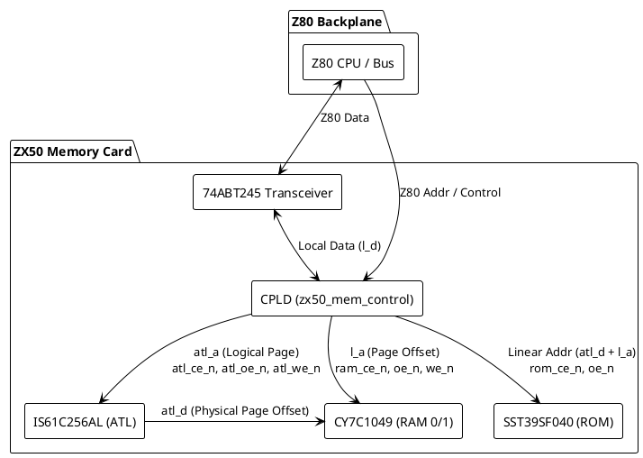
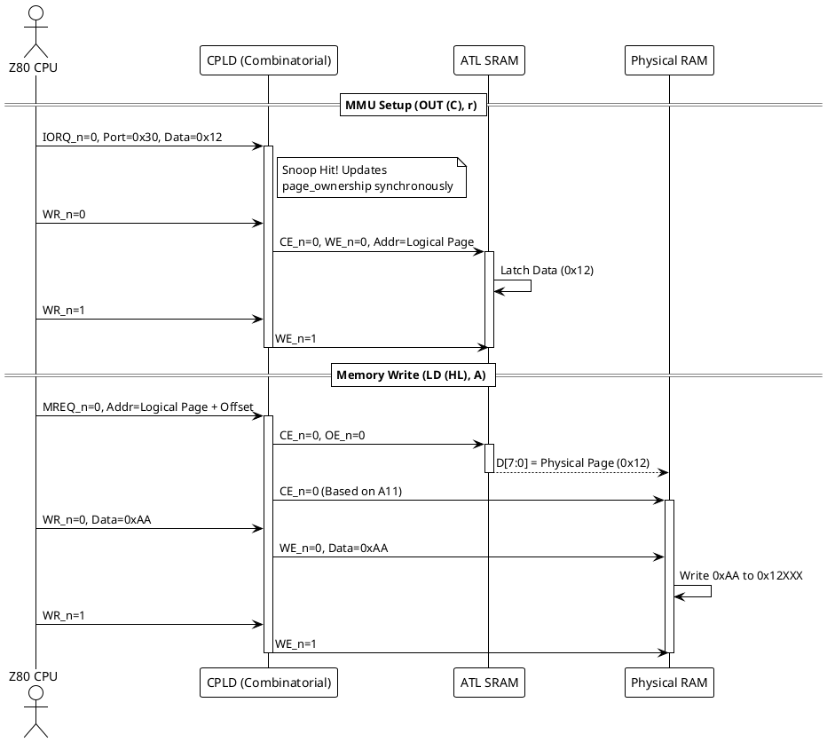

# ZX50 Memory Controller (CPLD)

## Overview
The ZX50 Memory Controller is the heart of the ZX50 memory card, implemented in an Atmel ATF1508AS CPLD. It acts as the bridge between the Z80 Backplane and the local physical memory chips (RAM, ROM, and the ATL SRAM).

By transitioning to a purely **combinatorial routing matrix** for memory accesses, the CPLD avoids clock-domain crossing latency and Z80 hold-time violations, providing cycle-accurate, zero-wait-state memory access.

## Hardware Architecture

## Operating Modes & Combinatorial Invariants
The CPLD does not use a clocked State Machine for memory access. Instead, it relies on strictly prioritized combinatorial logic governed by the Z80's physical strobes (`MREQ`, `IORQ`, `RD`, `WR`). This guarantees that chip selects and write enables are asserted and de-asserted exactly in phase with the CPU.

### 1. Safe Default (Idle)
When the Z80 is not targeting the card, all transceivers are disabled (`z80_d_oe_n = 1`), and all local memory chips are deselected (`ce_n = 1`, `we_n = 1`).

### 2. MMU Write (`mmu_direct_wr`)
**Trigger:** `IORQ = 0`, `WR = 0`, Port = `0x3X`, and `X == card_addr`.
* **Invariants:**
    * Transceiver opens inward (`d_dir = 1`).
    * `atl_a` is driven by Z80 A11-A8 (Logical Page from CPU `B` register).
    * `atl_ce_n = 0`, `atl_oe_n = 1`.
    * `atl_we_n` is bound directly to the Z80 `WR_n` strobe to perfectly satisfy SRAM hold times.

### 3. ROM Read (`effective_use_rom`)
**Trigger:** Memory cycle (`MREQ = 0`), Card ID = 0, ROM is enabled, and Z80 is addressing the lower 32K (`A15 = 0`).
* **Invariants:**
    * ATL SRAM is completely bypassed (`atl_ce_n = 1`).
    * CPLD reconstructs the linear address to bypass the A11 hardware bug, driving `atl_d` with `{3'b000, z80_a[15:11]}`.
    * `rom_ce2_n = 0`, `oe_n` bound to Z80 `RD_n`.

### 4. RAM Access (`ram_hit`)
**Trigger:** Memory cycle (`MREQ = 0`), CPLD owns the logical page (`page_ownership[z80_a[15:12]] == 1`), and it is not a ROM Read.
* **Invariants:**
    * `atl_a` is driven by Z80 A15-A12 (Logical Page).
    * `atl_ce_n = 0`, `atl_oe_n = 0` (ATL outputs Physical Page onto `atl_d`).
    * RAM Chip Select (`ram_ce0_n` or `ram_ce1_n`) is toggled exclusively by the `A11` bit.
    * `we_n` and `oe_n` are bound directly to Z80 `WR_n` and `RD_n`.

## Sequence Diagram: MMU Configuration & RAM Access

## Synchronous State Logic
While data routing is purely combinatorial, the CPLD maintains a synchronous core clocked by `mclk` to manage safe state transitions:
1.  **Hardware Reset:** On the rising edge of `reset_n`, the CPLD latches the physical DIP switches from the shared backplane control lines into `card_addr`. It resets `page_ownership` based on whether the card is flagged to provide the boot ROM.
2.  **Distributed MMU Snooping:** Every card monitors I/O writes to port `0x3X`. If `X` matches a card's ID, it claims the page in its `page_ownership` mask. If `X` belongs to another card, it instantly drops ownership.
3.  **ROM Kill-Switch:** If any CPU maps an MMU page into the lower 32K space (Logical pages 0-7), the boot ROM is permanently disabled (`rom_enabled = 0`), seamlessly replacing the boot ROM with dynamic RAM.
